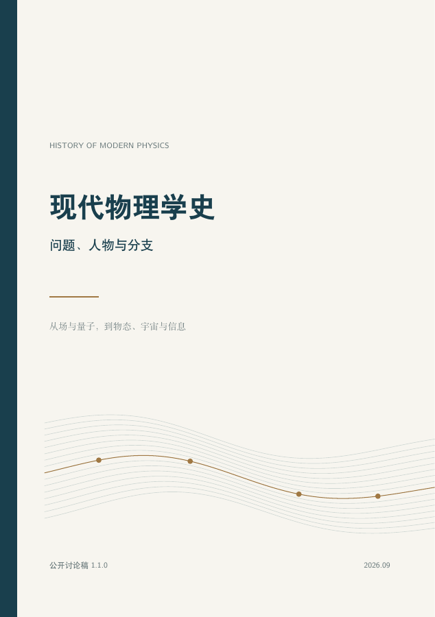

# 现代物理学史：问题、人物与分支



从具体问题出发，理解物理学的发展：为什么要提出一种新理论，哪些研究者改变了问题的问法，理论和实验究竟取得了什么成果，又留下了什么疑问。

**[阅读 PDF](pdf/modern-physics-history.pdf)** · **[从导读开始](docs/preface.md)** · **[查问题与出处](docs/appendices/question-index.md)** · **[参与修订](CONTRIBUTING.md)**

公开讨论稿。主要历史节点截至 2025 年，全文共七篇、二十一章，含二十则推导札记、五个附录及 192 项文献与资料。PDF 共 113 页，含目录、书签和文献链接。

下载完整项目后，可直接双击 `index.html` 阅读网页版：支持目录跳转、全文搜索、公式和分支关系图。公式已排成矢量图，离线也能显示。本次 1.1.0 发布的网页、合并稿和 PDF 来自同一份分章源稿。

第一次把本项目上传到 GitHub，请看 **[START_HERE.md](START_HERE.md)**。阅读和首次上传不需要安装 Python、Node.js 或 TeX。

## 全文目录

| 篇 | 章节 |
| --- | --- |
| 第一篇：场、量子与时空 | [1. 场、概率与不可逆性](docs/chapters/01-thermal-legacy.md) · [2. 量子理论的诞生](docs/chapters/02-quantum-birth.md) · [3. 相对论](docs/chapters/03-relativity.md) |
| 第二篇：物质组成与基本相互作用 | [4. 量子场论](docs/chapters/04-quantum-fields.md) · [5. 核物理](docs/chapters/05-nuclei.md) · [6. 粒子物理与标准模型](docs/chapters/06-particles.md) |
| 第三篇：集体行为与物态 | [7. 凝聚态物理](docs/chapters/07-condensed-matter.md) · [8. 相变与重整化群](docs/chapters/08-criticality.md) · [9. 拓扑物态](docs/chapters/09-topological-matter.md) |
| 第四篇：变化、涨落与持续驱动 | [10. 非线性、混沌与湍流](docs/chapters/10-nonlinear-dynamics.md) · [11. 非平衡统计物理](docs/chapters/11-nonequilibrium.md) · [12. 软物质、主动物质与生物物理](docs/chapters/12-soft-active-living-matter.md) · [13. 等离子体与聚变](docs/chapters/13-plasmas.md) |
| 第五篇：从观察量子规律到控制量子过程 | [14. 原子、分子与光](docs/chapters/14-atoms-light.md) · [15. 量子信息](docs/chapters/15-quantum-information.md) |
| 第六篇：恒星、宇宙与黑洞 | [16. 天体物理](docs/chapters/16-astrophysics.md) · [17. 宇宙学](docs/chapters/17-cosmology.md) · [18. 黑洞与量子引力](docs/chapters/18-black-holes.md) |
| 第七篇：数学、实验与研究方法 | [19. 数学、计算与仪器](docs/chapters/19-methods.md) · [20. 分支之间的桥](docs/chapters/20-branch-map.md) · [21. 从历史到研究问题](docs/chapters/21-research-questions.md) |

## 从问题、推导和资料进入

- [二十则推导札记](docs/derivations/index.md)：保留假设、步骤与适用范围，也在正文相应位置出现。
- [附录 A：关键时间轴](docs/appendices/timeline.md)：104 个发展节点及其在正文中的讨论。
- [附录 B：常见误解](docs/appendices/misconceptions.md)：区分常见说法与更准确的表述。
- [附录 C：继续阅读](docs/appendices/reading.md)：从具体问题进入后续资料。
- [附录 D：文献与资料索引](docs/appendices/references.md)：192 项来源。
- [附录 E：问题与出处](docs/appendices/question-index.md)：第 1—19 章的 94 个核心问题及推导位置。第 20、21 章讨论分支联系与研究问题，另有 5 个小节。

## 一起修订

欢迎核对史实、发现归属、公式条件、文献和章节之间的衔接。提出勘误时，请写明位置、原句、建议及出处；若引用 PDF 页码，注明版本。Issues 提供内容勘误、文献建议、新增章节和推导补充四个模板。

[项目纲领](handbook/PROJECT_CHARTER.md) 说明范围与编写原则，[编审大纲](docs/outline.md) 说明各章的问题主线和衔接，[审阅指南](handbook/REVIEW_GUIDE.md) 约定怎样记录证据、适用范围与尚未解决的问题。

本版展开了黑体辐射小节与普朗克推导，补充模式计数、零点能与热激发能的区分，以及原始计数和熵的论证路线。[试点核对记录](handbook/reviews/ch02-planck.md) 列出证据位置和核对范围，独立专业审阅仍待进行；其余章节继续按公开讨论稿使用。

可编辑的正文在 `docs/chapters/`，推导在 `docs/derivations/`，附录在 `docs/appendices/`。完整稿、网页和索引由脚本生成；日常改稿只维护源文件。具体约定见 [CONTRIBUTING.md](CONTRIBUTING.md)。

引用检查能发现编号、对应关系和跳转错误，不能证明来源真正支持某项结论。史实与科学内容仍需要逐项核对原始资料。

## 文件说明

| 文件或目录 | 用途 |
| --- | --- |
| `index.html` | 已生成的完整阅读网页；可本地打开或直接发布 Pages |
| `pdf/modern-physics-history.pdf` | 当前 PDF 阅读版 |
| `docs/` | 分章正文、推导、附录及封面 |
| `manuscript.md` | 合并后的完整 Markdown 快照 |
| `data/book.json` | 章节顺序、标题、推导归属与版本文字 |
| `data/` 中的其余 JSON | 从正文及附录导出的文献、问题、时间轴索引 |
| `docs/assets/references.bib` | 从文献附录导出的简式 BibTeX |
| `scripts/`、`web/` | 检查、网页及 PDF 生成工具与版式 |
| `.github/`、`tests/` | 协作模板、自动检查与回归检查 |
| `START_HERE.md`、`handbook/BUILD.md` | 上传方法与后续构建说明 |
| `docs/outline.md`、`handbook/` | 编审大纲、项目约定与审阅记录 |

## 维护者更新网页

需要重新生成网页时，在项目根目录运行：

```bash
python -m pip install -r requirements.txt
npm ci --ignore-scripts
python scripts/build_web.py
python scripts/check_package.py
```

然后把修改的源文件、`index.html`、`manuscript.md` 和生成索引一并提交。PDF 的编译方法见 [构建说明](handbook/BUILD.md)。GitHub 自动检查会生成阅读产物供下载，不会替维护者提交文件。

## 许可

正文与自编代码尚未选定开放许可证，见 [LICENSE_STATUS.md](LICENSE_STATUS.md)。第三方资料与工具遵循各自条件；MathJax 说明见 [THIRD_PARTY_NOTICES.md](THIRD_PARTY_NOTICES.md)。
