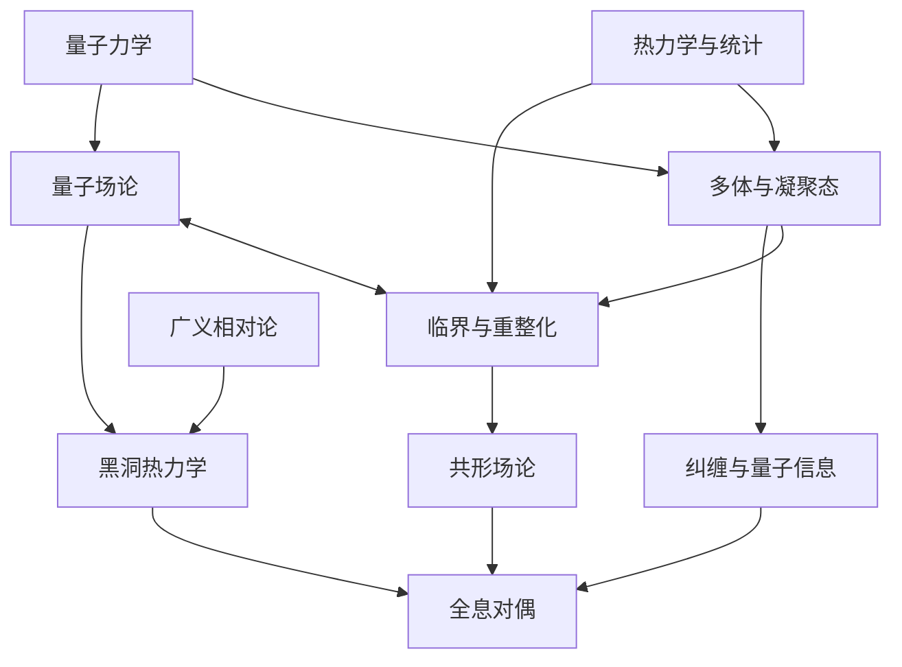

# 20. 分支之间的桥：为什么不同领域会反复遇到相同结构？

对称性、关联、尺度和几何在前面的章节中多次出现。下面按方法和对象重新整理这些联系，便于比较不同分支怎样使用相似的结构。

## 20.1 六种反复出现的组织方法

| 方法 | 最初容易理解的例子 | 后来出现的位置 | 它实际帮助回答什么 | 正文与出处 |
|---|---|---|---|---|
| 对称性与守恒 | 时间平移与能量、空间平移与动量、旋转与角动量 | 粒子分类、规范理论、晶体、流体 | 哪些量可以变化？哪些方程项不允许出现？ | [§6.3](06-particles.md#q-6-3) |
| 集体变量与有效自由度 | 温度、密度、声波 | 准粒子、序参量、主动流体、核模型 | 不追踪全部微观信息，能保留哪些预测？ | [§7.2](07-condensed-matter.md#q-7-2) |
| 关联与响应 | 自旋相关、电流涨落 | 散射、CFT、光子统计、宇宙微波背景 | 不同位置和时间的事件怎样联系？系统如何响应外界？ | [§11.2](11-nonequilibrium.md#q-11-2) |
| 尺度与重整化 | 临界磁体的块自旋 | QFT、有效理论、随机PDE、湍流 | 哪些细节在大尺度重要，哪些会消失？ | [§8.3](08-criticality.md#q-8-3) |
| 几何与拓扑 | 曲面弯曲、涡旋绕数 | 引力、Berry相位、霍尔效应、膜与缺陷 | 局部变化之外，什么整体结构保持稳定？ | [§9.1](09-topological-matter.md#q-9-1) |
| 信息与纠缠 | Bell相关、子系统熵 | 多体态压缩、量子纠错、黑洞和全息 | 一个部分怎样编码另一部分？哪些状态可区分？ | [§15.1](15-quantum-information.md#q-15-1) |

例如Calabrese与Cardy对量子场论纠缠熵的系统研究，将一维临界系统、CFT和量子信息连接起来。[Calabrese—Cardy，2004：量子场论纠缠熵](https://arxiv.org/abs/hep-th/0405152)。凝聚态与黑洞研究中的“纠缠熵”，因而可能共享可计算的子系统结构。但具体定义、紫外发散和几何条件仍需逐一处理。

下面这张图只画其中一组汇合关系，箭头表示知识和方法的联系，不代表历史上只有这一条单向因果：

## 20.2 今天的分支究竟如何区分？

| 分支 | 主要对象与尺度 | 常见问题 | 常用证据或方法 | 正文与出处 |
|---|---|---|---|---|
| 粒子物理 | 基本场、粒子、短距离相互作用 | 新粒子、对称性、参数和相互作用结构 | 散射、衰变、精密比较、QFT | [§6.6](06-particles.md#q-6-6) |
| 核物理 | 原子核、核物质 | 束缚、核力、形变、极端同位素 | 核反应、谱学、多体与有效理论 | [§5.5](05-nuclei.md#q-5-5) |
| 凝聚态物理 | 固体、液体、量子材料 | 物态、激发、输运、强关联 | 材料制备、输运、谱学、多体理论 | [§7.2](07-condensed-matter.md#q-7-2) |
| 统计物理 | 大量自由度及其统计 | 平衡、相变、普适性、涨落 | 系综、标度、RG、模型与实验 | [§8.3](08-criticality.md#q-8-3) |
| 非平衡物理 | 驱动、耗散与演化系统 | 热化、输运、生长、熵产生 | 动力学、随机过程、实验轨迹 | [§11.2](11-nonequilibrium.md#q-11-2) |
| 软物质 | 聚合物、胶体、液晶、界面 | 自组装、形变、流变、缺陷 | 显微成像、散射、弹性与统计 | [§12.1](12-soft-active-living-matter.md#q-12-1) |
| 主动物质与生物物理 | 自驱单元、细胞、分子机器 | 集群、感知、能耗、形态与功能 | 活体或人工实验、随机与连续模型 | [§12.4](12-soft-active-living-matter.md#q-12-4) |
| 流体与非线性物理 | 流动、波、振子 | 失稳、混沌、湍流、可积性 | PDE、实验、模拟、动力系统 | [§10.3](10-nonlinear-dynamics.md#q-10-3) |
| 等离子体物理 | 带电粒子与自洽电磁场 | 集体波、重联、约束、加热 | 动力学、磁流体、空间与装置测量 | [§13.2](13-plasmas.md#q-13-2) |
| 原子分子光物理 | 原子、分子、光及可控量子系统 | 结构、碰撞、相干、冷却与控制 | 激光、光谱、囚禁与干涉 | [§14.4](14-atoms-light.md#q-14-4) |
| 量子信息 | 量子态、信道、测量、计算 | 传输、复杂度、纠错、认证 | 信息论、可控实验、算法 | [§15.3](15-quantum-information.md#q-15-3) |
| 引力与相对论 | 时空、引力场、黑洞 | 因果、形成、稳定与引力检验 | 几何、PDE、天文和精密实验 | [§3.4](03-relativity.md#q-3-4) |
| 天体物理 | 恒星、星系、致密天体 | 能量来源、演化、辐射和物质状态 | 多波段、多信使、等离子体与核物理 | [§16.2](16-astrophysics.md#q-16-2) |
| 宇宙学 | 宇宙整体和大尺度统计 | 起源条件、成分、膨胀、结构形成 | 背景辐射、星系巡天、模型推断 | [§17.5](17-cosmology.md#q-17-5) |
| 量子引力 | 引力与量子理论的共同结构 | 微观时空、黑洞熵、信息、紫外一致性 | 场论、几何、对偶与可控模型 | [§18.5](18-black-holes.md#q-18-5) |
| 数学物理 | 物理模型的数学结构 | 存在性、谱、稳定、极限与可解性 | 严格证明、几何、分析、概率 | [§19.1](19-methods.md#q-19-1) |
| 计算物理 | 上述各类模型与数据 | 如何获得受控的数值信息 | Monte Carlo、格点、张量网络、数值PDE | [§19.3](19-methods.md#q-19-3) |
| 精密测量与仪器 | 可控探针、信号和噪声 | 分辨率、灵敏度、校准与新窗口 | 计量、工程、统计、量子控制 | [§14.5](14-atoms-light.md#q-14-5) |

这些分类并非同一层级：凝聚态更多按对象划分，统计物理更多按问题和方法划分，计算物理横贯多个对象。理解这一点，可以避免把统计物理方法与凝聚态、生物或宇宙学的研究对象误认为互相排斥。

另外，地球物理、海洋与大气物理、医学物理、声学、物理化学、光子学、材料与器件物理，都与这张地图相连。本文以基本概念与研究问题的演变为主，没有逐一展开这些方向的全部技术史；它们的分量不能由本文篇幅来排序。

分支名称只能给出大致范围。进一步阅读时，还要明确一个具体问题的对象、假设和已有结果。
