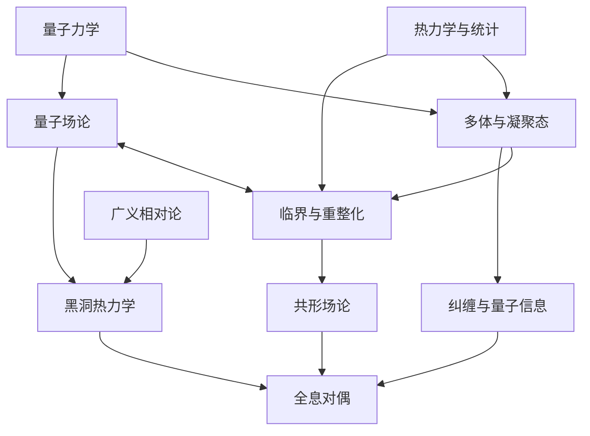

# 现代物理学史：问题、人物与分支

知道物质由电子和原子组成，还不足以解释金属为什么超导、水为什么沸腾、恒星为什么能维持平衡。不同问题需要不同的描述：有时必须修改基本定律，有时要辨认尚未发现的组成，有时则要从已知定律中找出适合当前尺度的变量。

本文从这些问题出发，梳理现代物理各分支的发展。每一节交代问题的由来、研究者的主要贡献和代表成果，并说明这些成果后来怎样被使用，又在哪些地方遇到限制。理论、实验、数学和仪器的发展放在一起讨论。

以今天的问题回看历史，可以看出不同分支之间的联系，但也容易把后来才有的认识归给早期研究者。普朗克引入能量元时，尚未建立光子理论；原子物理的研究也曾沿不同路线展开。下文采用便于理解的叙述顺序，实际的年代关系另见附录A。

历史叙述以十九世纪为起点，重点在二十世纪以后，主要节点截至2025年。各节附有文献，附录D、E提供集中索引。文中的“推导札记”共20则，统一使用现代记号；模型假设、近似和结论范围在各则中说明，不作为原作者发现过程的复原。

## 全文结构

| 篇章 | 章节 | 主要问题 | 与后文的联系 |
|---|---|---|---|
| 第一篇：场、量子与时空 | 1—3 | 经典物理在哪些问题上遇到困难？ | 量子理论与相对论怎样结合？ |
| 第二篇：物质组成与基本相互作用 | 4—6 | 怎样描述核结构与基本相互作用？ | 粒子规律如何用于多体系统？ |
| 第三篇：集体行为与物态 | 7—9 | 材料的物态和临界规律从何而来？ | 系统怎样形成这些状态，又怎样演化？ |
| 第四篇：变化、涨落与持续驱动 | 10—13 | 如何解释热化、输运、生长和集体运动？ | 怎样制备和控制所研究的系统？ |
| 第五篇：量子控制与信息 | 14—15 | 量子态怎样用于测量、通信和计算？ | 量子理论与信息概念怎样用于天体和黑洞？ |
| 第六篇：恒星、宇宙与黑洞 | 16—18 | 怎样从观测推断天体性质与宇宙演化？ | 理论计算与观测分别检验了哪些内容？ |
| 第七篇：数学、实验与研究方法 | 19—21 | 证明、数值与测量分别能给出什么结论？ | 怎样据此提出具体的研究问题？ |

各分支在历史上交错发展，这里按问题分为七篇。查年代可用附录A，查具体问题的文献可用附录E。

首次阅读可以先贯通正文，再回头细读推导。公式中的记号按小节定义：$h$ 与 $\hbar=h/(2\pi)$ 是普朗克常数，$k_B$ 是玻尔兹曼常数，$c$ 是真空光速，$G$ 是牛顿引力常数。其余字母可能在不同模型中承担不同含义。

| 篇 | 章节导航 |
|---|---|
| 一 | [1 场、概率与不可逆性](#chapter-1) · [2 量子理论](#chapter-2) · [3 相对论](#chapter-3) |
| 二 | [4 量子场](#chapter-4) · [5 原子核](#chapter-5) · [6 基本相互作用](#chapter-6) |
| 三 | [7 凝聚态](#chapter-7) · [8 相变与尺度](#chapter-8) · [9 几何与拓扑](#chapter-9) |
| 四 | [10 非线性与热化](#chapter-10) · [11 涨落与增长](#chapter-11) · [12 软物质与生命](#chapter-12) · [13 等离子体](#chapter-13) |
| 五 | [14 原子、分子与光](#chapter-14) · [15 量子信息](#chapter-15) |
| 六 | [16 天体物理](#chapter-16) · [17 宇宙学](#chapter-17) · [18 黑洞与量子引力](#chapter-18) |
| 七 | [19 证明、计算与仪器](#chapter-19) · [20 分支地图](#chapter-20) · [21 研究问题](#chapter-21) |
| 附录 | [A 时间轴](#appendix-a) · [B 常见误解](#appendix-b) · [C 延伸阅读](#appendix-c) · [D 文献索引](#appendix-d) · [E 问题与出处](#appendix-e) |

## 0. 现代物理的主要问题

现代物理有许多并行发展的分支。同一套方法常用于不同对象，同一个现象也可能需要几个分支共同解释。下表按所研究的问题作一个粗略区分：

| 追问 | 具体例子 | 主要相关分支 |
|---|---|---|
| 自然界允许什么基本规律？ | 哪些相互作用存在？什么对称性成立？ | 粒子物理、量子场论、引力 |
| 微观规律怎样产生宏观世界？ | 原子相互作用已知，为什么会有铁磁、超导和玻璃？ | 凝聚态、统计物理、软物质 |
| 系统怎样随时间变化？ | 为什么会热化？如何形成湍流？什么决定生长界面的粗糙度？ | 非平衡、流体、非线性、等离子体 |
| 时空与宇宙怎样演化？ | 黑洞形成吗？元素从哪里来？宇宙为什么加速膨胀？ | 相对论、天体物理、宇宙学 |
| 我们能知道和控制多少？ | 测量精度有什么极限？纠缠能做什么？ | 原子分子光物理、精密测量、量子信息 |
| 什么使一种解释可信？ | 方程是否有解？近似是否受控？数据能区分哪些模型？ | 数学物理、计算物理、实验方法 |

同一现象可以同时属于几类：中子星涉及核物质、统计力学、广义相对论和观测天文学；冷原子系统既是原子物理实验，也是研究凝聚态模型的实验室；KPZ同时属于非平衡物理、概率论和随机偏微分方程。

## 第一篇：场、量子与时空

### 1. 十九世纪留下的三种遗产：场、概率与不可逆性

十九世纪的热机、电磁和光谱研究，使物理学逐渐超出质点轨道的描述。热力学研究过程的限制，统计力学研究分布，电磁理论研究场的传播。现代物理继承了这三套方法，也继承了它们尚未解决的问题。

#### 1.1 热究竟是什么，热机为什么不能循环地把单一热源的热全部变成功？

工业时代的热机首先提出了一个很实际的问题：为什么有些发动机效率高，有些低？卡诺在1824年研究理想热机时，并没有现代分子图像。他抓住的是循环过程和两个温度不同的热源之间的限制。此后，焦耳的热功当量实验、迈尔和亥姆霍兹等人的能量守恒思想，逐渐让“热是一种可守恒流体”的热质观失去核心地位。

克劳修斯和开尔文把热力学发展为一套普遍约束。第一定律规定能量怎样记账；第二定律进一步限制哪些满足能量守恒的过程仍然不可能发生。一台循环工作的机器，若唯一效果是从单一热源吸热并将其全部变成功，就违背第二定律；功通过摩擦全部转为热，则不违背这一限制。“循环工作”和“唯一效果”是不能删掉的前提。

到1865年，克劳修斯明确提出“熵”这个名称。热力学不依赖具体的微观模型，就能限制热机效率和过程的可能性。这一点后来在黑洞热力学、量子热机和随机热力学中重新出现。热机时代到原子理论时代的背景，可从[Brush《The Kind of Motion We Call Heat》的出版与研究资料](https://pubs.aip.org/aapt/ajp/article/45/11/1130/529253/The-Kind-of-Motion-We-Call-Heat-A-History-of-the)进入。

卡诺的论证可直接从[《Reflections on the Motive Power of Heat》英译本](https://www.gutenberg.org/files/78610/78610-h/78610-h.htm)查阅，尤其应观察其中仍然使用的热质语言。现代第二定律与循环过程的表述可对照[《费曼物理学讲义》I，第44章](https://www.feynmanlectures.caltech.edu/I_44.html)。对照两者，可以看出热机效率的限制怎样保留，而对热的解释怎样改变。

#### 1.2 宏观的温度和压强，能否从看不见的粒子运动中算出？

麦克斯韦在1860年前后把气体问题改写成速度分布问题：不追踪每个分子，而是问“有多少分子落在某个速度范围内”。玻尔兹曼随后发展碰撞与分布函数的动力学，1872年的工作给出后来称为玻尔兹曼方程和H定理的结构。吉布斯在1902年的《统计力学基本原理》中系统组织系综方法。

计算压强、热容、涨落和响应，通常不需要知道全部粒子的轨道。统计力学要解释，为什么极大量微观状态能够由温度、密度等少量变量概括。吉布斯原著的一个可访问版本是[《Elementary Principles in Statistical Mechanics》](https://www.gutenberg.org/ebooks/50992)。

但是，时间方向立刻成为难题。微观方程在适当条件下可以时间反演，而H定理表现出向平衡演化的方向性。洛施密特的可逆性反驳、策梅洛利用庞加莱回复提出的反驳，逼迫人们认识到：不可逆性不能只靠机械地重写微观方程得到，还牵涉初态、典型性、分子混沌假设、粗粒化和极限次序。把熵简单解释为“混乱”，会略去这些条件。

关于时间反演、典型性和宏观熵的区别，参见[Lebowitz，1993：《Boltzmann’s Entropy and Time’s Arrow》作者机构存档](https://cmsr.rutgers.edu/images/people/lebowitz_joel/publications-archived/lebowitz_370.pdf)。与Gibbs对系综的组织相对照，时间箭头问题还要求解释初态及宏观描述如何选取。

#### 1.3 电、磁和光是不是同一类东西？

法拉第研究电磁感应时，把空间中的“力线”当成理解作用如何分布的重要工具。麦克斯韦在1860年代将电磁现象组织成场论，发现其波动传播速度与光速相符，从而把光纳入电磁理论。代表原文是[麦克斯韦，1865：《A Dynamical Theory of the Electromagnetic Field》](https://royalsocietypublishing.org/rstl/article/doi/10.1098/rstl.1865.0008/118816/VIII-A-dynamical-theory-of-the-electromagnetic)。

场成为描述空间中传播和储存能量的物理量，与粒子共同进入理论。赫兹在1880年代对电磁波的产生和探测，让这种统一获得直接实验支持。

电磁理论后来用于电磁工程、现代光学和无线通信，同时留下一个问题：电磁波方程中的光速，究竟相对于谁？将这套方程放进伽利略时空中会遇到困难，相对论由此获得重要背景。

##### 推导札记：为什么“光是电磁波”是一项可计算的统一？

这里使用现代SI记号重构论证。设区域内没有电荷、电流，介质是真空。Maxwell方程给出

$$
\nabla\cdot\mathbf E=0,\qquad
\nabla\times\mathbf E=-\partial_t\mathbf B,\qquad
\nabla\times\mathbf B=\mu_0\varepsilon_0\partial_t\mathbf E.
$$

对第二式再取旋度，并交换空间、时间微分：

$$
\nabla\times(\nabla\times\mathbf E)
=-\partial_t(\nabla\times\mathbf B)
=-\mu_0\varepsilon_0\partial_t^2\mathbf E.
$$

向量恒等式
$\nabla\times(\nabla\times\mathbf E)=\nabla(\nabla\cdot\mathbf E)-\nabla^2\mathbf E$
把左边化为 $-\nabla^2\mathbf E$，因而

$$
\partial_t^2\mathbf E=c^2\nabla^2\mathbf E,\qquad
c=\frac1{\sqrt{\mu_0\varepsilon_0}}.
$$

磁场满足同样的波动方程。对平面波，散度条件还要求波矢与电场垂直，旋度方程固定电场、磁场和传播方向的关系。由电学、磁学量得到的传播速度和横波结构，可以直接与光学实验比较。现代演算参见[《费曼物理学讲义》II，第20章](https://www.feynmanlectures.caltech.edu/II_20.html)；历史论证参见本节Maxwell原文。

#### 1.4 原子是计算工具，还是真实存在的东西？

十九世纪末，并不是所有物理学家都接受原子的实在性。热力学可以不依赖原子模型而成功，化学原子也未必已经等同于“被物理实验确定的微观对象”。

爱因斯坦1905年、斯莫卢霍夫斯基1906年的布朗运动理论，将可见小颗粒的随机运动与不可见分子的热运动联系起来。在扩散时间尺度上，一维均方位移满足

$$
\langle[x(t)-x(0)]^2\rangle=2Dt.
$$

对稀悬浮液中的球形颗粒，在适当条件下还有 $D=k_BT/(6\pi\eta a)$。温度、黏度、颗粒半径与扩散的联系，使原子理论能够产生定量预测。佩兰1908年前后的实验成为强有力的证据。这里的小颗粒通常并不是被显微镜直接看见的单个分子；人们通过它的运动反推分子的存在与尺度。[爱因斯坦—佩兰实验关系的研究与复现实验](https://pubs.aip.org/aapt/ajp/article/74/6/478/1041859/Einstein-Perrin-and-the-reality-of-atoms-1905)。

##### 推导札记：不用追踪分子，也能算出扩散与阻力的关系

设稀薄悬浮颗粒在温度恒定的流体中运动，迁移率为 $\mu$：小外力 $F$ 产生平均漂移速度 $v=\mu F$。设外势 $U(x)$，粒子浓度为 $n(x)$，扩散系数 $D$ 在考虑的区域内为常数。漂移和扩散的总粒子流是

$$
j(x)=\mu F(x)n(x)-D\partial_xn(x),\qquad F=-U'.
$$

热平衡既要求没有净流，也要求稀薄粒子服从Boltzmann分布：

$$
n_{\rm eq}(x)\propto e^{-U(x)/(k_BT)},\qquad
\partial_xn_{\rm eq}=-\frac{U'}{k_BT}n_{\rm eq}.
$$

代回流量式：

$$
0=j_{\rm eq}
=\left(-\mu+\frac{D}{k_BT}\right)U'n_{\rm eq}.
$$

对可施加的非零势梯度都要成立，所以

$$
D=\mu k_BT.
$$

球形颗粒满足低雷诺数、连续流体与无滑移边界等Stokes阻力条件时，$\mu=(6\pi\eta a)^{-1}$，得到本节的Einstein关系。撤去外力后，在均匀介质中再由自由扩散方程 $\partial_t n=D\partial_x^2n$，在边界项消失且分布归一化的条件下两次分部积分：

$$
\frac{d}{dt}\langle x^2\rangle
=D\int x^2\partial_x^2n\,dx
=2D\int n\,dx=2D.
$$

以起点为原点，便得到 $\langle[x(t)-x(0)]^2\rangle=2Dt$。平衡分布和零净流条件，把扩散强度与机械响应联系起来。当系统持续主动耗能、存在记忆效应或已经进入短时弹道运动时，要重新检查假设。现代推导背景参见[《费曼物理学讲义》I，第43章“扩散”](https://www.feynmanlectures.caltech.edu/I_43.html)；历史归属及实验检验见本节所引Einstein—Perrin研究。

热、统计和电磁理论在热辐射问题上汇合，却遇到了困难：若按经典方式给电磁模式分配能量，为什么得不到正确的光谱？

### 2. 量子理论的诞生：原子世界为什么拒绝经典解释？

热辐射把电磁场与统计力学放在同一个问题里，却得不到符合实验的经典结果。原子的稳定性和光谱又带来另一组困难。量子理论是在处理这些具体矛盾的过程中逐步形成的。

#### 2.1 一个烧热的物体，为什么以特定方式分配不同颜色的光？

黑体辐射把上一章的两个问题接在一起：电磁场有哪些振动方式，这些振动在热平衡时又怎样分配能量？基尔霍夫关于热辐射的普适性，把研究对象收束为理想黑体：在给定温度下，它的平衡辐射谱不依赖材料的具体成分。实验者要造出尽可能接近这一条件的腔体，测量不同温度和波长下的辐射；理论家则要解释同一条谱曲线为何能适用于不同材料。[研究背景与黑体实验](https://www.mpg.de/19252749/what-did-max-planck-discover)。

维恩的能量分布公式曾很成功，但不能覆盖所有实验范围。普朗克在1901年论文开头明确提到：卢默尔、普林斯海姆以及鲁本斯、库尔鲍姆的新测量，表明这一定律没有普遍有效性。这里不能把“维恩的能量分布公式”与仍然成立的“维恩位移定律”混为一谈。[原文导言及§6—§10](https://de.wikisource.org/wiki/Ueber_das_Gesetz_der_Energieverteilung_im_Normalspectrum)。

需要区分三个节点：普朗克在1900年10月19日报告新辐射公式，在12月14日的报告中给出包含能量元与组合计数的统计解释，完整论述于1901年发表。1901年原文首页注明了两次报告日期；1900年报告也回顾了先提出公式、再寻找解释的过程。因而，“1900年提出能量元”与“引用1901年论文”可以同时成立，二者分别指事件时间与文献发表时间。[1900年报告英译](https://commons.princeton.edu/josephhenry/wp-content/uploads/sites/71/2021/01/Planck-1900-Distribution-Law.pdf)；[1901年原刊出版记录](https://onlinelibrary.wiley.com/doi/10.1002/andp.19013090310)。

普朗克的关键步骤，是把一组同频率谐振子的总能量按有限大小的能量元分配，计算这些分配的数目，再由熵求出温度与平均能量的关系。借助位移定律，能量元须取与频率成正比的形式 $\epsilon=h\nu$。这条路线解释了辐射谱，却还不是成熟的光子理论；不能把后来完整的量子概念提前放进1900年的论证。原始计算可查1901年论文§3—§10；[该文英译入口](https://www.theory.physics.ubc.ca/200-06/Planck-1901.html)供对照，德文原文链接同时保留。

下面先用现代正则系综看清能量元怎样改变热平均，再回到“计数—熵—温度”的原始论证结构。两条路线得到相同公式，却使用了不同的概念组织。读者既能算出结果，也能分清我们今天怎样理解它，以及普朗克当时怎样提出它。

##### 推导札记：能量元怎样改变整个辐射谱？

**要算什么，以及在什么条件下计算**

记 $u_\nu(T)d\nu$ 为单位体积内、频率在 $\nu$ 到 $\nu+d\nu$ 之间的**热辐射能量**。它是按频率定义的能量密度谱，不是从表面射出的功率。以下使用普通频率 $\nu$，角频率是 $\omega=2\pi\nu$；$h$ 为普朗克常数，$k_B$ 为玻尔兹曼常数，$c$ 为真空光速。

模型是一只足够大的三维真空腔，辐射通过与腔壁交换能量达到温度 $T>0$ 的热平衡。腔内场取理想自由电磁场，各个正常模式彼此独立；腔壁的吸收与发射用于建立平衡，并未因此被否认。模式计数取大体积的连续近似，不讨论有限腔体的精细谱线或介质改变的色散关系。

每个模式用量子谐振子描述。这是现代量子统计的教学重构，不能写成普朗克在1900年已经采用了完整的量子场与光子语言。现代模型及模式数可核对[Fitzpatrick讲义§8.10](https://farside.ph.utexas.edu/teaching/sm1/statmech.pdf)；历史路线在本札记后半部分另行说明。

**第一步：一个模式的平均热能**

对固定的 $\nu>0$，先把能量零点选在基态，热激发能量为

$$
E_n=nh\nu,\qquad n=0,1,2,\ldots,\qquad
\beta=\frac{1}{k_BT}.
$$

令 $r=e^{-\beta h\nu}$，则 $0<r<1$。正则分布给出 $p_n=r^n/Z_\nu$，其中

$$
Z_\nu=1+r+r^2+\cdots.
$$

将这个级数乘以 $r$ 后相减，得到 $(1-r)Z_\nu=1$，所以

$$
Z_\nu=\frac{1}{1-r}.
$$

平均激发数需要的不是这一个级数本身，而是带有权重 $n$ 的级数。在 $0<r<1$ 内可逐项求导：

$$
\frac{d}{dr}\sum_{n=0}^{\infty}r^n
=\sum_{n=1}^{\infty}nr^{n-1}
=\frac{1}{(1-r)^2}.
$$

再乘以 $r$，并用 $Z_\nu$ 归一化：

$$
\begin{aligned}
\langle n\rangle
&=\frac{\sum_{n=0}^{\infty}nr^n}{\sum_{n=0}^{\infty}r^n}
=\frac{r/(1-r)^2}{1/(1-r)}\\
&=\frac{r}{1-r}
=\frac{1}{e^{\beta h\nu}-1}.
\end{aligned}
$$

于是每模式的平均热能为

$$
\langle E\rangle_\nu
=h\nu\langle n\rangle
=\frac{h\nu}{e^{h\nu/(k_BT)}-1}.
$$

也可以用配分函数复核符号与归一化：

$$
\begin{aligned}
-\frac{\partial\log Z_\nu}{\partial\beta}
&=\frac{\partial}{\partial\beta}
\log(1-e^{-\beta h\nu})\\
&=\frac{h\nu e^{-\beta h\nu}}{1-e^{-\beta h\nu}}
=\langle E\rangle_\nu.
\end{aligned}
$$

这不是说一个模式只容许一个能量元。任意非负整数 $n$ 都允许；量子化改变的是相邻能级的间距，从而改变它们在热平衡中的权重。

**第二步：同一频率附近有多少模式？**

为计算大体积下的模式密度，暂用边长 $L$、体积 $V=L^3$ 的周期性盒子。允许的波矢分量为 $k_i=2\pi m_i/L$，其中 $m_i$ 是整数。因此，每个波矢点在 $\boldsymbol{k}$ 空间占据体积 $(2\pi/L)^3$。

半径 $k$、厚度 $dk$ 的球壳体积为 $4\pi k^2dk$。每个非零波矢有两个横向偏振，故该球壳内的模式数为

$$
dN=2\frac{V}{(2\pi)^3}\,4\pi k^2dk.
$$

这里已经数遍所有传播方向，不能再额外乘一次“正反方向”的因子。除以实际空间体积 $V$，并使用 $k=2\pi\nu/c$、$dk=(2\pi/c)d\nu$：

$$
\begin{aligned}
g(\nu)d\nu
&=\frac{dN}{V}
=\frac{k^2}{\pi^2}dk\\
&=\frac{1}{\pi^2}
\left(\frac{2\pi\nu}{c}\right)^2
\frac{2\pi}{c}d\nu
=\frac{8\pi\nu^2}{c^3}d\nu.
\end{aligned}
$$

周期性边界是取得大体积主导项的计数方法，并不把真实吸收腔壁改成了周期性材料。对于尺寸与波长可比的腔体，应返回实际边界条件求离散模式。上述计数可对照[Fitzpatrick，式(8.70)—(8.72)](https://farside.ph.utexas.edu/teaching/sm1/statmech.pdf)。

**第三步：把模式数与热平均相乘**

单位体积的谱等于“每单位体积、每单位频率的模式数”乘“每模式平均热能”：

$$
u_\nu(T)=g(\nu)\langle E\rangle_\nu
=\frac{8\pi h\nu^3}{c^3}
\frac{1}{e^{h\nu/(k_BT)}-1}.
$$

$u_\nu$ 的单位为 $\mathrm{J\,m^{-3}\,Hz^{-1}}$，乘上 $d\nu$ 才是能量密度；不要把它与按波长定义的 $u_\lambda$ 直接等同。变量替换必须满足 $u_\lambda=u_\nu|d\nu/d\lambda|$。

令 $x=h\nu/(k_BT)$。两个极限解释了公式的物理内容：

$$
x\ll1:\quad e^x-1=x+O(x^2),\qquad
\langle E\rangle_\nu\simeq k_BT,\qquad
u_\nu\simeq\frac{8\pi k_BT\nu^2}{c^3};
$$

$$
x\gg1:\quad
\langle E\rangle_\nu\simeq h\nu e^{-x},\qquad
u_\nu\simeq\frac{8\pi h\nu^3}{c^3}e^{-x}.
$$

低频恢复瑞利—金斯形式；高频则因激发一个能量元的代价远大于 $k_BT$ 而被指数压低。改变的是热平均，模式密度的几何计数并未改变。这一高频抑制使总热能密度的积分收敛。结果与[普朗克1901年论文式(12)](https://de.wikisource.org/wiki/Ueber_das_Gesetz_der_Energieverteilung_im_Normalspectrum)一致；现代极限计算可核对[Fitzpatrick，式(8.79)—(8.83)](https://farside.ph.utexas.edu/teaching/sm1/statmech.pdf)。

**零点能：说明计算对象，而不是声称它很小**

完整谐振子能级为 $E_n^{\mathrm{full}}=h\nu(n+1/2)$。保留它时，配分函数与平均能量分别为

$$
Z_\nu^{\mathrm{full}}
=\frac{e^{-\beta h\nu/2}}{1-e^{-\beta h\nu}},
\qquad
\langle E^{\mathrm{full}}\rangle_\nu
=\frac{h\nu}{2}+\frac{h\nu}{e^{\beta h\nu}-1}.
$$

固定频率下，所有能级同时平移 $h\nu/2$，这个共同因子会在概率的归一化中约去。因此

$$
\langle E^{\mathrm{full}}\rangle_{\nu,T}
-\langle E^{\mathrm{full}}\rangle_{\nu,0}
=\frac{h\nu}{e^{h\nu/(k_BT)}-1}.
$$

本札记计算的是相对于同一基态的热激发能。这里并没有要求 $h\nu/2$ 很小，也没有证明真空能在所有问题中都可以删去。完整谐振子公式及两项的区分见[Kardar讲义第121页，式VI.11—VI.12](https://ocw.mit.edu/courses/8-333-statistical-mechanics-i-statistical-mechanics-of-particles-fall-2013/368b2180e6efa1417ab336d79b2df6db_MIT8_333F13_Lec20.pdf)。

**回到原论文：计数怎样通过熵决定温度？**

以下用现代记号整理原论文的一条论证路线，不逐字复现发现过程。1901年论文§3—§5先把总能量按能量元分配，§6—§10再借助位移定律确定能量元的频率依赖。设 $N$ 个可区分的同频率谐振子，共有 $P$ 个相同的能量元，每个大小为 $\epsilon$，则总能量为 $U_N=P\epsilon$。

一种分配由非负整数 $n_1,\ldots,n_N$ 指定，并满足 $n_1+\cdots+n_N=P$。把 $P$ 个标记用 $N-1$ 个分隔符分成 $N$ 组，得到分配数

$$
\Omega(N,P)=\binom{P+N-1}{P}
=\frac{(P+N-1)!}{P!\,(N-1)!}.
$$

组合数只回答“有多少种分配”。还需引入这些分配等权的统计假设，才能用 $S_N=k_B\log\Omega$ 计算熵。普朗克在§4明确提出了这一假设；它并不是由排列组合本身证明的物理定律。

取 $N,P$ 都很大、$y=P/N$ 固定，用 $\log m!=m\log m-m+O(\log m)$，保留熵中随系统大小增长的主导项：

$$
\begin{aligned}
\frac{S_N}{k_B}
&\simeq (N+P)\log(N+P)-N\log N-P\log P,\\
s(y):=\frac{S_N}{N}
&\simeq k_B\big[(1+y)\log(1+y)-y\log y\big].
\end{aligned}
$$

其中每谐振子的平均能量为 $\bar E=\epsilon y$。固定频率及 $N$，热力学关系给出

$$
\begin{aligned}
\frac1T
=\frac{\partial S_N}{\partial U_N}
=\frac{ds}{d\bar E}
&=\frac{k_B}{\epsilon}
\big[\log(1+y)+1-\log y-1\big]\\
&=\frac{k_B}{\epsilon}\log\frac{1+y}{y}.
\end{aligned}
$$

因而 $e^{\epsilon/(k_BT)}=1+1/y$，解得

$$
y=\frac{1}{e^{\epsilon/(k_BT)}-1},\qquad
\bar E=\frac{\epsilon}{e^{\epsilon/(k_BT)}-1}.
$$

以上微分采用大系统极限得到的熵主导项，有限 $N,P$ 的精确组合熵并不等同于这一光滑函数。原论文再用位移定律要求单个谐振子的熵只通过 $\bar E/\nu$ 依赖能量与频率；与上式的 $\bar E/\epsilon$ 结构比较，得到 $\epsilon=h\nu$。配合谐振子平均能量与辐射能量密度的关系，便得到同一辐射谱。[1901年原文§3—§10、式(6)、(8)、(11)—(12)](https://de.wikisource.org/wiki/Ueber_das_Gesetz_der_Energieverteilung_im_Normalspectrum)；[1900年报告英译，PDF第3—5页](https://commons.princeton.edu/josephhenry/wp-content/uploads/sites/71/2021/01/Planck-1900-Distribution-Law.pdf)。

这条历史路线把实验约束、热力学关系和统计假设接在一起。前面的现代推导则从量子能级与正则分布出发。两者的公式可以相互核对，概念背景与论证地位仍应分别说明。

辐射谱的困难因此得到一个明确答案：高频模式所需的能量元较大，热激发受到抑制。但热平衡中的成功留下了新的问题——离散能量是否只是一种处理辐射统计的办法，还是也会出现在单次吸收与发射中？光电效应把这个问题带到了实验面前。

#### 2.2 为什么提高光的强度，不能随意提高被打出电子的能量？

爱因斯坦1905年提出光量子假说，将光电效应解释为单次吸收事件中的能量交换：

$$
K_{\max}=h\nu-\Phi.
$$

这里 $\Phi$ 是材料的逸出功。在弱光、单光子吸收且可忽略空间电荷等影响的条件下，频率决定单个光量子的能量，强度主要影响一定时间内的吸收事件数。强场和多光子过程中，需要另外分析能量交换；上述公式不能无条件外推。

密立根后来精确检验了光电方程；康普顿1923年的X射线散射工作进一步支持光具有可计算的能量和动量。量子论因此越来越难被当成仅用于黑体热平衡的一种技巧。光电效应及其历史地位可参见[爱因斯坦1921年诺贝尔奖资料](https://www.nobelprize.org/prizes/physics/1921/einstein/facts/)。

但光量子没有取消干涉、衍射。新理论需要解释：为什么相同的光既能显示干涉结构，又以离散事件的方式与探测器交换能量？量子态和概率幅的表述需要同时解释这两类现象。

康普顿散射的论证与实验比较可查[Compton，1923：《A Quantum Theory of the Scattering of X-rays by Light Elements》](https://link.aps.org/doi/10.1103/PhysRev.21.483)。光电方程与康普顿散射提供的证据并不相同：前者涉及光与物质的能量交换，后者进一步检验散射中的能量—动量关系。

#### 2.3 原子为什么不塌缩，为什么只发出离散谱线？

J. J. Thomson在1897年的阴极射线研究中确认电子，原子因此显露出内部结构。随后盖革和马斯登的散射实验及卢瑟福1911年的核式原子解释，表明正电荷和主要质量集中在极小区域。但如果把电子当成绕核运行的经典带电小球，它会辐射、失能，难以维持稳定原子。

玻尔1913年采用定态和跃迁假设，将氢原子能级与谱线联系起来：

$$
h\nu=E_i-E_f.
$$

玻尔模型把原子结构、普朗克常数和光谱规律联系起来，但还没有形成完整的量子力学。索末菲等人进一步发展轨道量子化，但旧量子论面对多电子原子、谱线强度和复杂结构时越来越依赖额外规则。[玻尔，1913：原子和分子的构造](https://www.tandfonline.com/doi/abs/10.1080/14786441308634955)。

现代量子力学中，电子不必沿经典轨道运动。将电子限制得越来越紧，会提高其动能代价；与库仑势能竞争后出现有下界的原子束缚态。原子的稳定性问题由“找到不会辐射的特殊轨道”转化为“求量子哈密顿量的谱”。

##### 推导札记：原子为什么具有一个有限的量子尺度？

原子稳定性可以进一步表述为基态能量的下界。取非相对论氢原子的相对坐标，忽略精细结构和辐射修正：

$$
H=-\frac{\hbar^2}{2\mu}\nabla^2-\frac{\kappa}{r},
\qquad
\kappa=\frac{e^2}{4\pi\varepsilon_0},
\qquad
a_0=\frac{\hbar^2}{\mu\kappa},
$$

其中 $\mu$ 是电子与质子的约化质量。先对归一化、足够光滑且边界项消失的 $\psi$ 计算，再以二次型的稠密逼近延伸到相应有限能量态。利用 $\nabla\cdot\widehat{\mathbf r}=2/r$，

$$
\begin{aligned}
\int\left|\nabla\psi+\frac{\widehat{\mathbf r}}{a_0}\psi\right|^2d^3x
&=\int|\nabla\psi|^2d^3x+\frac1{a_0^2}
 +\frac1{a_0}\int\widehat{\mathbf r}\cdot\nabla|\psi|^2\,d^3x\\
&=\int|\nabla\psi|^2d^3x+\frac1{a_0^2}
 -\frac2{a_0}\int\frac{|\psi|^2}{r}\,d^3x.
\end{aligned}
$$

所以能量期望恰好是

$$
\langle H\rangle
=\frac{\hbar^2}{2\mu}
\int\left|\nabla\psi+\frac{\widehat{\mathbf r}}{a_0}\psi\right|^2d^3x
-\frac{\hbar^2}{2\mu a_0^2}
\ge-\frac{\mu\kappa^2}{2\hbar^2}.
$$

等号由 $\nabla\psi=-\widehat{\mathbf r}\psi/a_0$ 达到：

$$
\psi_0(r)=\frac{e^{-r/a_0}}{\sqrt{\pi a_0^3}}.
$$

这既找到有限大小的基态，也排除了在这个模型中把电子无限压向原点便能无限降低能量的可能。它体现的是微分算符的动能与奇异势能之间的竞争，没有使用经典电子轨道。这个单原子论证不自动证明任意大块物质的稳定性，后者还需要多体结构与费米统计。模型及基态可对照[《费曼物理学讲义》III，第19章](https://www.feynmanlectures.caltech.edu/III_19.html)；稳定性层次参见[Lieb，2004年综述](https://arxiv.org/abs/math-ph/0401004)。上述配方演算为本文的教学重构。

#### 2.4 我们是不是一开始就选错了描述原子的对象？

德布罗意在1923—1924年提出物质波思想：波粒关系可能不只属于光。1925年海森堡转向可与光谱联系的跃迁量，而不是不可直接观测的电子轨道。玻恩识别出其中的矩阵结构，玻恩、约尔当和海森堡继续发展矩阵力学。

薛定谔在1926年建立波动力学，使能级成为微分方程的本征值：

$$
\hat H\psi=E\psi.
$$

两条路线后来被证明在适当表述下等价。玻恩提出波函数的概率解释；狄拉克发展变换理论；冯·诺依曼等人建立更系统的算符与希尔伯特空间框架。达维孙—革末及G. P. 汤姆孙1927年的电子衍射实验，为物质波提供关键证据。

在量子力学中，状态不再由一条确定轨道描述，不对易可观测量也未必能同时具有确定值。预测的对象变为测量结果的概率及其关联。[AIP：海森堡与量子力学的形成](https://history.aip.org/exhibits/heisenberg/quantum-mechanic.html)；[APS：矩阵力学与波动力学的1925—1926年历史](https://www.aps.org/apsnews/2025/07/werner-heisenberg-pioneers-quantum-mechanics)。

#### 2.5 为什么电子不全部掉进同一个最低能态？

泡利1925年的不相容原理指出，相同费米子不能占据同一个单粒子量子态。这里“相同态”包括自旋等全部量子数，并不是说两个电子不能出现在同一空间区域。乌伦贝克和古兹密特提出电子自旋；费米与狄拉克发展费米统计。玻色1924年的光量子统计以及爱因斯坦1924—1925年的推广，则通向玻色统计和玻色—爱因斯坦凝聚。

这些工作让元素周期结构、金属电子、白矮星简并压力等问题具有共同语言。后来戴森—莱纳德、利布—瑟林等人的严格研究进一步说明，稳定的大块物质涉及多体量子结构和不相容原理，远比“氢原子有最低能级”更深。泡利的代表贡献可由[1945年诺贝尔奖资料](https://www.nobelprize.org/prizes/physics/1945/pauli/facts/)核验。

空间量子化的早期实验节点，还包括[Stern—Gerlach在1922年的原论文](https://link.springer.com/article/10.1007/BF01326983)。它先于1925年的电子自旋概念，不能写成实验者当时已经以完整现代自旋理论设计并解释实验。单原子能量下界与大块物质稳定性的区别，可进一步查[Lieb，2004：《Quantum Mechanics, The Stability of Matter and Quantum Electrodynamics》](https://arxiv.org/abs/math-ph/0401004)。

#### 2.6 量子理论能给出实验结果，是否就已经解释了现实？

爱因斯坦、波多尔斯基、罗森1935年质疑量子描述是否完备；薛定谔在同年强调纠缠结构，并以猫的思想实验突出微观叠加与宏观经验之间的紧张。

问题不只是“人看了一眼会不会改变东西”。量子测量涉及系统、仪器与环境如何相关，概率如何出现，为什么我们得到具体结果。玻尔、冯·诺依曼、玻姆、埃弗雷特以及后来的退相干研究，提供了不同层面的回答。它们不能全部混成一个统一的“哥本哈根解释”。

这些争论后来产生了可以实验检验的命题。贝尔1964年证明，满足特定局域因果性与测量设置独立性等条件的模型，会受到某些相关性不等式约束；量子理论可以违反这些约束。[贝尔，1964年原论文](https://link.aps.org/doi/10.1103/PhysicsPhysiqueFizika.1.195)。相关实验及其与量子信息的联系见第15章。

原始争论可直接对照[EPR，1935：《Can Quantum-Mechanical Description of Physical Reality Be Considered Complete?》](https://link.aps.org/doi/10.1103/PhysRev.47.777)；环境怎样抑制子系统可观察的干涉，可查[Zurek的退相干综述，2003年期刊版](https://arxiv.org/abs/quant-ph/0105127)。退相干解释某些经典行为的出现，与是否已经解决单次确定结果的全部解释问题，应保持区分。

量子理论改变了状态与测量的描述。几乎与此同时，相对论从电动力学和运动参考系的问题出发，重新讨论空间与时间。

### 3. 相对论的发展：空间和时间能不能继续当作固定舞台？

相对论与量子理论在相近的年代发展，最初处理的问题却不同。它首先研究运动观察者之间怎样比较时钟、长度和光信号，随后把自由落体与时空几何联系起来。

#### 3.1 运动观察者之间，究竟什么保持不变？

十九世纪末，洛伦兹、菲茨杰拉德、庞加莱等人已经在研究电动力学与运动参考系之间的关系。迈克耳孙—莫雷实验是重要背景之一，但爱因斯坦1905年的论证不能简单归结为对这一个实验的直接回答。

狭义相对论把惯性系之间物理定律的等价性与真空光速的角色结合起来。改变的是远隔事件同时性的定义，以及时间、空间坐标如何随参考系变换。闵可夫斯基1908年的四维几何表述，使这些关系显得更统一。

固有时是钟沿世界线积累的可测时间。能量与动量也不再是彼此孤立的量。相对论后来成为粒子加速器、宇宙射线和精密时频实验的日常工具。[马克斯·普朗克引力物理研究所：Einstein Online](https://www.einstein-online.info/en/)提供这一结构的系统入口。

固有时、Lorentz变换及相对论能动量的技术定义，可由[Carroll的GR讲义第1节“Special Relativity and Flat Spacetime”](https://arxiv.org/abs/gr-qc/9712019)核对；这份讲义采用现代记号；概念的历史形成过程还需对照原始文献。

#### 3.2 引力为什么让不同物体以同样方式自由下落？

牛顿理论中惯性质量和引力质量的比例一致，是一个需要解释的事实。爱因斯坦从1907年前后的等效原理思想出发，逐渐认识到：自由落体可以局部消去引力效应，而不同位置的自由落体系又不能在一个有限区域内全部拼成同一个惯性系。

这使问题从“空间中有一种拉力”走向“时空的几何结构怎样影响物体运动”。黎曼几何、里奇与列维—奇维塔的张量工具，以及格罗斯曼对爱因斯坦的帮助，构成必要背景。1915年爱因斯坦得到不含宇宙学常数的场方程；1917年在宇宙学研究中加入宇宙学常数项，见[1917年原文第4节](https://adsabs.harvard.edu/pdf/1917SPAW.......142E)。将这两个历史步骤区分以后，今天通常把方程写为

$$
G_{\mu\nu}+\Lambda g_{\mu\nu}
=\frac{8\pi G}{c^4}T_{\mu\nu}.
$$

左边描述几何，右边描述物质的能量、动量和应力。能量、动量和应力共同参与引力作用，方程还包含非线性、因果结构和约束。1915年的节点可参见[NASA：广义相对论一百年](https://asd.gsfc.nasa.gov/blueshift/index.php/2015/11/25/100-years-of-general-relativity/)。

##### 推导札记：场方程中的 $8\pi G/c^4$ 从哪里来？

这段计算是在已经选定Einstein张量以后，用牛顿极限固定耦合常数；它不是从几个类比就唯一推导整个引力理论。取度规号差 $(-,+,+,+)$、$x^0=ct$，暂设 $\Lambda=0$，写

$$
G_{\mu\nu}=\kappa T_{\mu\nu}.
$$

四维缩并给出 $-R=\kappa T$，故

$$
R_{\mu\nu}=\kappa\left(T_{\mu\nu}-\frac12g_{\mu\nu}T\right).
$$

对弱、静态引力场中的非相对论物质，压强相对于静质量能量密度可忽略：

$$
g_{00}\simeq-\left(1+\frac{2\Phi}{c^2}\right),\qquad
T_{00}\simeq\rho c^2,\qquad T\simeq-\rho c^2.
$$

在相应的曲率符号约定下，线性化的 $00$ 分量是 $R_{00}\simeq\nabla^2\Phi/c^2$。于是

$$
\frac{\nabla^2\Phi}{c^2}
=\frac{\kappa}{2}\rho c^2.
$$

与 $\nabla^2\Phi=4\pi G\rho$ 比较，得到 $\kappa=8\pi G/c^4$。这里的因子2来自迹反演后的物质项，不能把 $T_{00}$ 单独塞进 $R_{00}=\kappa T_{00}$。这一系数使场方程在牛顿极限下与已知的引力测量相符。现代技术来源：[Carroll《Lecture Notes on General Relativity》，第4节“Gravitation”](https://arxiv.org/abs/gr-qc/9712019)。

#### 3.3 几何引力怎样接受检验？

水星近日点进动是早期重要成功；光线偏折在1919年日食观测中获得历史上著名的支持，但当时精度和数据分析远不等于现代检验。此后引力红移、雷达回波时间延迟、脉冲双星轨道演化、引力波观测等逐渐组成多层证据。

不同实验检验理论的不同部分：弱场轨道、时钟速率、光传播、强场动力学。某一类检验成功，不能逻辑上保证理论在所有尺度都成立。

黑洞与引力波研究后来将相对论从以少数天文修正为主的理论，变为直接研究高能天体和时空动力学的学科。LIGO于2015年观测、2016年发表的双黑洞并合信号，是这一变化的标志。[LIGO—Virgo，GW150914原论文](https://arxiv.org/abs/1602.03837)。

弱场、等效原理和脉冲双星等检验的区分，可查[Will，2014：《The Confrontation between General Relativity and Experiment》](https://arxiv.org/abs/1403.7377)。该综述覆盖首次直接引力波探测之前的检验；GW150914则把检验推进到双黑洞并合的强场动力学。

#### 3.4 方程有一个精确解，这个解就会在宇宙中出现吗？

史瓦西1916年得到球对称真空解，克尔1963年得到旋转黑洞解。但精确解只回答“有没有这样一个数学对象”。物理上还要问：它能否由合理初态形成？稍微扰动后是否仍接近某个黑洞？坐标奇异与真实几何奇异如何区分？

彭罗斯1965年的奇点定理，把引力塌缩的研究从高度对称的特殊解推进到更一般的几何条件。霍金与彭罗斯等人的工作进一步联系宇宙学、因果结构和奇点。奇点定理通常证明的是测地线不完备；它不自动给出奇点的全部局部结构，也不是直接证明“中心有一个实际无限密度小点”。

黑洞稳定性与宇宙监督问题继续研究这些时空解的演化。Giorgi、Klainerman、Szeftel等人的系列工作，证明了适当小扰动下慢转Kerr黑洞外部区域的非线性稳定性；慢转是指旋转参数相对于质量充分小，不能把结论直接推广到任意旋转速度。这里所引论文是系列证明的一部分。[Giorgi、Klainerman、Szeftel，2022：慢转Kerr非线性稳定性](https://arxiv.org/abs/2205.14808)。双曲偏微分方程、能量估计与微分几何在这一问题上共同发挥作用。

奇点定理的原始节点是[Penrose，1965：《Gravitational Collapse and Space-Time Singularities》](https://link.aps.org/doi/10.1103/PhysRevLett.14.57)。奇点定理限制坍缩后的因果与测地线结构；稳定性理论则研究允许的扰动是否长期保持受控。

相对论改变时空，量子理论改变物质状态。描述粒子的产生与湮灭时，两者必须在同一套理论中相容。

## 第二篇：物质组成与基本相互作用

### 4. 量子场论：当粒子会产生和消失，量子力学需要怎样扩展？

高能碰撞可以产生新粒子，辐射过程包含发射和吸收。量子理论既要容纳粒子数的变化，又要符合相对论。由此形成的场论还需要回答：计算怎样与可观测量相联系，一套理论在什么能区内有效？

#### 4.1 怎样同时尊重量子原理与相对论？

早期波动力学常从固定粒子数出发。但高能碰撞中可以产生新粒子，电磁辐射也表现为发射、吸收过程。将普通单粒子薛定谔方程简单“相对论化”，不足以系统处理这些现象。

狄拉克1927年发展辐射的量子理论，1928年的电子方程自然包含自旋结构，并引出负能态及反粒子问题。正电子的解释经历了发展，安德森1932年的宇宙射线实验提供了关键发现。不能将“1928年写下方程”与“已经完整具有后来反粒子的场论解释”压成同一时刻。[狄拉克，1928：《The Quantum Theory of the Electron》](https://royalsocietypublishing.org/rspa/article/117/778/610/2242/The-quantum-theory-of-the-electron)。

量子场论把场作为基本描述对象，粒子可理解为在适当背景和条件下的场的激发。产生、湮灭算符让粒子数可以改变。它后来也成为声子、磁振子、超流和临界涨落的共同语言，所以“场论”并不等于“高能粒子理论”。

正电子实验还可查[Anderson，1933年完整论文《The Positive Electron》](https://link.aps.org/doi/10.1103/PhysRev.43.491)；发现于1932年，完整论文发表于1933年。

##### 推导札记：Dirac为什么会走到矩阵，而不只是另一条微分方程？

对自由粒子，要求相对论色散关系
$E^2=c^2\mathbf p^2+m^2c^4$。
进一步要求演化方程对时间和空间微分都取一阶，并取与位置、动量无关的系数。为同时满足自伴性与色散关系，允许系数成为Hermitian矩阵，试写

$$
H=c\sum_{i=1}^3\alpha_i p_i+\beta mc^2.
$$

将它平方：

$$
\begin{aligned}
H^2={}&c^2\sum_i\alpha_i^2p_i^2\\
&+c^2\sum_{i<j}(\alpha_i\alpha_j+\alpha_j\alpha_i)p_ip_j\\
&+mc^3\sum_i(\alpha_i\beta+\beta\alpha_i)p_i
+\beta^2m^2c^4.
\end{aligned}
$$

要对任意动量都等于所需色散关系，必须有

$$
\{\alpha_i,\alpha_j\}=2\delta_{ij}I,\qquad
\{\alpha_i,\beta\}=0,\qquad \beta^2=I.
$$

普通数不可能满足这组要求：若 $\alpha_i^2=\beta^2=1$，它们又作为数彼此交换，就不能同时反对易。矩阵却可以；四分量旋量提供了三维空间中熟悉的实现。代入 $\mathbf p=-i\hbar\nabla$，便得到一阶的Dirac演化方程。

这些代数条件要求引入矩阵。至于自旋、正负能量解和反粒子，需要进一步研究方程的解及其场论表述。历史与原始结构：[Dirac，1928](https://royalsocietypublishing.org/rspa/article/117/778/610/2242/The-quantum-theory-of-the-electron)；本段采用现代记号。

#### 4.2 理论算出无穷大，是完全错了，还是我们没有正确联系可观测量？

电子会与电磁场相互作用，场的量子涨落又影响电子的传播和能级。早期量子电动力学在这些修正中遇到发散。1947年前后，Lamb与Retherford的能级实验、电子磁矩的精密测量，使理论必须处理非常小但真实存在的修正。

贝特、朝永振一郎、施温格、费曼、戴森等人在1940年代后期发展了可系统计算的重整化QED。关键是区分理论表达中的裸参数与实验定义的质量、电荷，并建立能够一致计算散射和能级修正的方法。[1965年诺贝尔奖的QED历史说明](https://www.nobelprize.org/prizes/physics/1965/ceremony-speech/)。

允许的修正项受理论结构限制，重整化条件需要与实验量联系，随后必须预测新的可观测量。另一方面，微扰重整化的成功也不等于已经完成了所有量子场论的严格非微扰构造。物理上的预测成功与数学上的存在性问题是两层工作。

#### 4.3 为什么把所有路径加起来，能算出量子运动？

费曼1948年发表路径积分表述，将量子传播幅写成所有可能历史的相干叠加：

$$
K(b,a)\sim\int\mathcal D x\,e^{iS[x]/\hbar}.
$$

这里相加的是带相位的概率幅，不能解释成粒子按经典概率随机选取路径。不同路径的相位可以相消；经典极限中，作用量对路径变化不敏感的附近可以产生稳定的相干贡献。

路径积分在场论中把“场的各种构型”作为求和对象。虚时间与适当解析延拓又将某些量子问题和统计配分函数联系起来。这种联系有条件，不意味着任意实时间量子积分都是普通正概率平均。[费曼，1948年原论文](https://link.aps.org/doi/10.1103/RevModPhys.20.367)。

路径积分也用于计算关联函数。理解这类计算，先要分清“平均”的含义。在经典统计中，两个随机变量的关联可以由联合概率分布求平均；在量子理论中，算符次序还会影响结果。先以有限维系统为例：设密度矩阵为 $\rho$，算符为 $A,B$，二阶连通关联定义为

$$
C_\rho(A,B)=\operatorname{Tr}(\rho AB)
-\operatorname{Tr}(\rho A)\operatorname{Tr}(\rho B).
$$

当两个可观测量可共同测量时，可以用对应的联合统计解释；对一般不对易算符，$\operatorname{Tr}(\rho AB)$不能直接当成两个经典实测量乘积的平均。一个短例子是：取自旋沿 $z$ 轴向上的态，Pauli矩阵满足

$$
\sigma_x\sigma_y=i\sigma_z,\qquad
\langle\sigma_x\sigma_y\rangle=i,
\qquad\langle\sigma_x\rangle=\langle\sigma_y\rangle=0.
$$

这个关联是虚数，已经说明“普通经典联合分布”不是通用解释。量子场论还须区分算符原次序、时间序和对称化关联；场本身通常要按算符值分布处理，同点乘积尤其需要另行定义。[Wightman，1956：《Quantum Field Theory in Terms of Vacuum Expectation Values》](https://link.aps.org/doi/10.1103/PhysRev.101.860)。自旋例子直接显示了算符次序对平均值的影响。

##### 推导札记：作用量为什么能把量子相位接到经典运动？

先看一维粒子，取 $S[x]=\int_{t_a}^{t_b}L(x,\dot x,t)\,dt$，扰动路径为 $x+\epsilon\eta$，固定端点，即 $\eta(t_a)=\eta(t_b)=0$。一阶变化是

$$
\delta S=\int_{t_a}^{t_b}
\left(\frac{\partial L}{\partial x}\eta+
\frac{\partial L}{\partial\dot x}\dot\eta\right)dt.
$$

对第二项分部积分，端点项消失：

$$
\delta S=\int_{t_a}^{t_b}
\left[\frac{\partial L}{\partial x}
-\frac d{dt}\frac{\partial L}{\partial\dot x}\right]\eta\,dt.
$$

若对任意这样的 $\eta$ 都有 $\delta S=0$，就得到Euler—Lagrange方程。取 $L=m\dot x^2/2-V(x)$，恢复 $m\ddot x=-V'(x)$。

现在回看量子幅中的 $e^{iS/\hbar}$。在允许驻相近似的半经典情形，作用量快速变化的邻近路径容易产生相位相消；$\delta S=0$ 的历史附近能够留下有组织的贡献。经典方程因而出现在量子幅的驻相近似中。这是驻相解释，并非对任意势、任意时间的严格经典极限定理；多个驻点、焦散和隧穿都需要额外处理。[Feynman，1948](https://link.aps.org/doi/10.1103/RevModPhys.20.367)。

#### 4.4 不掌握最深的理论，能否仍然做可靠预测？

二十世纪后半叶，有效场论逐渐把一个思想系统化：在给定能量范围，先保留相关自由度，并写出满足对称性的相互作用；高能细节通过系数和受能标比控制的修正进入。

温伯格1979年的《Phenomenological Lagrangians》是重要节点。有效理论关心的是：为达到给定精度，需要保留哪些微观信息？核物理的手征有效理论、低能引力、凝聚态长波理论都体现这一策略。[温伯格，1979年原论文](https://www.sciencedirect.com/science/article/pii/0378437179902231)。

这也解释了为什么一门学科不必等到“终极理论”发现后才能进步。对低温磁体，可以先研究自旋；对流体，可以先研究守恒密度和流速。关键是给出适用范围、误差来源和失效条件。

核与粒子的实验为场论提供了具体对象。有效自由度的选择，也成为核物理和凝聚态反复面对的问题。

### 5. 核物理：原子内部还有一个怎样的世界？

放射性、散射实验、连续β能谱和裂变产物，逐步显露出原子核的结构。原子核有自己的尺度和多体性质：即使知道核子由夸克组成，仍须解释核壳层、集体运动与核反应。

#### 5.1 物质为什么会自己放出穿透性辐射？

伦琴1895年发现X射线，贝克勒尔1896年发现铀的放射性，玛丽·居里、皮埃尔·居里及合作者随后发现钋、镭并推进放射性研究。卢瑟福与索迪在二十世纪初发展放射性嬗变的解释，显示元素不一定是永久不变的。

这些发现早于成熟的原子核理论。电离、穿透和偏转等实验特征先提供线索，人们再区分不同辐射。卢瑟福的散射解释把原子结构的尺度分开；查德威克1932年确认中子，随后以质子和中子构成原子核的图像逐渐建立。[查德威克的发现与研究经历](https://www.nobelprize.org/prizes/physics/1935/chadwick/biographical/)。

新问题立即出现：质子相互排斥，原子核为什么还能束缚？核力为什么作用距离很短？原子核大小、结合能和稳定性如何变化？这使核物理成为一个具有自身对象和尺度的分支。

#### 5.2 许多质子和中子，为什么有的组合特别稳定？

液滴模型把原子核看作具有体积能、表面能和库仑能等贡献的有限多体系统，适合理解结合能的总体趋势、形变和裂变。但某些质子数或中子数对应异常稳定性，即所谓“幻数”，单靠平滑的液滴图像解释不了。

玛丽亚·格佩特—梅耶与延森及其合作者在1949年前后发展核壳层模型，强的自旋—轨道耦合是解释幻数的重要因素。核子虽有强相互作用，却在适当平均场中表现出类似壳层的能级结构。与此同时，Aage Bohr、Ben Mottelson、James Rainwater等人发展形变与集体运动的图像。[格佩特—梅耶与核壳层](https://www.nobelprize.org/stories/women-who-changed-science/maria-goeppert-mayer/)。

这里没有一个模型在所有方面取代另外一个模型。原子核同时具有单粒子运动、配对、转动和振动等特征。研究者要判断，对于当前能区和可观测量，哪些自由度最有效。这是“同一对象需要多种层次的理论”的典型实例。

形变与集体模型这条支线的代表贡献可查[1975年诺贝尔奖科学说明](https://www.nobelprize.org/prizes/physics/1975/summary/)。核壳层模型强调单粒子结构，集体模型描述核子的协同运动，两者处理核结构的不同方面。

#### 5.3 β衰变中，能量为什么好像不守恒？

若一个初始确定的粒子只衰变成两个对象，运动学通常会严格约束末态能量。然而β衰变电子具有连续能谱，早期看上去像是能量账目出了问题。泡利1930年提出一个很难探测的中性粒子；费米1933—1934年将其纳入β衰变理论，后来称为中微子。

莱因斯与考恩1956年的反应堆反中微子探测，是长期实验努力的重要结果。问题由“守恒定律是否失效”转为“缺失的能量是否被难以观测的自由度带走”。

这形成了一种持久的研究策略：通过缺失能量、缺失动量和事件分布推断看不见的粒子。但这种推断必须排除探测效率、背景和已知粒子的遗漏，不能把每一个异常都立即命名为新粒子。

实验者对这条历史的回顾是[Reines，1996：《The Neutrino: From Poltergeist to Particle》](https://link.aps.org/doi/10.1103/RevModPhys.68.317)。这里的实验对象严格说是反应堆产生的电子反中微子；历史叙述常简称为“发现中微子”，但讨论实验反应时应保留粒子类型。

#### 5.4 重原子核为什么会分裂，并释放那么多能量？

Hahn与Strassmann在1938年底的中子轰击实验中得到关键化学证据；Meitner与Frisch在1939年给出核裂变解释。这个贡献链必须完整保留，不能只用后来奖项的归属来复述历史。[Meitner与Frisch，1939年原论文](https://www.nature.com/articles/143239a0)。

核反应释放能量的根源，在于初末态质量和结合能的差。$E=mc^2$给出质量与能量的关系，但它本身并不决定哪种反应会发生、反应速率多大、需要什么条件。这些都属于核结构与核反应动力学。

裂变与聚变研究进入核反应堆、核武器和能源技术。核物理还包括不稳定同位素、核力、核物质状态方程、核天体物理以及中微子过程，都是独立而活跃的问题。

#### 5.5 核力既然最终来自夸克，为什么还要研究原子核？

量子色动力学提供强相互作用的基本理论，但从夸克胶子出发计算一个真实重核，仍有很大困难。低能核物理常用核子和介子作为有效自由度，再用有效场论、量子多体方法与实验约束建立可计算描述。

两个今天仍很具体的问题是：极端中子过剩的原子核在哪里不再束缚？核物质在中子星密度下有怎样的压强—密度关系？它们涉及有限多体与无限物质、实验和天文观测之间的联系。这些性质需要多体计算，不能仅由组成成分直接读出。

从QCD对称性到核子相互作用的具体路线见[Epelbaum、Hammer、Meißner，2009：《Modern Theory of Nuclear Forces》](https://arxiv.org/abs/0811.1338)。该文的重点是有效场论与核力构造；中子星内核的全部密度区间不能靠低密度展开直接无条件外推。 中子星中的密度范围、质量—半径关系与观测约束，可另从[Lattimer，2012：《The Nuclear Equation of State and Neutron Star Masses》](https://arxiv.org/abs/1305.3510)入手；所链接的作者存档上传于2013年。

核壳层与集体模型处理核的组织；更短距离的散射实验则继续追查核子的组成，并把问题带到粒子分类与基本相互作用。

### 6. 粒子物理：如何从“粒子动物园”走向标准模型？

随着实验发现的强子越来越多，研究者开始寻找分类规律。对称性、散射实验和规范理论逐渐结合，形成标准模型。宇称破坏则说明，对称性本身也需要实验检验。

#### 6.1 发现的粒子越来越多，究竟哪些才是基本对象？

宇宙射线与加速器不断发现介子、重子和共振态。电子、质子、中子组成的朴素图景迅速不够用。汤川秀树1935年的介子思想，是理解短程核力的一步；但随后大量新粒子的性质要求更系统的分类。

Gell-Mann与Ne'eman在1961年前后用近似对称性整理强子谱；Gell-Mann与Zweig在1964年分别提出夸克构成思想。随后SLAC的深度非弹性散射，由Friedman、Kendall、Taylor及合作团队等人的工作，给出质子内部近似点状组成的关键证据。费曼的部分子图像使高能散射更容易理解。

这段历史展示了两种互相支持的策略：先从谱的规律寻找隐藏结构，再用高分辨率散射探测内部组成。分类方案还要接受散射、产生和衰变实验的检验。[温伯格：《The Making of the Standard Model》](https://arxiv.org/abs/hep-ph/0401010)。

#### 6.2 我们认为必然成立的对称性，真的被实验检验过吗？

宇称对应空间镜像。李政道和杨振宁1956年重新检查弱相互作用的实验依据，指出宇称守恒在这一领域并没有得到所需验证。吴健雄与Ambler、Hayward、Hoppes、Hudson的低温钴-60实验，在1956年底完成关键工作、1957年发表，显示弱相互作用不保持宇称。

弱相互作用中的宇称守恒，曾被当作自然的假定。重新检查已有证据，才使检验这一假定成为明确的实验任务。[吴健雄等人，1957年原论文](https://link.aps.org/doi/10.1103/PhysRev.105.1413)。

1964年Cronin、Fitch及合作者发现中性K介子系统中的CP破坏，使对称性问题进一步深化。小林诚与益川敏英1973年提出的三代夸克混合结构，提供标准模型中的CP破坏机制。这又与“宇宙为什么以物质为主”发生联系，但已知夸克CP破坏并未自动解决宇宙重子不对称问题。

CP破坏与夸克混合的原始结果分别见[Christenson、Cronin、Fitch、Turlay，1964年中性K介子论文](https://link.aps.org/doi/10.1103/PhysRevLett.13.138)，以及[Kobayashi—Maskawa，1973年夸克混合论文](https://doi.org/10.1143/PTP.49.652)。

#### 6.3 相互作用能不能由一种统一的结构组织起来？

电磁理论允许不同势函数描述同一物理电磁场，这启发了规范思想。Weyl、Fock等人的工作，将局部相位变换与量子力学联系起来。Yang和Mills在1954年把局部规范结构推广到非阿贝尔情形：变换之间的次序可以重要，规范场也因此具有非线性自相互作用。[Yang—Mills原论文](https://link.aps.org/doi/10.1103/PhysRev.96.191)。

一个直观入口是：在每个空间点选择内部状态的表示方式后，怎样比较相邻点的状态？协变导数和联络负责这种比较。这里的联络可以用微分几何的语言表述。不过，“使用规范不变性”并不能唯一决定自然界必须具有哪一个规范群、多少粒子和哪些参数。[Jackson与Okun：规范不变性的历史根源](https://link.aps.org/doi/10.1103/RevModPhys.73.663)。

诺特1918年的定理则揭示连续对称性与守恒结构之间的系统关系。要区分全局物理对称性与局部描述冗余；规范对称性并不是普通意义上“把系统变成另一个可区分状态”。[诺特原文的Tavel英译](https://arxiv.org/abs/physics/0503066)。

##### 推导札记：一个连续对称性怎样变成守恒量？

给定 $L(q,\dot q,t)$，先只考虑不改变时间坐标的无穷小变换
$\delta q_i=\epsilon X_i(q,t)$。
若作用量在此变换下至多改变端点项，则
$\delta L=\epsilon\,dB/dt$。
另一方面，令 $p_i=\partial L/\partial\dot q_i$，有

$$
\frac{\delta L}{\epsilon}
=\sum_i\left(\frac{\partial L}{\partial q_i}X_i
+p_i\frac{dX_i}{dt}\right).
$$

沿满足Euler—Lagrange方程的运动，
$\partial L/\partial q_i=\dot p_i$，所以

$$
\frac{dB}{dt}
=\sum_i(\dot p_iX_i+p_i\dot X_i)
=\frac d{dt}\sum_ip_iX_i.
$$

因此

$$
Q=\sum_ip_iX_i-B,\qquad \dot Q=0.
$$

例如，沿固定方向 $\mathbf a$ 平移，$\delta\mathbf q=\epsilon\mathbf a$ 且 $B=0$，得到 $\mathbf p\cdot\mathbf a$ 守恒；旋转取 $\delta\mathbf q=\epsilon\,\mathbf a\times\mathbf q$，得到 $\mathbf a\cdot(\mathbf q\times\mathbf p)$ 守恒。

守恒量的得到同时用到了作用量的连续对称性、运动方程与端点条件。局部规范变换牵涉Noether第二定理、约束及边界，不能直接把这里每一个参数照搬成独立物理守恒荷。原始来源：[Noether，1918，Tavel英译](https://arxiv.org/abs/physics/0503066)；本段只展示第一定理的一个有限维版本。

#### 6.4 规范理论看起来偏好无质量媒介，弱相互作用为什么又是短程的？

Glashow、Weinberg、Salam在1960年代发展电弱理论。一个核心困难是如何在保持理论一致性的同时，得到有质量的弱相互作用媒介。Nambu、Goldstone等人的对称性破缺研究，以及Anderson对凝聚态集体行为的分析，是重要背景。

1964年，Brout与Englert、Higgs、Guralnik—Hagen—Kibble三个研究组合分别提出关键机制。Higgs场的真空结构，使W、Z等粒子获得质量，而电磁光子保持无质量。't Hooft与Veltman等人1970年代的工作，又使电弱理论的量子计算获得坚实基础。

1973年中性流的发现、1983年W和Z的发现，以及ATLAS、CMS在2012年发现与Higgs玻色子相符的新粒子，逐步构成这条理论链的实验支持。[CERN历史时间轴](https://timeline.web.cern.ch/timeline-header/89)；[ATLAS：Higgs发现的物理意义](https://atlas.cern/Discover/Physics/Higgs)。

需要特别分清：Higgs机制不等于解释了“所有质量为何取这些数值”。电子与不同夸克的耦合强度仍需实验输入；普通物质中质子、中子的大部分质量来自强相互作用的动力学，而不是把其中轻夸克的静质量简单相加。[Dürr等人，2008：轻强子质量的格点QCD计算](https://www.science.org/doi/10.1126/science.1163233)。

#### 6.5 为什么夸克在高能实验中好像很自由，却又从来不能轻易被单独拉出来？

Gross与Wilczek、Politzer在1973年发现非阿贝尔规范理论的渐近自由：在量子色动力学中，高能、短距离下的有效耦合可以变小。这解释了为何高能散射中的夸克表现得近似自由，同时为强相互作用选择正确理论结构提供关键线索。[2004年诺贝尔奖：渐近自由](https://www.nobelprize.org/prizes/physics/2004/popular-information/)。

长距离则进入强耦合区。色禁闭意味着观测到的是无净色荷的强子，而不是自由孤立的夸克。渐近自由本身并不构成禁闭的完整证明。Wilson1974年提出格点规范理论，为非微扰问题提供重要工具；这条线后来发展为格点QCD。

粒子物理因此既研究“有没有新粒子”，也研究既有基本理论怎样产生强子质量、束缚、相变和热介质。夸克—胶子等离子体正处在粒子、核与统计物理的交汇处。

从微扰高能行为走向非微扰束缚的历史转折，可对照[Wilson，1974：《Confinement of Quarks》](https://link.aps.org/doi/10.1103/PhysRevD.10.2445)。格点强耦合论证、数值连续极限和完整四维数学存在性，仍然是不同层次的任务。

#### 6.6 标准模型如此成功，我们还缺什么？

中微子振荡是一个例子。超级神冈1998年的大气中微子结果、SNO在2001—2002年的太阳中微子结果，表明传播过程中不同味的中微子发生转化。振荡依赖质量本征态之间的差异，说明最简的无质量中微子标准模型需要扩展。[超级神冈，1998](https://arxiv.org/abs/hep-ex/9807003)；[SNO，2002](https://arxiv.org/abs/nucl-ex/0204008)。

仍然要问：中微子的绝对质量是多少？质量排序怎样？它是否为自己的反粒子？另外，暗物质、物质—反物质不对称、Higgs部门的结构、强CP问题以及引力，都没有被现有标准模型完整解释。

这些问题不是同一种“找一台更大对撞机”的问题。它们需要能量前沿、精密测量、稀有衰变、地下探测和宇宙观测等多种策略。[Snowmass能量前沿报告，2022](https://arxiv.org/abs/2211.11084)可作为现代研究议程的一个入口；它属于共同体规划，不是保证未来一定发现什么的预言。

标准模型把众多微观事实压缩进共同结构，参数和适用边界却仍要实验回答。现在换一个方向：即便暂时接受这些微观规律，它们怎样产生金属、磁体与超导？这个问题不是前六章的重复。

## 第三篇：集体行为与物态

### 7. 凝聚态物理：为什么知道电子和原子，还远远不够？

同样由电子和原子组成的材料，可以是金属、绝缘体、磁体或超导体。能带、准粒子和相干多体态分别解释了其中一些性质；它们失效的地方，又催生强关联等新的研究方向。

#### 7.1 为什么有些材料导电，有些绝缘？

Drude在1900年前后用经典电子气解释金属输运，但热容等性质暴露了问题。Sommerfeld引入费米统计，Bloch在1928年的博士论文及随后发表的工作中分析周期势中的电子波，能带理论逐渐形成。[Bloch的研究经历](https://www.nobelprize.org/prizes/physics/1952/bloch/biographical/)。

原子放进晶体后，不能把每个原子的电子能级完全独立地看待。周期结构允许电子态在整个晶体中展开，能量形成带。是否有可利用的低能态、费米能位于哪里、是否存在能隙，决定许多基本电学性质。

Bardeen与Brattain1947年制成点接触晶体管，Shockley随后发展结型晶体管理论。表面态、半导体掺杂和载流子控制，使量子理论从解释物质转向设计功能。[Bell实验室晶体管历史](https://www.aps.org/funding-recognition/historic-sites/bell-telephone-laboratories)。

这里“应用”与“基础”并没有严格单向关系。器件实验暴露新的表面与界面物理，材料控制又使新量子现象成为可研究对象。

#### 7.2 大量电子互相排斥，为什么还能像自由粒子一样描述？

Landau在1950年代发展费米液体理论：某些相互作用费米系统的低能激发，可以用寿命较长的准粒子描述。准粒子带有被环境修饰的有效质量和相互作用参数，并不是说真实电子之间没有相互作用。

在适当低能条件下，多体问题可以用较少的有效对象描述。声子、磁振子、准粒子、涡旋和畴壁，都是凝聚态中常用的例子。

但简化会失效。Mott研究相互作用诱导的绝缘；Hubbard在1963年用简洁模型突出电子跃迁与局域排斥的竞争：

$$
H=-t\sum_{\langle ij\rangle,\sigma}
(c^\dagger_{i\sigma}c_{j\sigma}+\mathrm{h.c.})
+U\sum_i n_{i\uparrow}n_{i\downarrow}.
$$

当相互作用与动能相当，能带填充本身可能不够判断导电性。[Hubbard，1963年原论文](https://royalsocietypublishing.org/rspa/article/276/1365/238/11567/Electron-correlations-in-narrow-energy-bands)。强关联研究问的正是：原来有效的“近似独立粒子”图像在哪里坏掉，什么新规律接替它？

费米液体为什么能成为稳定的低能描述，可从[Shankar，1994年期刊版《Renormalization Group Approach to Interacting Fermions》](https://arxiv.org/abs/cond-mat/9307009)继续核对。这是继Landau之后形成的RG解释，显示同一种低能结构可以获得新的理论理解。

#### 7.3 无序只是增加碰撞，还是会从根本上阻止传播？

Anderson1958年发现，随机势中的量子干涉能够使波函数局域化。经典直觉把杂质看成障碍物，认为它们主要让运动变慢；量子干涉却可以改变长距离输运的性质。[Anderson，1958：随机晶格中扩散的缺失](https://link.aps.org/doi/10.1103/PhysRev.109.1492)。

局域化研究又与金属—绝缘体转变、弱局域化和介观物理相联系。介观系统处在微观与宏观之间，相位相干可以延伸到整个器件，因而电导涨落和干涉成为主要特征。

更进一步，当相互作用与无序同时存在，孤立系统是否仍会热化？由此产生多体局域化等研究。其成立条件、有限尺寸效应和高维稳定性并非都已解决，不能把单粒子局域化的结论直接原封不动搬过去。

相互作用、纠缠与热化的后续问题见[Abanin、Altman、Bloch、Serbyn，2019年综述](https://arxiv.org/abs/1804.11065)。这份综述说明研究议程与主要机制；其中的结论仍受维数、噪声隔离和极限过程等条件约束。

#### 7.4 为什么电子会集体进入完全不同的导电状态？

Kamerlingh Onnes在1911年发现汞的超导性，Meissner与Ochsenfeld在1933年发现超导体的磁场排斥效应。后者说明超导不能只理解为“电阻恰好变成零的理想导体”。

London兄弟、Ginzburg与Landau建立了不同层面的理论。Cooper1956年说明费米海附近的吸引相互作用会引发配对不稳定性；Bardeen、Cooper、Schrieffer在1957年给出BCS理论，利用宏观相干的配对态解释常规超导的能隙、热力学和电磁响应。[BCS原论文](https://link.aps.org/doi/10.1103/PhysRev.108.1175)。

配对不是两个电子在真空里突然克服一切排斥黏成小球。常规超导中的晶格和费米海改变了有效相互作用与可用态。量子多体态的相干结构同样关键。

Josephson1962年的预言进一步表明，两个超导体之间的相位差能够控制隧穿电流。它后来连接超导电子学、精密测量和量子计算。低温液氦的超流研究则由Kapitza、Allen与Misener、London、Landau等人推进，展示另一类宏观量子相干及集体激发。

相位控制隧穿电流的原始预言见[Josephson，1962：《Possible New Effects in Superconductive Tunnelling》](https://doi.org/10.1016/0031-9163%2862%2991369-0)。它也让后文人工超导电路与本章的多体相干结构接起来。

#### 7.5 常规理论成功以后，为什么超导仍然是前沿？

Bednorz与Müller1986年发现铜氧化物高温超导，迫使研究者面对强关联、反铁磁、赝能隙和非常规配对等相互纠缠的问题。铁基、重费米子以及其他非常规超导体系，又表明不能用同一个简单机制不加区分地覆盖所有材料。

Novoselov、Geim及合作者2004年对原子级薄碳膜的研究推动石墨烯发展。Cao、Jarillo-Herrero及合作者2018年在魔角双层石墨烯中观察到非常规超导，使“旋转两层材料，重新设计低能能带”成为极具影响力的路线。[石墨烯原论文](https://arxiv.org/abs/cond-mat/0410550)；[魔角石墨烯超导原论文](https://www.nature.com/articles/nature26160)。

现在的具体提问可以是：什么产生配对吸引？正常态是否存在准粒子？磁性、轨道和几何怎样影响超导？是否能用可调实验区分竞争机制？它们比“如何实现室温超导”更细，也更直接对应真实论文。

铜氧化物中的配对、竞争序、涨落与正常态问题，参见[Keimer、Kivelson、Norman、Uchida、Zaanen，2015年综述](https://arxiv.org/abs/1409.4673)。它梳理的是铜氧化物的强关联难题；本节所述莫尔材料则提供另一个可调实验平台。

材料性质各不相同，连续相变附近却可能出现相同的临界规律。解释这种普适性，需要研究比单个准粒子更大尺度上的涨落。

### 8. 相变与重整化群：为什么不同物质会遵守相同的尺度规律？

不同材料在连续相变附近，可能表现出相同的临界指数。为什么组成不同，某些宏观规律却相同？从简单磁体到重整化群，问题逐渐转向涨落如何随尺度变化。

#### 8.1 一块磁铁怎样从无磁变成有磁？

磁体中的微观磁矩并不总沿同一方向。相互作用可能倾向对齐，温度则使不同构型被探索。Ising模型把这个竞争压缩为格点上取正负两值的自旋及其相互作用；Lenz提出模型背景，Ising于1925年求解一维情形。

它的价值不在于复刻真实磁体的一切细节，而在于保留“局部相互作用、热涨落、对称性”等要素。Landau在1930年代用序参量及自由能展开描述有序的出现：

$$
f(m)=f_0+a(T)m^2+b m^4+\cdots .
$$

如果自由能最小值从 $m=0$ 变成对称的非零位置，系统可以选择一个磁化方向。对称的是方程，选出的平衡态未必保持全部对称性。

有限系统和热力学极限必须区分。严格的非解析相变通常需要无限自由度极限；真实有限样品中观测的是对应的尖锐交叉与有限尺寸效应。

模型的原始发表记录是[Ising，1925：《Beitrag zur Theorie des Ferromagnetismus》](https://link.springer.com/article/10.1007/BF02980577)。一维最近邻模型的结果不等于任意维数的结论；正是维数差异和涨落问题，使这个极简模型持续产生新研究。

##### 推导札记：Landau理论怎样让“出现有序”变成一次分岔？

保留一个均匀实序参量 $m$，把与它共轭的外场记为 $H$。在连续转变的简单模型中取

$$
f(m)=f_0+a_0(T-T_c)m^2+bm^4-Hm,\qquad a_0>0,\ b>0.
$$

记 $a=a_0(T-T_c)$。先令 $H=0$，平衡条件为

$$
f'(m)=2am+4bm^3=2m(a+2bm^2)=0.
$$

当 $a>0$，只有 $m=0$ 是极小值。当 $a<0$，$m=0$ 的二阶导数 $2a<0$，而另外两个驻点

$$
m_\pm=\pm\sqrt{-\frac a{2b}}
$$

满足 $f''(m_\pm)=2a+12bm_\pm^2=-4a>0$。于是这个模型给出
$|m|\propto(T_c-T)^{1/2}$。
在高温相加入弱外场，$2am+4bm^3=H$，取 $H\to0$：

$$
\chi=\left.\frac{\partial m}{\partial H}\right|_{H=0}
=\frac1{2a}\propto(T-T_c)^{-1}.
$$

对称性限制自由能中允许的项，极小值结构给出有序分支和响应增强。这些指数来自忽略空间涨落的近似，不能直接用于所有磁体。有限系统在严格零场下的对称平均，也不必等于某个已选定的有序分支；自发破缺需要注意热力学极限与弱场极限的次序。空间涨落何时会使平均场结果失效，是下一节的问题。框架与超越平均场的历史可对照[Wilson的诺贝尔讲演](https://www.nobelprize.org/prizes/physics/1982/wilson/lecture/)。

#### 8.2 平均场已经能解释相变，为什么还不够？

平均场将周围的复杂环境简化成平均作用。它可以抓住相变的总体结构，但在临界点附近，相关区域越来越大，涨落跨越许多尺度，平均掉它们会丢失关键物理。

Onsager1944年给出二维零外场Ising模型自由能的精确解，明确显示临界行为可以不同于简单平均场预测。这里要注意范围：这不是一般二维有场Ising模型的完整解，也不是“三维Ising已经被求解”。[Onsager，1944年原论文](https://link.aps.org/doi/10.1103/PhysRev.65.117)。

由此，研究问题从“有没有相变”深化为：磁化如何消失？热容怎样奇异？关联长度以什么指数发散？这些指数为什么不像密度、熔点那样强烈依赖材料细节？

#### 8.3 看得更粗以后，理论本身会怎样变化？

Kadanoff1966年的块自旋思想提供直观步骤：把一小块微观自旋组织成一个粗尺度变量，再问粗变量之间的有效相互作用。Wilson在1971年前后的重整化群工作，将这种尺度改变发展成系统可计算的理论。

在理论空间中，耦合常数随观察尺度变化。某些方向会被放大，叫相关扰动；某些逐渐减弱，叫无关扰动；还有需要更细分析的边缘情形。如果不同微观系统流向相同的固定点，它们就可能表现相同的临界指数。[Kadanoff，1966](https://link.aps.org/doi/10.1103/PhysicsPhysiqueFizika.2.263)；[Wilson，1971](https://link.aps.org/doi/10.1103/PhysRevB.4.3174)。

在重整化群描述中，流向同一固定点的系统可以共享临界行为。判断平衡静态临界行为，通常要先指定维数、序参量对称性、相互作用范围及无序等条件。若进一步问弛豫时间和动力学临界标度，还必须检查守恒量、慢变量及其耦合：具有相同静态临界行为的系统，可以有不同的动态普适类。[Hohenberg—Halperin，1977：《Theory of Dynamic Critical Phenomena》](https://link.aps.org/doi/10.1103/RevModPhys.49.435)。

##### 推导札记：为什么四维对 $\phi^4$ 理论特别？

下面只做高斯固定点附近的尺度计数。把自由能除以 $k_BT$，写成无量纲泛函

$$
\mathcal S[\phi]=\int d^dx
\left[\frac12|\nabla\phi|^2+\frac r2\phi^2+\frac u{4!}\phi^4\right].
$$

放大观察尺度：$x=bx'$，$b>1$。为了让梯度项系数保持不变，选择

$$
\phi(x)=b^{-(d-2)/2}\phi'(x').
$$

因为 $d^dx=b^dd^dx'$，且 $\nabla=b^{-1}\nabla'$，梯度项总因子是
$b^d b^{-2}b^{-(d-2)}=1$。另外两项分别变为

$$
r'=b^{d-(d-2)}r=b^2r,\qquad
u'=b^{d-2(d-2)}u=b^{4-d}u.
$$

所以二次项是相关方向；四次相互作用在 $d<4$ 时随粗尺度放大，在 $d>4$ 时按这一线性尺度判断衰减，在 $d=4$ 时为边缘项，需要继续计算。

尺度计数表明，四维以下的相互作用项会在粗粒化下增长，高斯固定点因而可能不稳定。它尚未积分掉短波模式，也没有算出相互作用固定点和真实临界指数；完整RG还会生成耦合的非线性流动。即使在四维以上，也须注意危险无关变量等细节。原始路线见[Kadanoff，1966](https://link.aps.org/doi/10.1103/PhysicsPhysiqueFizika.2.263)、[Wilson，1971](https://link.aps.org/doi/10.1103/PhysRevB.4.3174)；现代固定点与扰动分类也可对照[Shankar的RG综述](https://arxiv.org/abs/cond-mat/9307009)。

#### 8.4 为什么研究磁铁，会遇到粒子物理的“重整化”？

在QFT中，问题是观测能标变化时耦合怎样变化；在临界现象中，问题是观察长度变化时有效理论怎样变化。两者触及同一种多尺度结构。Wilson的工作把场论中的重整化与临界现象的尺度分析系统地联系起来。[Wilson关于重整化群与临界现象的诺贝尔讲演](https://www.nobelprize.org/prizes/physics/1982/wilson/lecture/)。

这不意味着所有计算步骤完全相同，但说明“先找到相关自由度与尺度，再研究其流动”比盯着原始方程的每个细节更有组织力。后来有效场论、临界动力学、量子杂质和某些随机PDE中的重整化，都从不同侧面利用了这种结构。

Anderson1972年《More Is Different》则表达了另一层认识：高层次的组织规律值得独立解释，掌握低层次定律并不自动给出全部高层次科学。[Anderson原文](https://www.science.org/doi/10.1126/science.177.4047.393)。从微观定律到宏观性质，仍须识别适当变量并求解多体问题。

#### 8.5 临界点上，能否用对称性直接约束关联函数？

在连续相变临界点上，热力学极限中的关联长度可以发散；离开临界点，即使相距很近，通常仍有有限关联长度。在适当条件下，临界理论的尺度对称性进一步扩展为共形对称性。共形变换保留局部角度结构；共形场论，简称CFT，是利用这种强对称性组织局域算符及其关联的理论。

Belavin、Polyakov、Zamolodchikov在1984年对二维CFT的工作，展示了无限维对称性如何强烈限制理论，某些模型因而可以精确求解。[BPZ，1984年原论文](https://www.sciencedirect.com/science/article/pii/055032138490052X)。

局域算符编码局部观测或扰动，磁化密度、能量密度是直观例子，但并非每个算符都能直接当成一次测量的实数结果。在经典临界系统中，关联函数描述统计相关；在量子理论中，还要指定状态和算符排列，见§4.3。算符乘积展开、对称性和一致性条件，让理论能够直接组织关联，无须先找到简单的微观粒子轨道。

Rattazzi、Rychkov、Tonni、Vichi在2008年的工作推动了现代数值共形bootstrap：利用交叉对称性、幺正性等条件，对允许的算符维数和相互作用数据施加约束。[Rattazzi、Rychkov、Tonni、Vichi，2008：CFT标度维数界](https://arxiv.org/abs/0807.0004)。因此CFT既连接二维临界系统，也连接高维强耦合场论与后来的全息理论；它不是AdS/CFT出现后才被发明的工具。

重整化群解释了某些微观差别为何不影响临界规律。拓扑物态提出另一类问题：哪些整体性质能够在满足条件的连续扰动下保持不变？

### 9. 拓扑物态：物态之间的区别一定要靠局部序参量吗？

序参量和对称性破缺解释了许多相变。涡旋、量子霍尔效应和拓扑物态则表明，局部序参量还不足以完成物态分类。先从AB效应与Berry相位说起，可以较具体地理解几何在其中的作用。

#### 9.1 磁场为零的路径区域，为什么仍能显示磁通的量子效应？

Aharonov与Bohm在1959年指出，即使电子经过的区域局部磁场为零，绕过不可进入的磁通区域的不同路径仍可以积累可测的相位差：

$$
\Delta\varphi=\frac{q}{\hbar}\oint\mathbf A\cdot d\mathbf l
=\frac{q\Phi_B}{\hbar}.
$$

这个闭合回路的相位信息具有规范不变的物理内容。它不是说任意选定的势函数数值都可以单独被测量，也不是说整个装置处处没有磁场。重要的是局部可达区域、整体回路结构和干涉共同决定可观测量。[Aharonov—Bohm，1959](https://link.aps.org/doi/10.1103/PhysRev.115.485)。

Berry1984年进一步系统阐明，量子系统参数缓慢循环变化时，状态可以获得与参数空间路径几何有关的相位。[Berry，1984年原论文](https://royalsocietypublishing.org/rspa/article/392/1802/45/15579/Quantal-phase-factors-accompanying-adiabatic)。

AB效应、几何相位和能带拓扑共同提示：局部数值不足以穷尽量子态沿回路的结构。但几何与拓扑还需区分：一般Berry相位随路径连续变化，并不总是量子化；陈数和涡旋绕数则是在相应条件下取整数的拓扑量。本章先讲几何相位，再讨论拓扑响应，是概念上的安排；BKT转变还可以出现在经典二维模型中，并非必须依赖量子相位。

##### 推导札记：缓慢绕一圈，量子态为什么可能没有“原样回来”？

设 $H(R)|n(R)\rangle=E_n(R)|n(R)\rangle$，沿参数路径始终有隔离的非简并本征态，并满足所需绝热条件。在绝热近似下写

$$
|\psi(t)\rangle=
\exp\left[-\frac{i}{\hbar}\int_0^tE_n(R(s))\,ds\right]
e^{i\gamma(t)}|n(R(t))\rangle.
$$

代入Schrödinger方程，动力学相位部分抵消，再左乘 $\langle n|$：

$$
-\hbar\dot\gamma+i\hbar\langle n|\partial_t n\rangle=0,
\qquad
\dot\gamma=i\langle n|\partial_t n\rangle.
$$

于是对闭合路径 $C$，

$$
\gamma(C)=\oint_C\mathcal A(R)\cdot dR,\qquad
\mathcal A=i\langle n|\nabla_Rn\rangle.
$$

改选本征态相位 $|n\rangle\mapsto e^{i\chi(R)}|n\rangle$ 时，
$\mathcal A\mapsto\mathcal A-\nabla_R\chi$；
在单值允许的规范变换下，闭路可测相位保持不变，模 $2\pi$ 理解。

因此动力学结束时，能量和参数都回到原值，态仍可能带有路径留下的相位。沿闭路得到的相位关系可以通过干涉检验。简并情形要改用更一般的矩阵结构，发生能级交叉时也不能盲用本式。[Berry，1984](https://royalsocietypublishing.org/rspa/article/392/1802/45/15579/Quantal-phase-factors-accompanying-adiabatic)。后面的量子霍尔效应将进一步用到量子态随参数变化的几何。

#### 9.2 二维连续对称性系统没有通常长程有序，就没有相变吗？

对于非零温度下、满足短程相互作用等条件的一类一维或二维平衡系统，长波涨落会阻止连续对称性的常规自发破缺。Mermin与Wagner1966年对有限程相互作用的各向同性Heisenberg模型给出原始定理之一。[Mermin—Wagner，1966年原论文](https://link.aps.org/doi/10.1103/PhysRevLett.17.1133)。这些限制不能无条件套到离散对称性的二维Ising模型、零温体系或长程相互作用系统。

Berezinskii、Kosterlitz和Thouless在1970年代说明，二维XY型系统仍可能发生由涡旋配对与解离控制的转变。

低温相可以具有代数衰减的关联和准长程有序；升温后自由涡旋增多，关联性质发生变化。这里重要的自由度是拓扑缺陷，转变不是普通Landau序参量图像的直接翻版。

所以“二维不能有磁性或超流”这种说法过粗。定理的维数、对称性、相互作用范围和平衡条件必须保留。[2016年诺贝尔奖：拓扑相变与物态说明](https://www.nobelprize.org/prizes/physics/2016/popular-information/)。

##### 推导札记：一个涡旋的能量与熵怎样竞争？

取二维相位场的长波能量

$$
E[\theta]=\frac{\rho_s}{2}\int|\nabla\theta|^2\,d^2x,
$$

其中 $\rho_s$ 是具有能量量纲的相位刚度。对有限圆盘中的单位涡旋，核外 $\theta$ 绕中心转一圈变化 $2\pi$，故 $|\nabla\theta|=1/r$。以 $a$ 为核尺度、$L$ 为系统尺度：

$$
E_v-E_{\rm core}
=\frac{\rho_s}{2}\int_a^L\frac1{r^2}\,2\pi r\,dr
=\pi\rho_s\log\frac La.
$$

涡旋中心大约有 $(L/a)^2$ 个可区分位置，于是位置熵估算为

$$
S_v\simeq k_B\log (L/a)^2=2k_B\log\frac La.
$$

自由能的大尺度部分因此是

$$
F_v\simeq E_{\rm core}
+(\pi\rho_s-2k_BT)\log\frac La.
$$

低温时产生自由涡旋的自由能代价随系统尺度增大；升温时位置熵能够与它竞争。因此，分析转变时需要把涡旋作为激发纳入描述。

这只是孤立涡旋的能熵估算。完整BKT转变要处理涡旋—反涡旋相互作用、边界或中性条件，以及刚度随尺度的重整化；不能把裸刚度代入就宣称得到精确转变温度。普适跳变关系使用的是长波重整化刚度。历史和技术背景见[2016年诺贝尔奖科学背景](https://www.nobelprize.org/prizes/physics/2016/advanced-information/)。

#### 9.3 为什么一种电导能精确到像在数整数？

von Klitzing1980年发现整数量子霍尔效应。二维电子在低温强磁场下，霍尔电导出现稳定平台：

$$
\sigma_{xy}=C\frac{e^2}{h}.
$$

Thouless、Kohmoto、Nightingale、den Nijs在1982年将其与能带态的拓扑结构联系起来，整数 $C$ 可由适当条件下的陈数表达。只要连续改变参数时保住所需能隙，陈数就不能连续改变；在有无序的霍尔平台上，相应讨论还涉及迁移率隙与局域化条件。跨过能隙闭合或有关的局域化转变时，拓扑分类与平台可以改变。[TKNN原论文](https://link.aps.org/doi/10.1103/PhysRevLett.49.405)。

这里的“拓扑”不是材料外形像甜甜圈，而是量子态随动量等参数变化形成的整体结构。实验测量的是电流响应，数学描述却需要几何相位、纤维丛和拓扑不变量。

#### 9.4 电子电荷固定，为什么集体激发可以带分数电荷？

Tsui、Störmer、Gossard于1982年发现分数量子霍尔效应。Laughlin1983年提出相关多体波函数，解释某些分数填充下的不可压缩量子液体及分数电荷激发。[Laughlin原论文](https://link.aps.org/doi/10.1103/PhysRevLett.50.1395)。

分数电荷并不是把自由电子切成几块，而是整个多体介质允许的激发具有分数化的有效量子数。随后拓扑序、任意子与拓扑量子计算的发展，让“量子态怎样整体纠缠”成为分类物态的核心。

这也是凝聚态为何不只是材料参数学：它能够发现自然界组织自由度的全新方式。

分数电荷还不是全部故事。某些候选态的准粒子交换，可在简并态空间产生依赖交换次序的变换，这便引出非阿贝尔任意子与拓扑量子计算。概念、候选系统和实验判据见[Nayak、Simon、Stern、Freedman、Das Sarma，2008：《Non-Abelian Anyons and Topological Quantum Computation》](https://link.aps.org/doi/10.1103/RevModPhys.80.1083)。这里区分已建立的分数化现象、具体候选态的判别，以及实现计算所需的操控。

#### 9.5 能否没有外加净磁场，也出现拓扑能带？

Haldane1988年的模型表明，特定晶格系统可以在零净磁通下具有量子霍尔型拓扑结构。此后Kane与Mele、Bernevig—Hughes—Zhang等人发展时间反演对称拓扑绝缘体理论，实验又在量子阱和三维材料中推进验证。

这些研究引出了拓扑绝缘体、拓扑半金属、拓扑超导和对称性保护拓扑相等分支。它们之间不能混为一谈：是否存在体能隙、是否依赖对称性、是否具有内禀拓扑序，都可能不同。Haldane等人的历史地位及代表论文，可由[2016年诺贝尔奖科学背景入口](https://www.nobelprize.org/prizes/physics/2016/advanced-information/)继续追查。

今天更细的研究问题是：强相互作用怎样改变拓扑分类？真实无序、有限温度和测量接触是否破坏预期的边界信号？怎样设计实验，区分拓扑边界信号与普通导电效应？

拓扑绝缘体的理论、量子阱和三维材料实验可查[Hasan—Kane，2010年综述](https://arxiv.org/abs/1002.3895)。这份来源补充的是BKT、Haldane模型之后的另一条发展线，并不把内禀拓扑序和对称性保护能带全部归为同一种物态。

物态的分类之外，还有形成和演化的问题：系统怎样接近某个态，受到驱动后又怎样变化？

## 第四篇：变化、涨落与持续驱动

### 10. 非线性、混沌与湍流：方程确定，为什么预测仍可能困难？

知道系统允许哪些状态，还要研究它怎样演化。确定的方程可能对初值极其敏感；非线性系统也可能保留长期记忆。混沌、孤子、热化与湍流分别提出了不同的动力学问题。

#### 10.1 一旦知道方程和初态，就真的能长期预测吗？

Poincaré研究天体力学时发现，确定性的动力学可以具有极其复杂的轨道结构。Lorenz1963年的简化对流模型进一步展示，对初始条件的敏感依赖会使有限精度的初态误差迅速放大。[Lorenz，1963：《Deterministic Nonperiodic Flow》](https://journals.ametsoc.org/view/journals/atsc/20/2/1520-0469_1963_020_0130_dnf_2_0_co_2.xml)。

混沌不是“没有规律”，也不是量子随机性的另一种名字。方程可以完全确定，但长期单条轨道难以预测；某些统计分布、吸引子结构或平均输运反而可以稳定研究。

这改变了科学提问：什么时候应预测具体轨道，什么时候应预测概率分布？什么量对初态误差敏感，什么量比较稳健？天气、流体、等离子体和非线性振子都遇到这种区分。

#### 10.2 非线性系统必然很快达到热平衡吗？

Fermi、Pasta、Ulam与Mary Tsingou参与的1950年代数值研究，观察到弱非线性振子链中的能量回复现象，而不是直观期待的快速均分。计算实验在这里制造了一个新的基础问题：什么条件足以保证热化？Tsingou承担的重要计算工作曾长期未得到充分署名和关注。[Dauxois，2008年的历史考证](https://arxiv.org/abs/0801.1590)。

Zabusky与Kruskal在1965年前后的工作推动孤子研究。某些非线性方程中，色散与非线性可以平衡，产生相互碰撞后仍保持重要特征的局域波。

相关工作延伸到可积系统、非线性波、近可积动力学与量子热化。这里需要区分：非线性、混沌、遍历和热化彼此相关，但不应当当成同义词。

由这一历史问题通向现代孤立量子系统，可参见[D’Alessio、Kafri、Polkovnikov、Rigol，2016年的热化综述](https://arxiv.org/abs/1509.06411)。其中本征态热化假说、可积性与广义系综的区分，说明“系统能否忘记初态”至今仍需要明确对象和假设。

#### 10.3 流体方程很早就有了，为什么湍流还没有“算完”？

Navier—Stokes方程描述黏性流体，但在高雷诺数下，流动会激发大量相互作用的尺度。大尺度输入的能量如何向小尺度传递？速度差的统计有什么规律？为何强烈事件比简单模型预测的更多？

Richardson提出级联图像，Kolmogorov1941年在局部均匀、各向同性等理想条件下发展惯性区标度理论，经典结果之一是 $E(k)\propto\varepsilon^{2/3}k^{-5/3}$。间歇性、边界、旋转、分层与可压缩性，则提示真实湍流远不止这一条谱。

所以有两个不同问题：数学家问三维方程的光滑解会不会在有限时间失效；物理学家问已经存在的复杂流动具有怎样可预测的统计规律。前者即使解决，也不会自动给出全部湍流统计；后者的进展也不等于已经证明全局正则性。[Clay研究所：Navier—Stokes问题](https://www.claymath.org/millennium/navier-stokes-equation/)。

Kolmogorov的原始标度假设可查[1941年论文的1991年英译出版记录](https://doi.org/10.1098/rspa.1991.0075)。这组假设针对充分高雷诺数下的惯性区统计，保留了真实流动中可能需要修正的条件。

#### 10.4 天气混沌，为什么仍然可以研究气候？

Manabe与合作者在1960年代推进辐射—对流与气候模型，将温室气体、辐射传输和大气热结构定量联系起来。Hasselmann在1970年代将快速天气变化视为对较慢气候系统的随机驱动，并发展识别人为信号与内部变率的方法。

关键区别是预测对象：某天某地是否下雨，与长期统计分布和能量平衡如何变化，不是同一个问题。局部轨道不可长期精确预测，不意味着外部强迫改变后的统计响应不可研究。[2021年诺贝尔奖：Manabe、Hasselmann与Parisi的科学背景说明](https://www.nobelprize.org/prizes/physics/2021/popular-information/)。

Parisi的自旋玻璃研究则处理无序、竞争相互作用和复杂状态空间。它与气候建模不是同一套理论，但共同体现了现代物理怎样面对复杂系统中的涨落与组织。

确定性动力学可以产生复杂统计，粗粒化又常把未被追踪的自由度写成随机力与耗散项。这些项应当满足什么条件，是非平衡统计物理的问题。

### 11. 非平衡统计物理：系统还在运动、输运和生长时，有什么普遍规律？

研究布朗运动、输运和生长过程时，往往关心轨迹的统计，而非某一条轨迹本身。噪声和耗散有什么联系？涨落能否给出响应？持续驱动又会形成怎样的结构？

#### 11.1 摩擦让运动衰减，为什么微小颗粒又永远在抖动？

Langevin在1908年将布朗运动写成可辨认的两部分：摩擦与随机力。例如

$$
m\dot v=-\gamma v+\xi(t),\qquad
\langle\xi(t)\xi(t')\rangle=2\gamma k_BT\,\delta(t-t').
$$

这里 $\gamma>0$ 是阻力系数。热浴一方面耗散颗粒的有序运动，另一方面不断给它随机冲击。要使稳态与温度为 $T$ 的同一热浴相容，噪声强度必须与阻力按上式匹配。不匹配并不必然导致无限升温：在线性模型中，若噪声相关为 $2A\delta(t-t')$，仍可达到有限稳态，只是其有效温度为 $A/(\gamma k_B)$，未必等于指定的热浴温度。下面的推导会给出这个区别。

白噪声是时间尺度分离后的理想化。$\delta(t-t')$作为分布表达相关性，不能把 $t=t'$ 直接代入，得到一个普通“瞬时噪声方差”。可测的是有限时间窗中积分或平均后的量。

Fokker—Planck方法转而描述概率分布随时间演化。随机轨迹与概率密度方程是同一物理的两种组织方式，分别适合不同问题。这些方法也用于化学反应等随机过程；在物理中，它们首先用来研究涨落与输运。

##### 推导札记：噪声强度为什么不能随意指定？

先不预先给出涨落—耗散关系，而把随机力强度记为 $A$。在Markov、线性阻力近似下，用Itô形式写

$$
dv=-\frac{\gamma}{m}v\,dt+\frac{\sqrt{2A}}m\,dB_t.
$$

由于 $(dB_t)^2=dt$，Itô公式给出

$$
d(v^2)=2v\,dv+(dv)^2.
$$

取平均，随机积分在相应可积条件下均值为零，于是

$$
\frac d{dt}\langle v^2\rangle
=-\frac{2\gamma}{m}\langle v^2\rangle+\frac{2A}{m^2}.
$$

平稳值为 $A/(\gamma m)$。热平衡又要求经典能量均分
$\langle v^2\rangle=k_BT/m$，所以 $A=\gamma k_BT$，正好恢复本节的噪声相关强度。

若初速度已经按平衡分布准备，令 $\tau=m/\gamma$，则速度相关为
$C_v(t)=\langle v(t)v(0)\rangle=(k_BT/m)e^{-|t|/\tau}$。
位置变化是速度的时间积分，因此

$$
\begin{aligned}
\langle[x(t)-x(0)]^2\rangle
&=2\int_0^t(t-s)C_v(s)\,ds\\
&=2\frac{k_BT}{\gamma}\left[t-\tau(1-e^{-t/\tau})\right].
\end{aligned}
$$

短时展开得到 $(k_BT/m)t^2$，是弹道行为；长时得到 $2Dt$，其中 $D=k_BT/\gamma$。于是第1章的扩散公式有了自己的时间尺度。同一热浴的平衡条件约束了摩擦、噪声和扩散的参数。1908年原文与历史背景见[Langevin论文的Lemons—Gythiel英译](https://pubs.aip.org/aapt/ajp/article/65/11/1079/1054916/Paul-Langevin-s-1908-paper-On-the-Theory-of)；上述Itô记号属于现代重构。

#### 11.2 不真的施加一个外场，能不能从平衡涨落预测系统的响应？

Onsager1931年研究不可逆过程的互易关系。在接近平衡时，电流、热流、扩散流可与驱动力线性联系；微观可逆性对交叉响应系数施加限制。有磁场或具有不同时间反演奇偶性的变量时，需要相应的Onsager—Casimir形式，不能总写成无条件的 $L_{ij}=L_{ji}$。[Onsager，1931](https://link.aps.org/doi/10.1103/PhysRev.37.405)。

Green、Kubo等人的线性响应理论，将输运系数与平衡态的时间关联联系起来。例如电流会自然涨落；这些涨落如何在时间上保持关联，携带系统受微弱电场驱动时如何导电的信息。[Kubo，1957](https://journals.jps.jp/doi/10.1143/JPSJ.12.570)。

这回答了一类常见困惑：为什么关联函数如此重要？因为在有明确假设的理论中，关联不仅表达“共同变化”，还能与可测的响应建立定量关系。不过，远离平衡时不能未经证明沿用同一个平衡涨落—耗散公式。

##### 推导札记：先从静态例子理解“涨落能告诉我们响应”

考虑经典正则系综，外场 $f$ 通过 $H_f=H_0-fB$ 耦合。设观测量 $A$ 本身不显含 $f$，则

$$
\langle A\rangle_f
=\frac{\int A(z)e^{-\beta[H_0(z)-fB(z)]}\,dz}
{\int e^{-\beta[H_0(z)-fB(z)]}\,dz}.
$$

对商求导，分子和分母都不能漏：

$$
\frac{\partial\langle A\rangle_f}{\partial f}
=\beta\langle AB\rangle_f
-\beta\langle A\rangle_f\langle B\rangle_f
=\beta\,{\rm Cov}_f(A,B).
$$

令 $A=B=M$ 为与磁场共轭的总磁矩，就得到

$$
\left.\frac{\partial\langle M\rangle_f}{\partial f}\right|_{f=0}
=\beta\,{\rm Var}_0(M).
$$

如果定义每单位体积的磁化率，还需再除以体积。这个结果解释了：平衡时总磁矩涨落越大，弱场越容易重新分配状态的权重，因而响应越大。

这是静态的经典结果。输运问题还涉及时间相关、因果响应和取极限顺序；一般量子情形还涉及非对易算符，不能把这个普通乘积公式无条件套上去。它是理解[Kubo，1957](https://journals.jps.jp/doi/10.1143/JPSJ.12.570)所研究问题的入口；正则系综本身见[Gibbs，1902](https://www.gutenberg.org/ebooks/50992)。

#### 11.3 持续输入能量，为什么反而可能产生有序结构？

Rayleigh—Bénard对流、化学振荡、激光和反应扩散图样表明，系统偏离平衡时可以形成稳定的空间或时间结构。Prigogine及合作者发展耗散结构思想；Haken的协同学研究不同模式如何竞争和选择。

这类研究要回答：均匀状态什么时候失稳？哪一种模式首先长大？非线性怎样限制增长？噪声会触发转变，还是破坏有序？这些问题通常通过线性稳定性、振幅方程和分岔理论处理。

不能把它概括成“远离平衡就必然自组织”，也没有一个普遍适用于所有远离平衡系统的最小熵产生原则。一个新的非平衡理论，首先要说清楚驱动、耗散、守恒量和观测时间尺度。

这套从失稳到振幅方程的研究框架可查[Cross—Hohenberg，1993：《Pattern Formation Outside of Equilibrium》](https://link.aps.org/doi/10.1103/RevModPhys.65.851)。应查阅具体系统的控制参数与对称性，而不是仅凭“耗散结构”四个字解释一个图样。

#### 11.4 微小系统偶尔逆着第二定律波动，热力学还成立吗？

对分子机器或单个胶体颗粒，每次实验做功不同，热交换也不同。Evans、Cohen、Morriss，Gallavotti与Cohen，以及Jarzynski、Crooks等人的工作，逐渐形成涨落关系和随机热力学的一组核心结果。

Jarzynski等式在适用条件下写成

$$
\left\langle e^{-\beta W}\right\rangle=e^{-\beta\Delta F},
\qquad \beta=(k_BT)^{-1}.
$$

这里系统从相应的热平衡分布准备出发，$W$取外界对系统做功的约定，$\Delta F$是初末控制参数所对应的平衡自由能差；实际驱动不必始终缓慢或保持平衡。由Jensen不等式可推出 $\langle W\rangle\ge\Delta F$。[Jarzynski，1997年论文](https://link.aps.org/doi/10.1103/PhysRevLett.78.2690)。

因此，单次涨落不等于宏观第二定律失效。新的理论补充的是整条概率分布和轨迹层面的热力学。Sekimoto、Seifert等人把功、热和熵产生组织到随机轨迹上，连接单分子拉伸、马达、化学网络等实验。[Seifert，2012年综述](https://arxiv.org/abs/1205.4176)。

##### 推导札记：一个非平衡过程，怎样精确给出平衡自由能差？

展示Jarzynski等式的一个简单适用情形：经典系统先按逆温度 $\beta$ 的正则分布准备，此后与热浴隔离，以给定协议改变哈密顿量参数 $\lambda_t$，并服从Hamilton动力学。设初末相点为 $z_0,z_\tau$：

$$
\rho_0(z_0)=\frac{e^{-\beta H(z_0,\lambda_0)}}{Z_0},\qquad
W=H(z_\tau,\lambda_\tau)-H(z_0,\lambda_0).
$$

后一式成立，因为这段过程只有外界做功，没有热交换。代入指数平均：

$$
\begin{aligned}
\langle e^{-\beta W}\rangle
&=\frac1{Z_0}\int dz_0\,e^{-\beta H(z_0,\lambda_0)}
e^{-\beta[H(z_\tau,\lambda_\tau)-H(z_0,\lambda_0)]}\\
&=\frac1{Z_0}\int dz_0\,e^{-\beta H(z_\tau,\lambda_\tau)}.
\end{aligned}
$$

对具有适当光滑性、固定相空间且全程良定义的Hamilton演化，Liouville定理给出相空间体积保持，$dz_\tau=dz_0$。因而

$$
\langle e^{-\beta W}\rangle
=\frac1{Z_0}\int dz_\tau\,e^{-\beta H(z_\tau,\lambda_\tau)}
=\frac{Z_\tau}{Z_0}=e^{-\beta\Delta F}.
$$

$Z_\tau$ 是末参数在同一 $\beta$ 下的平衡配分函数；实际末态并不要求已经达到这个平衡。再用凸性：

$$
e^{-\beta\langle W\rangle}
\le\langle e^{-\beta W}\rangle=e^{-\beta\Delta F},
\qquad
\langle W\rangle\ge\Delta F.
$$

这一等式不要求驱动缓慢，但依赖所设定的初始分布与动力学。与热浴持续接触的随机动力学也有相应结论，但需要其自己的动力学和功定义条件，不能用上面的相空间换元当作一切情形的证明。来源：[Jarzynski，1997](https://link.aps.org/doi/10.1103/PhysRevLett.78.2690)、[Seifert，2012](https://arxiv.org/abs/1205.4176)。

#### 11.5 一条随机生长的边界，为什么会有可重复的粗糙规律？

想象沉积薄膜、燃烧前沿或液晶中的增长区域。每处生长有随机性，但长时间、大尺度的粗糙度可能服从简单标度。Edwards—Wilkinson型线性生长理论是重要前身；Kardar、Parisi、张翼成在1986年提出后来称为KPZ方程的模型：

$$
\partial_t h=\nu\nabla^2h
+\frac{\lambda}{2}|\nabla h|^2+\eta.
$$

第一项使表面趋于平滑，第二项表达局部倾斜如何影响生长，第三项代表随机输入。这些项的竞争最终产生什么大尺度统计？哪些微观细节会消失？[Kardar—Parisi—Zhang，1986](https://link.aps.org/doi/10.1103/PhysRevLett.56.889)。

在通常的 $1+1$ 维KPZ普适类中，进入渐近生长区、但尚未出现有限尺寸饱和时，高度涨落的典型尺度为 $t^{1/3}$，空间粗糙指数为 $1/2$，动态指数为 $3/2$。这与普通布朗扩散不同。Sasamoto与Spohn、Amir—Corwin—Quastel等人在2010年前后推进一维精确分布研究；Takeuchi与Sano的液晶实验则检验了标度和更细的涨落统计。[Takeuchi—Sano，2010](https://arxiv.org/abs/1001.5121)。

必须区分三件事：KPZ方程是一个随机动力学模型；KPZ普适类是共享特定尺度统计的一批系统；一般的粗糙界面不自动属于这个类。在同一KPZ普适类内，平坦、弯曲或平稳初态可以对应不同的极限分布，不能只比较指数；改变噪声相关、无序或守恒结构，还可能改变是否属于这一普适类。

#### 11.6 一个物理上很好用的随机方程，为什么数学上甚至还没定义好？

白噪声驱动下，KPZ的高度场往往不够光滑，$|\nabla h|^2$不能按普通函数乘法随意定义。这里不是“积分技巧不熟练”，而是原来写下的表达式本身需要严格解释。

在Hairer之前，Cole—Hopf途径已能定义一维KPZ的一类解；Bertini与Giacomin1997年进一步从特定弱非对称粒子系统建立相应缩放极限。[Bertini—Giacomin，1997：《Stochastic Burgers and KPZ Equations from Particle Systems》](https://link.springer.com/article/10.1007/s002200050044)。

Hairer2013年的《Solving the KPZ Equation》发展了新的路径式解理论，使奇异非线性、近似与解对噪声的依赖获得更直接的分析框架；相关思想随后发展为正则结构理论。[Hairer，2013](https://annals.math.princeton.edu/2013/178-2/p04)。这项贡献应放在已有Cole—Hopf解与粒子系统极限工作的连续历史中理解。

于是，同一个现象可以产生三种不同但相互支持的论文：实验者检验某种界面是否具有KPZ统计；物理学家研究为什么出现这个普适类；数学家证明极限存在、解如何定义及离散模型怎样收敛。Le Doussal的[2025年KPZ发展综述](https://arxiv.org/abs/2507.08341)提供了从1986年至近年多条支线的追踪入口。

##### 推导札记：Cole—Hopf变换与白噪声极限

先把噪声平滑化，让下列微分按普通微积分合法。取一维

$$
\partial_t h=\nu h_{xx}+\frac{\lambda}{2}h_x^2+\eta,
\qquad
Z=e^{ah},\quad a=\frac{\lambda}{2\nu},\quad \nu>0,\ \lambda\ne0.
$$

链式法则逐项给出

$$
Z_t=aZh_t,\qquad
Z_{xx}=aZh_{xx}+a^2Zh_x^2.
$$

另一方面，

$$
Z_t=a\nu Zh_{xx}+\frac{a\lambda}{2}Zh_x^2+aZ\eta.
$$

由于 $\nu a^2=a\lambda/2$，非线性梯度项恰好合并进扩散项：

$$
\partial_tZ=\nu Z_{xx}+a\eta Z.
$$

这个方程对 $Z$ 是线性的，随机性以乘性项出现。于是增长高度与随机热方程发生联系：对数可以把乘性涨落变为梯度非线性。

但是空间—时间白噪声不是光滑函数，不能把刚才的链式法则原封不动照抄。一个具体检查是：对空间平滑、时间仍为白噪声的Itô方程

$$
dZ=\nu Z_{xx}\,dt+aZ\,dW_\varepsilon,\qquad
d[W_\varepsilon(x)]_t=C_\varepsilon(0)\,dt,
$$

取严格正的初值，并在 $Z>0$ 的情形令 $h=a^{-1}\log Z$，Itô二阶项产生

$$
dh=\left(\nu h_{xx}+\frac{\lambda}{2}h_x^2
-\frac{\lambda}{4\nu}C_\varepsilon(0)\right)dt+dW_\varepsilon.
$$

随着平滑尺度趋于零，$C_\varepsilon(0)$ 发散，提示必须给非线性乘积与减去的常数共同规定意义。具体常数还依赖正则化与归一化；这段算式展示其来源，不替代收敛证明。原始模型见[KPZ，1986](https://link.aps.org/doi/10.1103/PhysRevLett.56.889)，严格构造见[Hairer，2013](https://annals.math.princeton.edu/2013/178-2/p04)。

这些方法也用于链、膜、细胞和群体运动。在那里，随机性还要与形状变化及持续耗能一同考虑。

### 12. 软物质、主动物质与生物物理：复杂组织能否有简洁规律？

长链分子的回复力、膜的形状、群体运动和细胞感知，涉及不同的尺度与机制。统计、弹性、流体和随机过程在这些问题中相遇，也各有适用范围。

#### 12.1 一条长链分子，为什么可以表现得像弹簧？

聚合物的回复力不一定主要来自化学键被拉长。对许多柔性高分子，在一定拉伸范围内，拉直会减少可用构型数，因此产生熵驱动的回复趋势。Flory、Edwards、de Gennes等人，将随机行走、排除体积和尺度思想用于长链。

这类问题非常适合统计物理：分子种类很多，但长链尺寸、浓度依赖和临界行为可能由较少的结构要素决定。de Gennes尤其展示了相变和标度方法如何推广到聚合物与液晶。[1991年诺贝尔奖关于de Gennes的科学说明](https://www.nobelprize.org/prizes/physics/1991/press-release/)。

软物质研究包括聚合物、胶体、液晶、泡沫、颗粒材料、凝胶等，重视形状、界面、构型与介观组织。热涨落常在胶体和柔性高分子中发挥重要作用；宏观颗粒材料则通常属于非热体系，重力、摩擦、外部驱动与耗散可能更重要，不能把整个领域都归结为热涨落。[Jaeger、Nagel、Behringer，1996：《Granular Solids, Liquids, and Gases》](https://link.aps.org/doi/10.1103/RevModPhys.68.1259)。

##### 推导札记：没有拉长化学键，回复力也能出现

考虑三维理想自由连接链：$N\gg1$ 个独立、各向同性的链段，每段长度 $\ell$。端到端向量是
$\mathbf R=\sum_{i=1}^N\mathbf r_i$。
各链段均值为零，且不同链段的交叉平均为零，所以

$$
\langle R^2\rangle
=\sum_i\langle r_i^2\rangle
+2\sum_{i<j}\langle\mathbf r_i\cdot\mathbf r_j\rangle
=N\ell^2.
$$

在高斯近似有效的伸长范围内，端到端向量的概率密度为

$$
P(\mathbf R)\propto
\exp\left[-\frac{3R^2}{2N\ell^2}\right].
$$

固定 $\mathbf R$ 时，构型自由能的变化因此是

$$
F(\mathbf R)-F(0)
=-k_BT\log\frac{P(\mathbf R)}{P(0)}
=\frac{3k_BT}{2N\ell^2}R^2.
$$

回复力为

$$
\mathbf f_{\rm restore}=-\nabla_{\mathbf R}F
=-\frac{3k_BT}{N\ell^2}\mathbf R.
$$

它呈Hooke形式，却主要来自构型数减少，而非每根化学键的弹性能。这里固定的是向量，不能误用包含 $4\pi R^2$ 因子的径向分布而不改变约束的解释。排除体积、链刚性、溶剂和接近完全拉直的有限伸长都会改变结果。回复力由给定端到端向量时的构型数得到。尺度方法的历史入口：[de Gennes，1991年科学说明](https://www.nobelprize.org/prizes/physics/1991/press-release/)；上述独立链模型的计算为教学重构。

#### 12.2 一层薄膜为什么会弯曲、出芽，甚至形成复杂形状？

生物膜和液晶膜的形状具有力学代价。Helfrich在1973年建立的重要膜弹性描述，把平均曲率、自发曲率和高斯曲率等几何量纳入能量。曲面几何由此成为描述可测形态的语言。

研究膜的形状，需要给定面积、体积、张力、弯曲刚度、边界和组分，再判断稳定形态以及形变、分裂的条件。几何和能量竞争还会与蛋白质、主动应力和流体耦合。

因此“生物为什么和微分几何有关”有很具体的答案：细胞膜、组织曲率和液晶缺陷的约束，本身就是几何问题；物理学再告诉我们这些几何量如何进入动力学和测量。[Helfrich，1973：脂质双层的弹性性质](https://pubmed.ncbi.nlm.nih.gov/4273690/)。

#### 12.3 每个个体只看附近，为什么整个群体会一起运动？

Vicsek、Czirók、Ben-Jacob、Cohen、Shochet在1995年研究自驱粒子的局部对齐与噪声，展示了集体运动可以从简单局部规则涌现。[Vicsek等人原论文](https://link.aps.org/doi/10.1103/PhysRevLett.75.1226)。

Toner与涂豫海同年的连续理论说明，持续自驱动和输运项能够改变长波涨落的作用，使二维群体的有序性质不同于相应平衡模型。[Toner—Tu原论文预印本](https://arxiv.org/abs/adap-org/9506001)。

这里不是推翻低维平衡定理，而是系统不满足原来的平衡前提。更进一步，研究者会问：密度波、边界、障碍和个体速度变化怎样影响集群？什么时候会出现带状结构？同一个局部规则在不同尺度下是否仍成立？

#### 12.4 持续消耗能量的材料，有没有不同于被动物质的力学？

主动物质的组成单元能够持续把能量转化为机械活动，例如游动细菌、分子马达驱动的细丝，以及某些人工自推进颗粒。它们可以产生主动应力、自发流动和异常涨落。

Marchetti、Ramaswamy、Joanny、Prost、Liverpool、Rao、Simha等人的研究和综述，组织了主动流体的对称性、守恒量与长波方程。[《Hydrodynamics of Soft Active Matter》，2013](https://link.aps.org/doi/10.1103/RevModPhys.85.1143)。

进一步的问题包括：无需普通吸引力，自驱粒子能否因为拥挤而相分离？缺陷能否自己运动？组织流动是否受细胞形状和拓扑缺陷控制？这些问题将非平衡统计、软物质与生物实验直接连在一起。

需要避免一种误解：使用“主动”模型，不等于已经解释生命的全部特殊性。遗传调控、代谢、进化与材料力学处在不同解释层次。一个模型应当对特定可观测量负责。

#### 12.5 细胞怎样在分子碰撞的噪声中感知环境？

Berg与Purcell在1977年问：一个微小受体或细胞测量外界浓度时，精度能有多高？分子的扩散和到达是随机的，观察时间有限，接收区域也有限，因此任何浓度估计都有物理噪声。

在一种理想化扩散感知图像中，相对浓度误差的平方具有类似 $1/(Dac\tau)$ 的尺度依赖，其中 $D$为扩散系数、$a$为接收尺度、$c$为浓度、$\tau$为观察时间，具体系数和适用条件取决于模型。[Berg—Purcell，1977：《Physics of Chemoreception》](https://pmc.ncbi.nlm.nih.gov/articles/PMC1473391/)。

这类研究先问：在给定扩散、受体和采样假设下，能得到怎样的精度限制？再问真实细胞是否符合这些假设、离对应极限有多远。主动处理、多个受体协作或改变采样机制，都需要重新核对界的前提。不同机制可以通过感知误差、能耗和响应速度来比较。

#### 12.6 神经信号与生物形态，能不能由可检验的动力学解释？

Hodgkin与Huxley1952年用膜电压、离子电流和电导动力学解释动作电位的产生与传播。成就并不是说神经元“只是一个电路”，而是给出能够比较波形、刺激阈值和传播速度的定量模型。[Hodgkin—Huxley，1952](https://pmc.ncbi.nlm.nih.gov/articles/PMC1392413/)。

同年Turing提出反应—扩散机制，说明扩散在与反应耦合时，反而能使均匀状态失稳并产生图样。通常被看作“抹平差异”的过程，在合适耦合下参与放大差异。[Turing，1952：《The Chemical Basis of Morphogenesis》](https://royalsocietypublishing.org/rstb/article/237/641/37/112910/The-chemical-basis-of-morphogenesis)。

蛋白质折叠又提出另一种问题：巨大构象空间中，系统如何在有限时间到达有功能的结构？Anfinsen的工作、后来的能量景观与折叠动力学研究，把统计物理与分子生物学联系起来。预测静态结构、解释折叠路径和理解细胞内功能，是相关但不同的目标。

蛋白质折叠的实验起点及序列—结构关系，可从[Anfinsen，1973：《Principles That Govern the Folding of Protein Chains》](https://doi.org/10.1126/science.181.4096.223)查证。该论证的条件不能扩张成“任意蛋白在任意细胞环境下都无需辅助便迅速达到唯一结构”。

软物质和生物物理需要在分子、介观和连续介质之间选择描述。等离子体也有多尺度问题，并且要处理粒子运动与电磁场的相互反馈。

### 13. 等离子体与聚变：带电流体为什么特别难控制？

等离子体由带电粒子和它们产生的电磁场共同决定。单粒子轨道、动理学分布与磁流体模型适用于不同尺度，磁重联和聚变约束往往需要把几种描述接起来。

#### 13.1 把气体电离以后，它为什么不只是“更热的气体”？

自由电子和离子会产生电磁场，电磁场又反过来影响粒子运动。屏蔽、集体振荡、波粒相互作用和不稳定性，因而成为主要现象。Vlasov的动力学方程保留粒子在相空间的分布；流体和磁流体近似则在合适尺度下压缩自由度。

Alfvén1942年预言磁流体波，说明磁场和导电流体的运动能够共同传播。Landau1946年的阻尼研究则显示，在适当稳定分布附近，波可以通过无碰撞的相位混合衰减，能量转入粒子分布越来越细的速度结构；这种阻尼不能直接等同于碰撞造成的微观熵产生。[Alfvén，1942年原论文](https://www.nature.com/articles/150405d0)。

这些结果涉及不同的理论层次：单粒子轨道、动力学分布、流体场，分别适用于不同尺度与碰撞条件。选错层次，可能会把决定性效应平均掉。

波、动理学与流体近似的系统入口可用[Fitzpatrick的等离子体物理讲义](https://farside.ph.utexas.edu/teaching/plasma/Plasmahtml/Plasmahtml.html)。读这一层现代整理时，应特别检查无碰撞近似、频率与波长范围；“无明显碰撞”不等于没有相位混合和集体响应。

#### 13.2 磁场线为什么会突然改变连接方式并释放能量？

磁重联涉及磁场拓扑、等离子体运动和非理想效应。Sweet、Parker、Petschek等人的模型是重要历史节点。太阳耀斑、磁层亚暴以及实验室磁约束装置，都与重联相关。

具体难题是：在近似理想磁流体中，磁通似乎被冻结在流体里；真实系统却会在局部区域迅速改变连接。是什么微观或多尺度过程允许它发生？怎样解释观测到的速度与粒子加速？

因此等离子体是空间物理、天体物理和聚变之间的一座桥。它既追问基础非平衡动力学，也追问如何在现实装置中稳定保持极端状态。

历史模型和快重联的多尺度障碍，可查[Yamada、Kulsrud、Ji，2010：《Magnetic Reconnection》](https://link.aps.org/doi/10.1103/RevModPhys.82.603)，以及[Zweibel—Yamada，2009年的天体与实验室等离子体综述](https://www.annualreviews.org/content/journals/10.1146/annurev-astro-082708-101726)。局部非理想机制与全局磁结构演化，需要分别给出证据。

#### 13.3 为什么实现核聚变，不等于已经实现聚变发电？

受控聚变需要同时处理温度、密度、约束时间、能量损失和材料问题。磁约束与惯性约束采取不同策略；Lawson在1957年的分析，把获得净能量的必要条件组织成关键尺度关系。

NIF在2022年12月5日的实验中，以约2.05 MJ到靶激光能量获得约3.15 MJ聚变能量，是惯性约束聚变的重要科学里程碑。[LLNL：聚变点火与实验能量](https://lasers.llnl.gov/science/achieving-fusion-ignition)。

但是能量分母必须写清楚：到靶激光能量不是整个设施从电网消耗的能量。这次成就本身不等于商业电站净发电。进一步需要高重复率、整体效率、材料寿命、燃料循环等条件。

由此可见，同一项研究可以有三个不同目标：理解点火和燃烧物理；达到实验能量增益；建设可持续供电系统。它们互相联系，但成就的判据不同。

聚变研究把理解等离子体、约束它与维持运行联系起来。另一些控制问题出现在低能量子系统中：怎样准备一个足够明确的状态，用它测量或模拟别的系统？

## 第五篇：从观察量子规律到控制量子过程

### 14. 原子、分子与光：从观察量子规律到主动控制它

原子分子光物理既研究结构与光谱，也研究怎样制备、操纵和测量量子系统。激光、冷却和囚禁技术的发展，使原子逐渐成为精密探针与多体实验平台。

#### 14.1 量子理论怎样解释化学键和分子结构？

Heitler与London在1927年对氢分子的研究，说明量子交换结构如何参与成键。Born—Oppenheimer近似则利用原子核与电子质量尺度的差别，先处理电子态，再研究较慢的核运动。Pauling、Mulliken等人继续发展不同成键图像。

这使“为什么某些原子结合、结合后有什么光谱与形状”成为量子理论可研究的问题。量子化学与分子物理共享许多基础，但研究重点可以不同：化学反应和结构、分子碰撞、光解离、超冷反应及电子—核运动耦合，各有具体问题。

Born—Oppenheimer近似失效的地方也成为研究入口。例如电子与核运动在锥形交叉附近强烈耦合，光激发后的分子可能走向不同反应通道。这体现了常见发展模式：一种成功近似让学科建立起来，它的失效边界又催生新分支。

两个1927年的原始节点分别是[Heitler—London：量子力学中的中性原子相互作用与共价键](https://link.springer.com/article/10.1007/BF01397394)，以及[Born—Oppenheimer：《Zur Quantentheorie der Molekeln》](https://onlinelibrary.wiley.com/doi/10.1002/andp.19273892002)。它们确立不同的理论步骤：交换结构怎样参与成键，以及电子、核运动怎样按尺度分离。 锥形交叉如何影响分子光谱与光解离，则见[Domcke—Yarkony，2012年的非绝热分子动力学综述](https://www.annualreviews.org/content/journals/10.1146/annurev-physchem-032210-103522)。

#### 14.2 光能不能被做成高度可控的放大器与探针？

爱因斯坦1916—1917年的受激辐射思想，指出已有光场可以影响原子的辐射过程。Townes及合作者、Basov与Prokhorov在1950年代推进微波激射器；Maiman于1960年实现红宝石激光。[Maiman，1960：《Stimulated Optical Radiation in Ruby》](https://www.nature.com/articles/187493a0)。

激光的意义不只是更亮。它使频率、相位、方向和时间结构的控制达到新水平，进而改变精密光谱、非线性光学、冷原子、化学动力学和引力波干涉测量。

Glauber在1960年代发展光的量子相干理论。Hanbury Brown—Twiss型关联测量及其后续研究表明，仅看平均光强不足以区分光源，光子统计和高阶关联同样携带物理信息。这是关联函数直接进入实验判别的实例。[Glauber，1963：《Coherent and Incoherent States of the Radiation Field》](https://link.aps.org/doi/10.1103/PhysRev.131.2766)。

#### 14.3 光通常加热物体，为什么又能用来冷却原子？

吸收和发射光子会改变原子动量。如果恰当地安排激光频率与方向，可以让迎面运动的原子更容易吸收阻碍其运动的光子，从而降低随机运动能量。自发辐射的随机反冲同时造成加热，冷却与加热的平衡决定可达到的温度，不能把阻尼理解成无止境地降温。Doppler冷却、Sisyphus冷却、磁光阱等方法逐渐形成完整实验工具箱。

Hänsch与Schawlow、Wineland与Dehmelt等人的早期提案，Chu、Cohen-Tannoudji、Phillips及众多合作团队的实验与理论推进，使低温原子的制备与操纵逐渐成熟。[Phillips关于激光冷却与囚禁的诺贝尔讲演](https://link.aps.org/doi/10.1103/RevModPhys.70.721)。

1995年，Cornell—Wieman团队与Ketterle团队实现稀薄原子气体中的玻色—爱因斯坦凝聚。量子统计不再只是解释已经存在的液体，还能在可调系统中直接制备和研究。[2001年诺贝尔奖的BEC说明](https://www.nobelprize.org/prizes/physics/2001/popular-information/)。

#### 14.4 能否在实验室中“搭建”一个想研究的多体模型？

光晶格通过激光干涉产生周期势，冷原子可以在其中运动与相互作用。相互作用强度、填充、维数和势阱几何，在一定范围内可以人为调节。离子阱、Rydberg原子阵列和超导电路也能实现不同的有效哈密顿量。

这就是量子模拟的重要方向：把一个难以直接计算的量子问题，映射到一个较易控制与测量的量子系统。实验可以研究Mott转变、磁关联、淬火后热化、约束动力学等问题。

量子模拟的可靠性需要单独检验：实际装置实现了哪个模型，误差多大，测量能否区分不同解释？

不同平台实现什么模型、数字与模拟式量子模拟有何区别、怎样验证装置，可查[Georgescu、Ashhab、Nori，2014：《Quantum Simulation》](https://arxiv.org/abs/1308.6253)。这些原则帮助区分模型预测、实际实现和装置误差。

#### 14.5 我们能把时间和运动测量到多细？

Rabi、Ramsey、Bloch、Purcell等人发展的磁共振与精密谱学，推动原子钟、核磁共振和后来MRI等技术。Purcell、Torrey、Pound1946年在固体中观测核磁共振吸收，是这条路线的一个原始节点。[Purcell、Torrey、Pound，1946：核磁共振吸收](https://link.aps.org/doi/10.1103/PhysRev.69.37)。

现代光钟把原子跃迁当作高稳定度频率标准。Bothwell、叶军及合作者2022年的研究，在毫米尺度原子样品内分辨引力红移，展示量子精密控制怎样直接测量时空效应。[2022年光钟原论文](https://www.nature.com/articles/s41586-021-04349-7)。

另一端是极短时间。Strickland与Mourou1985年的啁啾脉冲放大，将脉冲先展宽、放大，再压缩，推动超强超短激光发展。[Strickland—Mourou，1985：《Compression of Amplified Chirped Optical Pulses》](https://www.sciencedirect.com/science/article/pii/0030401885901208)。L'Huillier、Agostini、Krausz等人的后续研究，使阿秒光脉冲成为观察电子动力学的工具。阿秒为 $10^{-18}$ 秒，研究目标是分辨电子在原子、分子和固体中的超快变化。[2023年诺贝尔奖说明](https://www.nobelprize.org/prizes/physics/2023/press-release/)。

精密测量与量子模拟都依赖同一类实验能力：准确地制备状态，控制演化，再从信号中读出所需的信息。

有了可控的原子与电路，量子态及其变换便可以用于具体的通信、计算和认证任务。

### 15. 量子信息：纠缠怎样从争论变成实验资源？

量子态的制备与测量能力，使早期关于关联和测量的争论进入实验。量子信息进一步研究：给定状态、操作和噪声条件，哪些通信、计算与认证任务能够完成？

#### 15.1 量子关联真的超出了局域经典解释吗？

贝尔的定理把抽象分歧转化为对相关性统计的限制。CHSH形式中，满足相应假设的模型具有 $|S|\le2$；某些量子态和测量选择可达到 $2\sqrt2$。

Freedman与Clauser在1972年进行重要实验，Aspect团队在1980年代推进检验，Zeilinger及合作者发展多粒子纠缠、传态和远距离量子实验。2015年Hensen等人，以及光子实验的其他团队，进一步同时处理重要实验漏洞。[2022年诺贝尔奖：实验发展](https://www.nobelprize.org/prizes/physics/2022/popular-information/)；[Hensen等人，2015](https://www.nature.com/articles/nature15759)。

结论必须精确：在相应假设与实验条件下，数据排斥满足这些局域性条件的模型。它不是“意识决定现实”的实验，也不允许通过纠缠任意超光速传信。

##### 推导札记：Bell争论怎样变成一个能测的数？

取CHSH设置：两侧各有两种测量选择，结果均为 $\pm1$。在局域隐藏变量描述中，给定 $\lambda$ 时可写成
$A_0(\lambda),A_1(\lambda),B_0(\lambda),B_1(\lambda)$；
每侧的结果不依赖远方的设置。随机响应可通过增添局部随机变量纳入这一表示。另要求采样分布 $\rho(\lambda)$ 与测量设置独立。

对每一个 $\lambda$ 定义

$$
C(\lambda)=A_0(B_0+B_1)+A_1(B_0-B_1).
$$

因为 $B_0,B_1\in\{-1,1\}$，$B_0+B_1$ 与 $B_0-B_1$ 必有一个为零，另一个为 $\pm2$，故 $|C(\lambda)|=2$。对同一个 $\rho(\lambda)$ 平均：

$$
|S|

=|E_{00}+E_{01}+E_{10}-E_{11}|
\le\int d\lambda\,\rho(\lambda)|C(\lambda)|=2.
$$

量子自旋单态给出 $E(\mathbf a,\mathbf b)=-\mathbf a\cdot\mathbf b$。取

$$
\mathbf a_0=\widehat{\mathbf z},\quad
\mathbf a_1=\widehat{\mathbf x},\quad
\mathbf b_0=\frac{\widehat{\mathbf z}+\widehat{\mathbf x}}{\sqrt2},
\quad
\mathbf b_1=\frac{\widehat{\mathbf z}-\widehat{\mathbf x}}{\sqrt2},
$$

四个相关依次为 $-1/\sqrt2,-1/\sqrt2,-1/\sqrt2,+1/\sqrt2$，于是 $S=-2\sqrt2$。这个设置实现了超出局域界的量子相关。

CHSH组合把上述假设转化为四组关联测量所满足的界。实验随后必须处理随机设置、分离、探测效率及统计置信度；一条形式不等式不能替代这些条件。原始来源：[Clauser、Horne、Shimony、Holt，1969](https://link.aps.org/doi/10.1103/PhysRevLett.23.880)。这里也没有得到可控的超光速通信通道。

#### 15.2 量子世界的非经典性，能不能完成新的信息任务？

Bennett与Brassard1984年的量子密钥分发、Ekert1991年的纠缠方案，以及Bennett等人1993年的量子传态，逐渐将量子理论视为信息任务的资源。[Bennett等人，1993年量子传态原论文](https://link.aps.org/doi/10.1103/PhysRevLett.70.1895)。

量子传态转移的是未知量子态所携带的信息，要求预共享纠缠和经典通信，并不是把物体瞬间搬到远处。量子密钥分发的安全也依赖明确的设备与协议假设，真实实现中的漏洞必须单独处理。

量子信息的日常问题由此变得很具体：给定噪声信道，能可靠传输多少信息？怎样认证纠缠？有限数据能确定一个量子态到何种精度？互无偏基、测量设计、态层析和量子假设检验，都属于这条支线。

量子密钥分发的历史、协议与安全假设另见[Gisin、Ribordy、Tittel、Zbinden，2002年期刊版《Quantum Cryptography》](https://arxiv.org/abs/quant-ph/0101098)。协议把状态、测量、通信和安全假设组织成可以逐项检验的任务。

#### 15.3 量子系统难以经典模拟，能否反过来用量子系统计算？

Feynman在1981年的讲演及1982年的论文中强调，用量子装置模拟量子物理的可能性。Deutsch随后发展通用量子计算模型。[Feynman，1982：《Simulating Physics with Computers》](https://link.springer.com/article/10.1007/BF02650179)。

Shor在1994年提出整数分解与离散对数的多项式时间量子算法，显示量子计算可能改变某些任务的复杂度；较完整的论文预印本在1995年上传，期刊版1997年发表。[Shor算法论文](https://arxiv.org/abs/quant-ph/9508027)。

加速的根源不是“把所有答案同时算好再全部读出”。测量不能随意读出全部幅度；算法需要让干涉结构集中到有用结果。量子计算也并非对每一种任务都快。

#### 15.4 量子态如此脆弱，怎样避免计算被噪声毁掉？

退相干会将系统与环境纠缠，操作和读出也会出错。不能克隆未知量子态，又不能直接测量全部量子信息，这让早期容错看起来尤其困难。

Shor1995年、Steane1996年等人的量子纠错方案，利用冗余编码和不直接泄露逻辑信息的错误综合征（syndrome）测量，使纠错成为可能。[Shor，1995年纠错论文](https://link.aps.org/doi/10.1103/PhysRevA.52.R2493)。容错阈值理论进一步说明，在明确噪声和操作假设下，足够低的物理错误率允许可扩展保护。

2024年公开、收入2025年Nature第638卷的表面码阈值以下实验，展示了增加编码规模时逻辑错误受抑制的关键行为。[Acharya等人，量子纠错实验](https://arxiv.org/abs/2408.13687)。它是具体编码与装置下的进展，不能直接改写成“已经建成能完成任意实际任务的大规模容错量子计算机”。

#### 15.5 信息为什么会与热、能量和宏观电路相联系？

Landauer1961年指出逻辑不可逆操作与物理耗散之间的联系。在标准等温复位情形中，将一个无偏且未知的比特复位，最低热耗散尺度为 $k_BT\ln2$；初始偏置、可利用关联及任务定义会改变一般表述。[Landauer，1961年原论文](https://ieeexplore.ieee.org/document/5392446)。

宏观电路又提出另一类问题：一个含大量电子的集体自由度，能否表现出量子隧穿与离散能级？Clarke、Devoret、Martinis在1984—1985年的超导电路实验对此作出关键展示，相关发现获2025年诺贝尔物理学奖。[2025年诺贝尔奖说明](https://www.nobelprize.org/prizes/physics/2025/press-release/)。

这说明“宏观系统”与“完全经典”不能直接画等号；是否能观察量子效应取决于相关自由度、能标、温度、噪声和相干时间。超导量子比特正是凝聚态、量子光学、微波工程和信息理论共同形成的对象。

量子信息主要依靠可控系统检验协议。天体物理面对的对象通常无法自由操纵，因而更依赖多种信号之间的交叉检验；量子与信息的问题也会在黑洞研究中再次出现。

## 第六篇：恒星、宇宙与黑洞

### 16. 天体物理：怎样把天空中的光点变成可解释的物理系统？

天体通常无法直接操纵，它们的性质需要从光谱、辐射、引力波等信号中推断。原子物理、核物理、统计力学与引力理论共同提供解释这些信号的依据。

#### 16.1 我们碰不到恒星，怎么知道它由什么组成？

Fraunhofer的太阳暗线观察、Kirchhoff与Bunsen发展的光谱分析，使实验室原子与恒星之间建立联系。同一种元素的跃迁结构，可以在天文光谱中留下特征。

但谱线强弱不简单等于元素丰度。温度、电离、激发和辐射传输都会影响它。Saha1920年前后的电离理论，为解释恒星光谱提供关键工具；Cecilia Payne在1925年的博士论文中据此研究恒星大气，指出氢和氦的巨大丰度。她的结论最初受到质疑，后来成为恒星物质组成的核心认识。[Harvard：Payne的教育与博士论文](https://library.cfa.harvard.edu/cecilia-payne-gaposchkin/education-and-doctoral-thesis)。

从光谱推断温度、密度与化学组成，需要原子物理、热统计和辐射模型；观测信号与天体性质之间由这些模型联系。

#### 16.2 太阳为什么能发光这么久，元素又从哪里来？

引力收缩曾被用来解释恒星能量，但它与地质、演化时间尺度之间存在压力。Eddington等人认识到核能的重要性，Bethe在1930年代末分析恒星中的核反应机制。

1957年Burbidge夫妇、Fowler、Hoyle的B²FH论文，以及Cameron同期的工作，系统推进恒星核合成。不同燃烧阶段、慢中子俘获与快中子俘获等过程，解释不同元素的形成路径。[B²FH，1957：《Synthesis of the Elements in Stars》](https://link.aps.org/doi/10.1103/RevModPhys.29.547)。

不是所有元素都在普通恒星内部以同一种过程制造：早期宇宙形成大量轻元素，恒星演化、超新星和致密天体并合又贡献不同核素。2017年GW170817的多信使观测，把中子星并合与重元素形成的研究紧密连接起来。[GW170817多信使论文](https://arxiv.org/abs/1710.05833)。

#### 16.3 恒星燃料耗尽后，什么能抵抗引力？

Chandrasekhar将量子简并压力与相对论结合，说明冷白矮星存在质量上限；典型碳氧白矮星的理想化上限约为1.4个太阳质量，具体模型条件必须保留。这个结果不是简单的恒星重量经验规律，而是微观统计与引力平衡的共同后果。

中子发现后，Baade与Zwicky提出中子星与超新星的联系；Oppenheimer与Volkoff在1939年研究中子星结构，Oppenheimer与Snyder同年研究理想化引力塌缩。1967年Jocelyn Bell Burnell在Hewish领导的射电项目中发现脉冲星信号，随后1968年的论文发表，把脉冲星的研究推向观测阶段。旋转中子星的解释随后逐渐确立，不能把后来成熟的解释全部写进最初发现的时刻。[Manchester：脉冲星五十年](https://arxiv.org/abs/1801.04323)。

这里一个微观性质——费米子不相容——决定了天体命运，但高密度核相互作用又使中子星比简单简并气体复杂得多。中子星质量、半径与潮汐形变的测量，因而可以反过来约束核物质。

##### 推导札记：一个恒星质量上限，为什么会含有 $\hbar$？

用量级估算先抓机制，不在几行里伪造精确的Chandrasekhar模型。设白矮星质量为 $M$、半径为 $R$，每个电子对应的平均物质质量为 $\mu_e m_u$。冷、完全简并电子气有

$$
N_e\simeq\frac{M}{\mu_e m_u},\qquad
n_e\sim\frac{N_e}{R^3},\qquad
p_F=\hbar(3\pi^2n_e)^{1/3}.
$$

非相对论时，简并动能量级
$U_e\sim N_ep_F^2/m_e\propto M^{5/3}/R^2$，
而引力能 $U_g\sim-GM^2/R$。在这个区间，缩小半径会使动能代价比引力吸引增长得更快。

当电子达到超相对论区间，单粒子能量转为 $pc$ 的尺度：

$$
U_e\sim N_ecp_F
\sim\frac{\hbar c}{R}
\left(\frac{M}{\mu_e m_u}\right)^{4/3}.
$$

此时两项都按 $R^{-1}$ 变化，能否支撑由它们的系数竞争决定：

$$
GM^2\sim\hbar c\left(\frac{M}{\mu_e m_u}\right)^{4/3}
\quad\Rightarrow\quad
M_{\rm scale}\sim
\frac{(\hbar c/G)^{3/2}}{(\mu_e m_u)^2}.
$$

量子统计提供压力，相对论改变其随密度增长的方式，引力决定是否能平衡。数值系数和约 $1.4M_\odot$ 的典型理想化结果，需要结合状态方程求解恒星结构，不能从这里的 $\sim$ 号直接得到。旋转、温度、组分、广义相对论与核过程还会修正适用范围。历史与理论入口：[Chandrasekhar，1983年诺贝尔讲演](https://www.nobelprize.org/prizes/physics/1983/chandrasekhar/lecture/)。

#### 16.4 黑洞看不见，为什么能成为观测科学？

可以通过黑洞对周围物体的引力作用、吸积辐射、恒星轨道及引力波研究它。Genzel与Ghez团队对银河系中心恒星轨道的长期观测，提供了中心极紧致大质量对象的关键证据。[2020年诺贝尔奖科学说明](https://www.nobelprize.org/prizes/physics/2020/popular-information/)。

EHT在2019年公布M87*的视界尺度图像。观测得到的是周围发光等离子体及强引力传播作用共同形成的亮环和中央暗区，结果与黑洞阴影的理论预期一致；它不是一张把事件视界当作实体表面直接照亮的照片。[EHT，2019年首篇结果论文](https://arxiv.org/abs/1906.11238)。

现代黑洞研究于是分成多条线：形成和增长、吸积与喷流、引力理论检验、并合率及环境，以及视界附近等离子体的微观过程。

#### 16.5 我们为什么需要光以外的“信使”？

电磁波、中微子、宇宙射线和引力波携带不同信息，也经历不同传播过程。引力波直接反映大质量系统的动力学；中微子可以离开光难以逃出的致密环境；电磁观测则提供位置、光谱和物质状态。

Weiss、Thorne、Drever、Barish等人的长期工作及庞大的实验合作，推动LIGO从构想成为探测器；数值相对论和波形建模同样不可缺少。GW150914不是单靠观察一条“形状像波”的曲线得到，而是仪器标定、噪声分析、多台探测器一致性和理论波形比较共同构成证据。

2023年NANOGrav等脉冲星计时阵列报告纳赫兹引力波背景的证据，又打开与地面干涉仪不同的频段。NANOGrav数据中的角相关与Hellings—Downs预期相符，但信号的精确天体来源仍需进一步研究。[NANOGrav，2023年论文](https://arxiv.org/abs/2306.16213)。

从恒星和致密天体扩大到宇宙整体，观测不再只用于判断某个天体的性质，还要检验宇宙的组成与演化历史。

### 17. 宇宙学：宇宙整体怎样成为可测量的对象？

宇宙学研究宇宙整体的组成与演化。距离、红移、轻元素丰度和背景辐射提供不同约束，模型必须同时与这些观测相容。观测数据、模型参数和微观机制也因此需要分别讨论。

#### 17.1 宇宙是静止舞台，还是自身在演化？

Einstein1917年建立相对论宇宙学模型；Friedmann1922年等工作给出动态宇宙解。Slipher测量星系光谱位移，Leavitt在1908、1912年的造父变星研究为距离测量提供基础；Lemaître1927年将膨胀模型与观测联系起来，Hubble1929年的距离—速度关系进一步巩固了这条线。

因此宇宙膨胀史不能只保留Hubble一个名字。距离标尺、红移观测和引力理论必须一起成立，才能把图上的相关关系解释为宇宙尺度因子变化。[NASA：从Leavitt到宇宙距离测量](https://roman.gsfc.nasa.gov/feature_hubble_constant.html)。

膨胀也不是“所有物体都在既有空空间里从一个中心飞出去”。在标准宇宙学描述中，大尺度空间几何的尺度因子演化，而恒星、星系等束缚系统不必随之按比例伸长。

#### 17.2 热大爆炸模型怎样从可能性变成有证据支持的历史？

Gamow、Alpher、Herman等人发展热早期宇宙与核合成思想；Alpher和Herman1948年讨论了残余背景辐射。Penzias与Wilson1965年发现微波背景，Dicke、Peebles、Roll、Wilkinson等人的工作参与了宇宙学解释。

宇宙膨胀、轻元素丰度和宇宙微波背景共同支持早期宇宙曾经更热、更密的图景。COBE对近乎黑体的频谱及温度各向异性进行关键测量；Mather与Smoot是这一阶段的代表人物。[NASA：Mather与COBE](https://asd.gsfc.nasa.gov/archive/mather/mather/cobe.html)。

“热大爆炸得到支持”并不意味着我们已经知道绝对起点发生了什么，或奇点一定是现实中的物理事件。可靠的热演化模型有适用范围，向更早时期外推时需要说明哪些物理已经验证、哪些仍是假说。

#### 17.3 宇宙如此均匀，星系的种子又从哪里来？

简单热大爆炸模型留下视界、平坦性和初始扰动等问题。Guth1981年的暴涨方案，Starobinsky更早的相关模型，以及Linde、Albrecht与Steinhardt等人的后续工作，探索早期加速膨胀如何改变这些初始条件问题。[Guth，1981年原论文](https://link.aps.org/doi/10.1103/PhysRevD.23.347)。

暴涨还把量子涨落与后来的宇宙结构联系起来：微观场涨落通过宇宙演化转化为大尺度初始扰动。不同模型预言谱倾斜、非高斯性和原初引力波等不同特征。

Planck对微波背景的精密测量对暴涨模型施加强约束，但观测支持某些共同特征，不等于已经唯一确认某一种暴涨机制。[Planck，2018：暴涨约束](https://arxiv.org/abs/1807.06211)。

#### 17.4 根据发光物质计算，引力为什么总像是多了一部分？

Zwicky在1930年代研究星系团动力学时提出缺失质量问题；Rubin、Ford、Thonnard等人在1970—1980年代的星系旋转曲线研究，使不可见质量问题变得更加突出。[Rubin等人，1980年代表论文](https://ui.adsabs.harvard.edu/abs/1980ApJ...238..471R/abstract)。

后来引力透镜、宇宙微波背景与大尺度结构提供独立约束。暗物质并不是只为修补一条旋转曲线而加上的名字，而是需要同时解释多类引力与宇宙学数据的研究对象。

但是，引力证据没有直接告诉我们暗物质粒子究竟是什么。WIMP、轴子、其他隐藏部门候选与修改引力方案，承担不同假设与检验责任。研究者需要比较跨尺度的一致性，而不是仅凭某一种图像“更自然”作判断。

#### 17.5 宇宙有引力，为什么膨胀反而加速？

Riess、Schmidt所在的High-Z团队和Perlmutter领导的超新星宇宙学项目，在1998—1999年发表远距离Ia型超新星结果，支持晚期宇宙加速膨胀。[Riess等人，1998](https://arxiv.org/abs/astro-ph/9805201)。

在广义相对论的宇宙学中，压强也影响加速度。宇宙学常数可以产生加速，但“暗能量”究竟是常数、动力学场，还是对引力描述的修正，仍需检验。暗能量不是暗物质的另一种称呼。

Planck2018的分析表明，平直六参数ΛCDM模型能很好描述大量微波背景数据；其中宇宙成分比例属于特定模型框架下的参数推断。[Planck，2018：宇宙学参数](https://arxiv.org/abs/1807.06209)。

2025年的DESI第二次数据发布与其他数据组合，对演化暗能量给出值得研究的偏好，但结果依赖数据组合、参数化与系统误差，不能写成“宇宙学常数已经被推翻”。[DESI DR2，2025年分析](https://arxiv.org/abs/2503.14738)。哈勃常数张力也属于这种研究：究竟是测量系统误差、模型假设，还是新物理？不同答案需要不同证据。

宇宙学中的未知成分要求继续检验引力与物质理论。黑洞则集中提出另一组困难：经典几何、量子场和热力学应当怎样相容？

### 18. 黑洞热力学、量子引力与全息

黑洞同时提出引力、量子和热力学问题。如果黑洞有温度和熵，它们对应怎样的微观结构？蒸发过程能否保持量子演化的幺正性？不同量子引力方案在这些问题上各有可计算的模型与困难。

#### 18.1 东西掉进黑洞，它携带的熵去了哪里？

Bekenstein在1970年代初提出黑洞应具有与面积相关的熵。Hawking在1974—1975年的量子场计算显示，黑洞具有热辐射。两者共同形成著名关系

$$
S_{\rm BH}=\frac{k_Bc^3A}{4G\hbar}.
$$

对理想的无电荷、不旋转黑洞，

$$
T_H=\frac{\hbar c^3}{8\pi GMk_B}.
$$

这里引力、量子和统计物理的常数同时出现。问题不再只是黑洞怎样吸引物体，而是：如果它有熵，究竟在数哪些微观状态？[Bekenstein，1973](https://link.aps.org/doi/10.1103/PhysRevD.7.2333)；[Hawking，1975](https://projecteuclid.org/journals/communications-in-mathematical-physics/volume-43/issue-3/Particle-creation-by-black-holes/cmp/1103899181.full)。

天体黑洞的Hawking辐射尚不能当作已经被直接测得的事实。实验中的类似效应可以检验相关机制，但不能与真实引力黑洞的直接观测混同。

##### 推导札记：接受Hawking温度以后，面积熵怎样接上热力学？

限定为无电荷、不旋转的Schwarzschild黑洞，并使用半经典温度
$T_H=\hbar c^3/(8\pi GMk_B)$。
第一定律在这条单参数平衡态族上简化为

$$
dE=T_H\,dS,\qquad E=Mc^2.
$$

所以

$$
dS=\frac{c^2\,dM}{T_H}
=\frac{8\pi Gk_B}{\hbar c}M\,dM.
$$

积分：

$$
S(M)=\frac{4\pi Gk_B}{\hbar c}M^2+S_0.
$$

又因为 $r_s=2GM/c^2$、$A=4\pi r_s^2=16\pi G^2M^2/c^4$，

$$
S=\frac{k_Bc^3A}{4G\hbar}+S_0.
$$

通常所写的Bekenstein—Hawking面积项即第一项；这段热力学积分自身不能确定质量无关的加性常数。温度随质量反比变化，使熵按面积而非体积增长。

这一积分从Hawking温度得到面积熵；辐射的推导与微观态计数仍是另外的问题。带电、旋转情形的第一定律还包含其他功项。来源：[Bekenstein，1973](https://link.aps.org/doi/10.1103/PhysRevD.7.2333)、[Hawking，1975](https://projecteuclid.org/journals/communications-in-mathematical-physics/volume-43/issue-3/Particle-creation-by-black-holes/cmp/1103899181.full)。

#### 18.2 真空和粒子，是不是所有观察者共享的同一概念？

弯曲时空QFT研究一个层次清楚的中间问题：让物质场服从量子理论，而时空背景仍由经典几何给定。Parker关于宇宙膨胀粒子产生的工作、Hawking辐射以及Unruh效应，是代表方向。

Unruh1976年分析加速探测器对Minkowski真空的响应。理想匀加速情形的特征温度为

$$
T_U=\frac{\hbar a}{2\pi ck_B}.
$$

探测响应取决于轨迹、场态及探测器与场的相互作用。“加速观察者看见热响应”不等于任何有限加速实验室都可以不加条件地当作浸在普通均匀热浴中。[Unruh，1976年原论文](https://link.aps.org/doi/10.1103/PhysRevD.14.870)。

这条分支独立于是否已经有完整量子引力。它研究视界、真空、局域可观测量和探测响应，直接触及“粒子概念为何可能依赖背景和运动状态”。

#### 18.3 如果连时空也需要量子化，有哪些不同路线？

弦论最初与1960年代强子散射的对偶模型有关。后来弦的谱中出现自旋2的无质量激发，促使研究者将它与引力联系。Scherk、Schwarz、Yoneya等人的工作推动这种转向；Green与Schwarz1984年的反常抵消结果是超弦发展的重要节点。[Green—Schwarz，1984](https://www.sciencedirect.com/science/article/pii/037026938491565X)。

另一条线从广义相对论的正则量子化出发。Ashtekar1986年的新变量，把引力重新表述为与联络有关的形式；Rovelli、Smolin等人随后推进圈量子引力。它强调背景独立和几何量子化的结构。[Ashtekar，1986](https://link.aps.org/doi/10.1103/PhysRevLett.57.2244)。

还存在有效量子引力、渐近安全、因果集合等不同研究计划。它们的出发点、可计算对象和证据类型不同。这些方案的数学结果还需要明确与可观测物理的联系，才能判断它们是否描述了实际宇宙。

#### 18.4 黑洞熵能否真的由微观态数出来？

Strominger与Vafa在1996年，对弦论中一类五维极端黑洞，通过BPS态计数得到与Bekenstein—Hawking面积熵一致的结果。这是明确的理论成就，但其黑洞类别与保护条件非常重要，不能简化成“所有现实黑洞的微观结构已经算清”。[Strominger—Vafa，1996](https://arxiv.org/abs/hep-th/9601029)。

Maldacena1997年提出AdS/CFT对偶，猜想某些引力或弦理论与边界上的共形场论是同一物理的不同描述。Gubser—Klebanov—Polyakov和Witten等人在1998年发展具体计算字典。[Maldacena原论文](https://arxiv.org/abs/hep-th/9711200)。

它让“没有引力的量子理论如何编码引力时空”成为精确可研究的问题。在许多可检验极限与例子中已有大量一致性证据，但不能写成“宇宙已经被证明是二维投影”，也不能把对偶体系与现实宇宙的宇宙学常数和物质内容直接等同。

#### 18.5 黑洞蒸发以后，量子信息是否丢失？

Hawking的早期半经典计算使蒸发辐射呈现热性质，而量子理论通常要求封闭系统的演化保持幺正。若黑洞完全蒸发，信息如何留在辐射中？Page对辐射纠缠熵的分析，把这个矛盾转成可追踪的熵曲线问题。

2019年前后，Penington、Almheiri及合作者推进量子极值曲面、岛公式和复制虫洞等计算，在特定可控模型中得到与幺正蒸发相符的Page曲线。[Almheiri等人，2021年综述](https://link.aps.org/doi/10.1103/RevModPhys.93.035002)。

这类进展很重要，但解释边界也同样重要：在可控模型中计算熵，不等于已经完整描述天体黑洞中每个量子的微观释放过程。全息、纠缠、量子纠错与引力之间的联系，正是当前量子引力的一类核心研究问题。

黑洞研究中的结果常先在特定模型里得到。它们能推广到多大范围，需要分别检查数学条件、近似和观测依据。这也关系到怎样评价前面各分支的成果。

## 第七篇：数学、实验与研究方法

### 19. 数学、计算和仪器：它们如何改变“什么问题值得问”？

一个结果可以由实验测量、严格证明或受控的近似计算得到，这些工作所回答的问题并不完全相同。仪器和计算方法的进步，还会改变哪些问题能够进入研究。

#### 19.1 物理理论预测成功，是否就意味着它的数学对象已经定义清楚？

量子力学催生了谱理论、算符代数及表示论在物理中的广泛应用。Wigner用对称群的表示组织粒子状态；von Neumann系统化算符框架。量子场论又遇到算符值分布、乘积发散和无限自由度等新困难，Wightman、Haag—Kastler、Osterwalder—Schrader、Glimm—Jaffe等人的不同路线，试图明确理论成立的数学条件。

这里要问的是：这个四维量子理论作为数学对象是否存在？真空如何定义？能谱是否有正的质量隙？哪些从形式计算中得到的性质可以严格证明？

四维量子Yang—Mills存在性与质量隙问题，正体现这种距离。Clay研究所的正式问题说明仍将其作为开放难题。[Yang—Mills与质量隙](https://www.claymath.org/millennium/yang-mills-the-maths-gap/)。这不否定规范理论的实验成就，而是指出预测实践与完整数学构造承担不同任务。

#### 19.2 解出一个方程，与理解一类物理过程，有什么区别？

数学物理还关心解的存在、唯一、稳定、散射、奇点与尺度极限。对波动方程，知道一个平面波解远不够；要研究一般初态如何传播、能量向哪里走、非线性是否造成聚焦或衰减。

相对论中，Choquet-Bruhat关于爱因斯坦方程初值问题的工作，首先回答适当初始数据能否确定局部演化。Christodoulou与Klainerman关于Minkowski时空的全局非线性稳定性研究，以及后来的Kerr稳定性研究，则进一步追问小扰动能否在长时间内保持受控。局部存在与适定性、最大演化区域、全局稳定性，是相关但不同的问题。

统计物理中则可以问：粒子数趋于无穷时，相变是否出现？格点间距趋于零时，是否得到所声称的连续场？随机模型在缩放后是否收敛到某个普适过程？这解释了为什么PDE、概率、几何和泛函分析都能成为物理研究的入口。

初值问题的一个明确原始结果是[Choquet-Bruhat—Geroch，1969：《Global Aspects of the Cauchy Problem in General Relativity》](https://link.springer.com/article/10.1007/BF01645389)：对满足约束及正则性要求的真空初始数据，存在最大全局双曲发展，并在保持给定初始数据的等距意义下唯一。这里的“最大”并不等于测地线完备，也不排除奇点。黑洞扰动的稳定性则需另查[Giorgi—Klainerman—Szeftel，2022](https://arxiv.org/abs/2205.14808)等工作。

#### 19.3 没有解析解，计算能给出怎样的知识？

1953年的Metropolis、Arianna Rosenbluth、Marshall Rosenbluth、Augusta Teller、Edward Teller论文，发展了具有巨大影响的统计抽样方法。它允许从高维构型空间中抽取有代表性的状态，而不必枚举所有可能。[1953年Monte Carlo原论文](https://pubs.aip.org/aip/jcp/article/21/6/1087/202680/Equation-of-State-Calculations-by-Fast-Computing)。

Wilson1974年的格点规范理论将场论放在离散时空格点上，使非微扰计算具有具体形式。[Wilson，1974：《Confinement of Quarks》](https://link.aps.org/doi/10.1103/PhysRevD.10.2445)。格点计算还必须控制有限体积、格距和统计误差，并研究连续极限。

White1992年的密度矩阵重整化群，利用量子态的重要子空间有效压缩一维强关联问题；后来与矩阵乘积态、纠缠和张量网络的联系进一步清晰。[White，1992](https://link.aps.org/doi/10.1103/PhysRevLett.69.2863)；[Schollwöck关于DMRG的综述](https://arxiv.org/abs/cond-mat/0409292)。

计算带来三种不同成就：发现意外现象，给出受误差控制的定量预测，或生成可以独立核验的证明证书。普通浮点模拟通常属于前两类；不能只因结果稳定就称为严格证明。反过来，数值研究也不能因此被视为没有理论价值——FPUT问题和现代多体物理都说明计算可以提出新的概念问题。

#### 19.4 如果没有新的仪器，许多新理论还有机会出现吗？

新的分辨率、能量、温度和统计规模，会把原来不可问的问题变成实验对象。下面列的是工具改变问题的典型方式，而非完整仪器史：

| 工具与历史代表 | 新增的实验能力 | 由此打开的研究问题 | 贡献核验入口 |
|---|---|---|---|
| 云室；C. T. R. Wilson | 让带电粒子径迹可见 | 辐射是什么粒子？碰撞和衰变怎样发生？ | [Wilson机构资料](https://www.nobelprize.org/prizes/physics/1927/wilson/facts/) |
| 回旋加速器；Ernest Lawrence | 可控地提高带电粒子能量 | 核反应阈值、核结构、新粒子 | [Lawrence机构资料](https://www.nobelprize.org/prizes/physics/1939/lawrence/facts/) |
| 气泡室；Donald Glaser | 在液体中记录粒子径迹 | 稀有反应与粒子分类 | [Glaser机构资料](https://www.nobelprize.org/prizes/physics/1960/glaser/facts/) |
| 多丝正比室；Georges Charpak | 快速电子读出大量带电径迹 | 高事件率精密实验和大型探测器 | [Charpak机构资料](https://www.nobelprize.org/prizes/physics/1992/charpak/facts/) |
| 电子显微镜；Ernst Ruska等人 | 比可见光更细的结构分辨 | 晶格、缺陷、纳米材料与结构生物学 | [显微技术资料](https://www.nobelprize.org/prizes/physics/1986/summary/) |
| 中子散射；Clifford Shull、Bertram Brockhouse等人 | 测量结构及激发的动量、能量信息 | 原子怎样排布？声子和磁振子的色散是什么？ | [中子散射资料](https://www.nobelprize.org/prizes/physics/1994/summary/) |
| 扫描隧道显微镜；Gerd Binnig、Heinrich Rohrer | 在局域尺度探测表面电子态 | 表面结构、局域态密度、纳米操控 | [扫描隧道显微镜资料](https://www.nobelprize.org/prizes/physics/1986/summary/) |
| 核磁共振；Bloch、Purcell等人 | 读出自旋响应及局部环境 | 物质结构、动力学、医学成像 | [磁共振资料](https://www.nobelprize.org/prizes/physics/1952/summary/) |
| CCD；Willard Boyle、George Smith | 高效电子成像 | 天文弱信号与精密成像 | [光纤与CCD资料](https://www.nobelprize.org/prizes/physics/2009/summary/) |
| 光纤与低损耗传输；Charles Kao、George Hockham等人 | 长距离相干或量子光信号传输 | 光通信、量子网络与分布式测量 | [光纤与CCD资料](https://www.nobelprize.org/prizes/physics/2009/summary/) |
| 激光冷却与原子囚禁；Chu、Cohen-Tannoudji、Phillips等 | 降低并控制原子的运动能量 | 冷原子碰撞、精密谱学与量子操控 | [冷却与囚禁讲演](https://link.aps.org/doi/10.1103/RevModPhys.70.721) |

例如中子散射测到的动力学结构因子，与密度或自旋的时空关联有关。理论中的“关联函数”，由此与探测器上随动量和能量变化的计数联系起来；实际反演还需要散射模型、仪器响应和归一化。[1994年诺贝尔奖：中子散射](https://www.nobelprize.org/prizes/physics/1994/summary/)。

材料、测量和工程能力的进步，往往先于粒子发现、量子控制和宇宙学测量精度的提高。

#### 19.5 统计物理为什么会出现在神经网络和计算中？

Hopfield1982年的模型将记忆状态与动力系统的吸引子联系起来。自旋模型、能量函数、无序和多稳态，提供了研究集体计算的一套工具。[Hopfield，1982年原论文](https://www.pnas.org/doi/10.1073/pnas.79.8.2554)。

随后Boltzmann机器等模型进一步发展概率学习。今天机器学习也被用于实验控制、事件识别、波函数表示和复杂模型的近似。

但应当分清三个方向：物理思想启发学习算法；用学习方法解决物理计算；研究学习系统自身的统计规律。它们可以交叉，却不能互相替代。预测准确也未必等于已找到机制，物理应用仍需对称性、守恒、误差与外推能力的检验。

Hopfield模型到后续概率学习的支线可对照[Ackley、Hinton、Sejnowski，1985：《A Learning Algorithm for Boltzmann Machines》](https://doi.org/10.1207/s15516709cog0901_7)。物理模型提供研究学习系统的结构，不意味着今天所有网络都服从同一个平衡自旋模型。

#### 19.6 为什么二十世纪的物理越来越依赖大型合作？

高能加速器、航天观测、引力波探测和大规模数据分析，要求长期基础设施、专门工程与稳定资金。大学、工业实验室和国家实验室承担不同角色。战争与冷战时期的投入、人员迁移和科研组织方式，也改变了哪些问题能被持续研究。

一个方向能够长期发展，既有科学上的原因，也有仪器、人才培养和协作条件的支持。Bose、Saha、Chandrasekhar，Yukawa、Tomonaga、Kubo，以及Yang、Lee、Wu等人的工作，也说明现代物理的思想网络始终跨越国家，不能简化成少数欧美机构的单线历史。

David Kaiser的《Quantum Legacies》特别适合补充这一层：科学家的训练、机构规模、教学与政治环境，如何与量子物理的扩展相互作用。[MIT对该书研究主题的介绍](https://news.mit.edu/2020/quantum-legacies-book-kaiser-physics-0429)。

理论、计算和实验方法常在分支之间流动。按方法重新整理这些联系，可以补充按研究对象划分的学科目录。

### 20. 分支之间的桥：为什么不同领域会反复遇到相同结构？

对称性、关联、尺度和几何在前面的章节中多次出现。下面按方法和对象重新整理这些联系，便于比较不同分支怎样使用相似的结构。

#### 20.1 六种反复出现的组织方法

| 方法 | 最初容易理解的例子 | 后来出现的位置 | 它实际帮助回答什么 | 正文与出处 |
|---|---|---|---|---|
| 对称性与守恒 | 时间平移与能量、空间平移与动量、旋转与角动量 | 粒子分类、规范理论、晶体、流体 | 哪些量可以变化？哪些方程项不允许出现？ | [§6.3](#q-6-3) |
| 集体变量与有效自由度 | 温度、密度、声波 | 准粒子、序参量、主动流体、核模型 | 不追踪全部微观信息，能保留哪些预测？ | [§7.2](#q-7-2) |
| 关联与响应 | 自旋相关、电流涨落 | 散射、CFT、光子统计、宇宙微波背景 | 不同位置和时间的事件怎样联系？系统如何响应外界？ | [§11.2](#q-11-2) |
| 尺度与重整化 | 临界磁体的块自旋 | QFT、有效理论、随机PDE、湍流 | 哪些细节在大尺度重要，哪些会消失？ | [§8.3](#q-8-3) |
| 几何与拓扑 | 曲面弯曲、涡旋绕数 | 引力、Berry相位、霍尔效应、膜与缺陷 | 局部变化之外，什么整体结构保持稳定？ | [§9.1](#q-9-1) |
| 信息与纠缠 | Bell相关、子系统熵 | 多体态压缩、量子纠错、黑洞和全息 | 一个部分怎样编码另一部分？哪些状态可区分？ | [§15.1](#q-15-1) |

例如Calabrese与Cardy对量子场论纠缠熵的系统研究，将一维临界系统、CFT和量子信息连接起来。[Calabrese—Cardy，2004：量子场论纠缠熵](https://arxiv.org/abs/hep-th/0405152)。凝聚态与黑洞研究中的“纠缠熵”，因而可能共享可计算的子系统结构。但具体定义、紫外发散和几何条件仍需逐一处理。

下面这张图只画其中一组汇合关系，箭头表示知识和方法的联系，不代表历史上只有这一条单向因果：

#### 20.2 今天的分支究竟如何区分？

| 分支 | 主要对象与尺度 | 常见问题 | 常用证据或方法 | 正文与出处 |
|---|---|---|---|---|
| 粒子物理 | 基本场、粒子、短距离相互作用 | 新粒子、对称性、参数和相互作用结构 | 散射、衰变、精密比较、QFT | [§6.6](#q-6-6) |
| 核物理 | 原子核、核物质 | 束缚、核力、形变、极端同位素 | 核反应、谱学、多体与有效理论 | [§5.5](#q-5-5) |
| 凝聚态物理 | 固体、液体、量子材料 | 物态、激发、输运、强关联 | 材料制备、输运、谱学、多体理论 | [§7.2](#q-7-2) |
| 统计物理 | 大量自由度及其统计 | 平衡、相变、普适性、涨落 | 系综、标度、RG、模型与实验 | [§8.3](#q-8-3) |
| 非平衡物理 | 驱动、耗散与演化系统 | 热化、输运、生长、熵产生 | 动力学、随机过程、实验轨迹 | [§11.2](#q-11-2) |
| 软物质 | 聚合物、胶体、液晶、界面 | 自组装、形变、流变、缺陷 | 显微成像、散射、弹性与统计 | [§12.1](#q-12-1) |
| 主动物质与生物物理 | 自驱单元、细胞、分子机器 | 集群、感知、能耗、形态与功能 | 活体或人工实验、随机与连续模型 | [§12.4](#q-12-4) |
| 流体与非线性物理 | 流动、波、振子 | 失稳、混沌、湍流、可积性 | PDE、实验、模拟、动力系统 | [§10.3](#q-10-3) |
| 等离子体物理 | 带电粒子与自洽电磁场 | 集体波、重联、约束、加热 | 动力学、磁流体、空间与装置测量 | [§13.2](#q-13-2) |
| 原子分子光物理 | 原子、分子、光及可控量子系统 | 结构、碰撞、相干、冷却与控制 | 激光、光谱、囚禁与干涉 | [§14.4](#q-14-4) |
| 量子信息 | 量子态、信道、测量、计算 | 传输、复杂度、纠错、认证 | 信息论、可控实验、算法 | [§15.3](#q-15-3) |
| 引力与相对论 | 时空、引力场、黑洞 | 因果、形成、稳定与引力检验 | 几何、PDE、天文和精密实验 | [§3.4](#q-3-4) |
| 天体物理 | 恒星、星系、致密天体 | 能量来源、演化、辐射和物质状态 | 多波段、多信使、等离子体与核物理 | [§16.2](#q-16-2) |
| 宇宙学 | 宇宙整体和大尺度统计 | 起源条件、成分、膨胀、结构形成 | 背景辐射、星系巡天、模型推断 | [§17.5](#q-17-5) |
| 量子引力 | 引力与量子理论的共同结构 | 微观时空、黑洞熵、信息、紫外一致性 | 场论、几何、对偶与可控模型 | [§18.5](#q-18-5) |
| 数学物理 | 物理模型的数学结构 | 存在性、谱、稳定、极限与可解性 | 严格证明、几何、分析、概率 | [§19.1](#q-19-1) |
| 计算物理 | 上述各类模型与数据 | 如何获得受控的数值信息 | Monte Carlo、格点、张量网络、数值PDE | [§19.3](#q-19-3) |
| 精密测量与仪器 | 可控探针、信号和噪声 | 分辨率、灵敏度、校准与新窗口 | 计量、工程、统计、量子控制 | [§14.5](#q-14-5) |

这些分类并非同一层级：凝聚态更多按对象划分，统计物理更多按问题和方法划分，计算物理横贯多个对象。理解这一点，可以避免把统计物理方法与凝聚态、生物或宇宙学的研究对象误认为互相排斥。

另外，地球物理、海洋与大气物理、医学物理、声学、物理化学、光子学、材料与器件物理，都与这张地图相连。本文以基本概念与研究问题的演变为主，没有逐一展开这些方向的全部技术史；它们的分量不能由本文篇幅来排序。

分支名称只能给出大致范围。进一步阅读时，还要明确一个具体问题的对象、假设和已有结果。

### 21. 从历史到具体研究问题

了解一个研究方向，最后还要落到具体问题上：研究什么对象，作哪些假设，已有结果到哪里，下一步能用什么方法判断。以下例子可作为继续阅读文献的起点。

#### 21.1 二十四个可以继续追查的具体研究问题

下面既包括开放问题，也包括已经有重要部分答案、仍存在边界和推广空间的问题。表中的题目用于了解各分支的研究内容，难度和所需准备并不相同。研究者列中混合历史奠基者与代表贡献者，不表示每个人如今仍在从事该课题。最后一列给出与问题相关的具体结果或研究入口；较早的原文用于定位问题来源，不能单凭它断言后来的全部开放性或优先权。

| 方向 | 具体问题 | 相关研究者与代表线索 | 如何判断取得了进展 | 文献入口 |
|---|---|---|---|---|
| 粒子与Higgs | Higgs自相互作用是否符合最简标准模型？ | Brout、Englert、Higgs；ATLAS、CMS | 更精确约束相关耦合，区分不同模型 | [Higgs研究议程](https://arxiv.org/abs/2211.11084) |
| 中微子 | 质量来自何种机制？是否存在轻子CP破坏？ | Pontecorvo；Kajita、McDonald及实验合作 | 振荡参数、稀有过程与一致性检验 | [振荡证据与质量差](https://arxiv.org/abs/hep-ex/9807003) |
| 强相互作用 | 强子质量怎样由夸克胶子动力学生成？ | Gross、Wilczek、Politzer、Wilson | 连续极限与实验一致的非微扰计算 | [格点强子质量](https://www.science.org/doi/10.1126/science.1163233) |
| 核物质 | 中子星密度下的状态方程是什么？ | Tolman、Oppenheimer、Volkoff；现代核与天文合作 | 同时满足实验、质量、半径和潮汐数据 | [核物态方程与中子星质量](https://arxiv.org/abs/1305.3510) |
| 高温超导 | 配对来自何种机制，正常态为什么异常？ | Bednorz、Müller、Anderson及后续研究 | 同一模型解释多个独立观测并给出新预测 | [铜氧化物高温超导综述](https://arxiv.org/abs/1409.4673) |
| 莫尔材料 | 几何调控怎样改变强关联与拓扑？ | Bistritzer、MacDonald、Cao、Jarillo-Herrero | 可调参数下的相图与可区分机制 | [可调莫尔超导](https://www.nature.com/articles/nature26160) |
| 拓扑量子态 | 怎样认证真正的分数化与非阿贝尔激发？ | Laughlin、Wen、Kitaev及实验研究 | 排除普通机制并检验特有统计或响应 | [非阿贝尔任意子与操控](https://link.aps.org/doi/10.1103/RevModPhys.80.1083) |
| 量子临界 | 不依靠微扰，怎样确定临界理论的数据？ | Wilson、BPZ、Rattazzi、Rychkov等 | 一致性边界、精确或高精度临界参数 | [共形bootstrap](https://arxiv.org/abs/0807.0004) |
| 热化 | 孤立量子系统为什么看起来达到热平衡？ | von Neumann、Deutsch、Srednicki；可积研究 | 区分一般机制、守恒约束与有限尺寸假象 | [本征态热化综述](https://arxiv.org/abs/1509.06411) |
| KPZ | 哪些微观模型收敛到同一种大尺度过程？ | Kardar、Parisi、张翼成；Corwin、Quastel等 | 标度、分布、关联与严格极限相互支持 | [KPZ发展综述](https://arxiv.org/abs/2507.08341) |
| 随机PDE | 奇异噪声下怎样定义非线性动力学？ | Hairer及相关随机分析研究 | 受控重整化、存在唯一性、稳定与收敛 | [严格KPZ构造](https://annals.math.princeton.edu/2013/178-2/p04) |
| 随机热力学 | 一个小机器的速度、精度和耗散有什么关系？ | Sekimoto、Seifert、Jarzynski等 | 可检验的界、最优协议与单分子数据 | [随机热力学综述](https://arxiv.org/abs/1205.4176) |
| 玻璃 | 长时间不松弛来自什么组织机制？ | Edwards、Anderson、Parisi及玻璃研究 | 将状态空间、时间尺度与实际观测联系 | [复杂状态空间背景](https://www.nobelprize.org/prizes/physics/2021/popular-information/) |
| 主动物质 | 局部耗能怎样产生集体流动和相分离？ | Vicsek、Toner、涂豫海、Marchetti、Cates等 | 对密度、缺陷、流动和标度的统一解释 | [主动流体综述](https://link.aps.org/doi/10.1103/RevModPhys.85.1143) |
| 生物感知 | 细胞能否接近扩散噪声给出的感知极限？ | Berg、Purcell、Bialek等 | 将感知精度、时间、能耗和受体机制比较 | [扩散感知极限](https://pmc.ncbi.nlm.nih.gov/articles/PMC1473391/) |
| 生物几何 | 曲率和缺陷怎样控制组织形态与运动？ | Helfrich、de Gennes；主动液晶研究 | 可重复的形态变化和可预测的失稳阈值 | [膜曲率能](https://pubmed.ncbi.nlm.nih.gov/4273690/) |
| 湍流 | 间歇性和极端事件能否由可控理论解释？ | Richardson、Kolmogorov、Kraichnan等 | 超越单一平均谱的高阶统计预测 | [Kolmogorov假设](https://doi.org/10.1098/rspa.1991.0075) |
| 等离子体 | 快速磁重联与湍流输运由哪些尺度控制？ | Alfvén、Landau、Parker及后续研究 | 动力学与流体模型、实验与空间数据一致 | [重联综述](https://link.aps.org/doi/10.1103/RevModPhys.82.603) |
| 量子控制 | 怎样同时降低噪声、提高规模并保留可验证性？ | Chu、Phillips、Cohen-Tannoudji、Wineland等 | 可校准的操作、误差与任务成功率 | [量子模拟的验证问题](https://arxiv.org/abs/1308.6253) |
| 量子纠错 | 增加物理比特是否持续降低逻辑错误？ | Shor、Steane、Kitaev及现代实验合作 | 阈值以下缩放及完整容错操作 | [表面码实验](https://arxiv.org/abs/2408.13687) |
| 黑洞PDE | 一般旋转黑洞受扰动后是否稳定？ | Christodoulou、Klainerman、Dafermos、Szeftel等 | 明确参数与初态范围的非线性定理 | [慢转Kerr稳定性](https://arxiv.org/abs/2205.14808) |
| 宇宙学 | 数据张力来自系统误差，还是超出ΛCDM的新结构？ | Peebles；Planck、DESI、超新星团队 | 多种数据与替代模型的稳健比较 | [DESI的模型比较](https://arxiv.org/abs/2503.14738) |
| 量子引力 | 黑洞信息怎样以微观方式编码和释放？ | Bekenstein、Hawking、Maldacena、Penington等 | 可控模型中的一致计算及可推广机制 | [熵与岛公式综述](https://link.aps.org/doi/10.1103/RevModPhys.93.035002) |
| 数学场论 | 四维Yang—Mills如何严格构造并证明质量隙？ | Yang、Mills、Jaffe、Witten及构造场论研究 | 满足明确公理和条件的严格证明 | [正式数学问题](https://www.claymath.org/millennium/yang-mills-the-maths-gap/) |

#### 21.2 从“大问题”缩到“第一篇论文”：以KPZ为例

“研究普适性”这个目标还太大。可以先缩成：某一种生长模型中的高度涨落，是否具有 $1+1$ 维KPZ统计？

下一步明确对象：高度如何定义，横向维数是多少，噪声是什么，是否有守恒，初态是平的还是弯的。然后找基准：去掉非线性后是否变成Edwards—Wilkinson型行为？改变噪声相关长度，会改变什么？

再区分证据层次。测到一个近似 $1/3$ 指数，通常不足以确认全部普适结构；还要研究有限时间交叉、分布形状、两点关联以及可能的竞争解释。若做数学研究，则需明确缩放、拓扑、紧性和极限识别等目标。

这时就从一个很大的方向，缩成了可以检索、计算或证明的具体题目。读历史最有价值的地方，是看到先驱也在不断完成这种缩小工作。

这个缩小问题的步骤是本文的研究方法建议，物理基准可对照[Takeuchi—Sano，2010年的液晶实验](https://arxiv.org/abs/1001.5121)、[Hairer，2013年的严格KPZ构造](https://annals.math.princeton.edu/2013/178-2/p04)和[Le Doussal，2025年的发展综述](https://arxiv.org/abs/2507.08341)。它们恰好承担实验判别、方程定义与方向综览三种不同工作。

#### 21.3 如何阅读这份讲义而不只记住更多人名？

阅读时可以围绕三个问题作简短记录：

1. 这个分支最初面对的障碍是什么？
2. 关键突破改变了什么——对象、方程、近似、测量能力，还是证据标准？
3. 这个突破留下了哪一个值得继续追问的具体问题？

例如超导可以写成：“零电阻与磁通排斥需要统一解释；配对与相干多体态改变了基本描述；强排斥的电子系统为什么还能配对，仍需具体解释。”这三句话分别对应现象、解释和仍待解决的问题。

也可以按主题交叉阅读：宏观规律的形成，对应7—9、11—12章；几何与动力学，对应3、10、16、18、19章；量子理论的意义与操作，对应2、4、14、15章。每条路线都可以从一个具体问题出发，再补充所需的概念与证据。

读到这里，可以带着一个尚未想清的问题回到原文：作者为什么选这些变量，哪些实验迫使理论改变，结论又依赖哪些条件。沿着这些细节读下去，学科的发展史才会逐渐接上具体的研究。

## 附录A. 关键时间轴：每个节点究竟改变了什么？

年份有时指关键论文发表，有时指实验观测，二者不同时在表中注明。一个年份是便于定位的节点，不表示整个方向就在这一年被一次建立。

| 年代 | 研究者、实验组或合作组织 | 代表节点 | 改变了什么问题 | 正文与出处 |
|---|---|---|---|---|
| 1824 | Carnot | 理想热机研究 | 热机效率能否受普遍规律限制？ | [§1.1](#q-1-1) |
| 1831 | Faraday | 电磁感应 | 变化的磁与电如何相互产生？ | [§1.3](#q-1-3) |
| 1840年代 | Joule、Mayer、Helmholtz等 | 热功关系与能量守恒 | 热能否与机械功统一记账？ | [§1.1](#q-1-1) |
| 1860前后 | Maxwell | 气体速度统计 | 能否用分布代替全部分子轨道？ | [§1.2](#q-1-2) |
| 1864—1865 | Maxwell | 电磁场理论 | 光能否与电、磁统一？ | [§1.3](#q-1-3) |
| 1865 | Clausius | 熵的命名与系统表述 | 过程方向如何由状态量约束？ | [§1.1](#q-1-1) |
| 1872 | Boltzmann | 动理学与H定理 | 微观碰撞如何产生趋近平衡？ | [§1.2](#q-1-2) |
| 1880年代 | Hertz等 | 电磁波实验 | 场能否作为真实传播对象被操控？ | [§1.3](#q-1-3) |
| 1895 | Röntgen | X射线 | 新穿透性辐射来自什么？ | [§5.1](#q-5-1) |
| 1896 | Becquerel | 放射性 | 物质为何自发放出辐射？ | [§5.1](#q-5-1) |
| 1897 | J. J. Thomson | 电子 | 原子是否有更小的组成？ | [§2.3](#q-2-3) |
| 1898 | Marie、Pierre Curie | 钋与镭 | 放射性是否是物质内部的普遍属性？ | [§5.1](#q-5-1) |
| 1900 | Planck | 辐射公式与能量元 | 连续能量统计是否足够？ | [§2.1](#q-2-1) |
| 1900前后 | Drude | 经典金属电子模型 | 金属导电能否由移动电子解释？ | [§7.1](#q-7-1) |
| 1902 | Gibbs | 系综理论的系统化 | 热力学如何由统计结构产生？ | [§1.2](#q-1-2) |
| 1905 | Einstein | 光量子、布朗运动、狭义相对论 | 光、原子与时空的描述一起受到挑战 | [§2.2](#q-2-2)、[§1.4](#q-1-4)、[§3.1](#q-3-1) |
| 1908前后 | Langevin、Perrin；Minkowski | 随机动力学、原子证据、四维时空 | 噪声与时空分别获得新语言 | [§11.1](#q-11-1)、[§1.4](#q-1-4)、[§3.1](#q-3-1) |
| 1911 | Rutherford；Kamerlingh Onnes | 核式原子；超导 | 原子结构与宏观量子态的新问题 | [§2.3](#q-2-3)、[§7.4](#q-7-4) |
| 1913 | Bohr | 量子原子模型 | 稳定性与离散谱线如何联系？ | [§2.3](#q-2-3) |
| 1915 | Einstein | 广义相对论场方程 | 引力能否是时空几何动力学？ | [§3.2](#q-3-2) |
| 1916 | Schwarzschild；Einstein | 球对称解；引力波研究 | 时空方程允许什么强场与传播结构？ | [§3.3](#q-3-3)、[§3.4](#q-3-4) |
| 1918 | Noether | 对称性与守恒定理 | 对称性怎样系统限制动力学？ | [§6.3](#q-6-3) |
| 1920前后 | Saha | 电离理论 | 恒星谱线怎样反映温度与组成？ | [§16.1](#q-16-1) |
| 1922 | Friedmann；Stern、Gerlach | 动态宇宙解；空间量子化实验 | 宇宙可演化，原子磁矩方向呈离散结果 | [§17.1](#q-17-1)、[§2.5](#q-2-5) |
| 1923 | Compton | X射线散射 | 光是否具有可计算的粒子动量？ | [§2.2](#q-2-2) |
| 1923—1924 | de Broglie | 物质波 | 电子能否也显示波的性质？ | [§2.4](#q-2-4) |
| 1924—1925 | Bose、Einstein | 玻色统计与凝聚预言 | 相同粒子的统计是否有新形式？ | [§2.5](#q-2-5) |
| 1925 | Pauli；Heisenberg、Born、Jordan；Payne | 不相容、矩阵力学、恒星组成 | 状态结构、计算规则与天体图像同时扩展 | [§2.5](#q-2-5)、[§2.4](#q-2-4)、[§16.1](#q-16-1) |
| 1926 | Schrödinger、Born；Fermi、Dirac | 波动力学、概率解释、费米统计 | 微观预测与统计为何必须重写？ | [§2.4](#q-2-4)、[§2.5](#q-2-5) |
| 1927 | Heitler、London；Born、Oppenheimer | 量子成键与分子近似 | 化学结构怎样进入量子计算？ | [§14.1](#q-14-1) |
| 1927 | Davisson、Germer；G. P. Thomson | 电子衍射 | 物质波获得实验支持 | [§2.4](#q-2-4) |
| 1927—1929 | Lemaître、Hubble及观测前驱 | 宇宙膨胀研究 | 距离与红移如何解释？ | [§17.1](#q-17-1) |
| 1928 | Dirac；Bloch | 电子相对论方程；周期势电子 | 反粒子、自旋、能带成为核心结构 | [§4.1](#q-4-1)、[§7.1](#q-7-1) |
| 1931 | Onsager | 互易关系 | 近乎平衡的不同输运过程怎样联系？ | [§11.2](#q-11-2) |
| 1932 | Chadwick；Carl Anderson | 中子；正电子 | 核构造与反物质获得关键实验基础 | [§5.1](#q-5-1)、[§4.1](#q-4-1) |
| 1933—1934 | Fermi | β衰变理论 | 连续能谱与中微子怎样定量描述？ | [§5.3](#q-5-3) |
| 1935 | EPR；Schrödinger；Yukawa | 完备性争论；纠缠；介子理论 | 量子关联与核力分别提出新对象 | [§2.6](#q-2-6)、[§6.1](#q-6-1) |
| 1930年代 | Landau、Chandrasekhar等 | 相变理论与致密天体结构 | 集体态与天体稳定性能否系统解释？ | [§8.1](#q-8-1)、[§16.3](#q-16-3) |
| 1938—1939 | Hahn、Strassmann；Meitner、Frisch | 核裂变证据与解释 | 原子核为何能分裂并释放能量？ | [§5.4](#q-5-4) |
| 1939 | Bethe；Oppenheimer及合作者 | 恒星核能；致密天体与塌缩 | 恒星如何发光与终结？ | [§16.2](#q-16-2)、[§16.3](#q-16-3) |
| 1942 | Alfvén | 磁流体波 | 磁场与等离子体怎样共同传播？ | [§13.1](#q-13-1) |
| 1944 | Onsager | 二维零场Ising精确解 | 临界行为为何超出平均场？ | [§8.2](#q-8-2) |
| 1946 | Bloch、Purcell等；Landau | 核磁共振；碰撞很弱时的波阻尼 | 自旋与相空间动力学获得新探针 | [§14.5](#q-14-5)、[§13.1](#q-13-1) |
| 1947—1949 | Lamb、Retherford；QED研究群体 | 精密能级实验与重整化QED | 真空涨落修正能否可靠计算？ | [§4.2](#q-4-2) |
| 1947 | Bardeen、Brattain；随后Shockley | 晶体管 | 量子材料如何成为可设计器件？ | [§7.1](#q-7-1) |
| 1948 | Feynman | 路径积分论文 | 能否用历史的相干叠加组织量子理论？ | [§4.3](#q-4-3) |
| 1949前后 | Goeppert Mayer、Jensen等 | 核壳层结构 | 原子核幻数从何而来？ | [§5.2](#q-5-2) |
| 1952 | Hodgkin、Huxley；Turing | 动作电位模型；反应扩散图样 | 生物信号与形态能否动力学解释？ | [§12.6](#q-12-6) |
| 1953 | Metropolis、Rosenbluth夫妇、Teller夫妇 | 统计抽样算法 | 高维系综怎样可计算？ | [§19.3](#q-19-3) |
| 1954 | Yang、Mills；激射器研究团队 | 非阿贝尔规范场；maser | 相互作用结构与量子控制共同发展 | [§6.3](#q-6-3)、[§14.2](#q-14-2) |
| 1955前后 | Fermi、Pasta、Ulam、Tsingou | 非线性链数值实验 | 非线性是否必然导致快速热化？ | [§10.2](#q-10-2) |
| 1956—1957 | Lee、Yang；Wu及合作者 | 弱相互作用宇称不守恒 | 默认对称性是否有充分证据？ | [§6.2](#q-6-2) |
| 1957 | Bardeen、Cooper、Schrieffer | BCS理论 | 常规超导如何由集体配对解释？ | [§7.4](#q-7-4) |
| 1957 | Kubo；B²FH、Cameron | 线性响应；核合成 | 涨落怎样决定输运？元素怎样形成？ | [§11.2](#q-11-2)、[§16.2](#q-16-2) |
| 1958 | Anderson | 局域化 | 无序能否借量子干涉阻止扩散？ | [§7.3](#q-7-3) |
| 1959 | Aharonov、Bohm | AB效应 | 势、回路与可测相位怎样联系？ | [§9.1](#q-9-1) |
| 1960 | Maiman | 激光 | 如何产生高度可控的光？ | [§14.2](#q-14-2) |
| 1961 | Landauer | 信息复位与耗散 | 计算有没有热力学代价？ | [§15.5](#q-15-5) |
| 1962 | Josephson | 超导隧穿预言 | 相位差如何控制宏观电流？ | [§7.4](#q-7-4) |
| 1963 | Kerr；Lorenz；Hubbard | 旋转黑洞；混沌；关联电子模型 | 精确解、长期预测与多体近似的边界 | [§3.4](#q-3-4)、[§10.1](#q-10-1)、[§7.2](#q-7-2) |
| 1964 | Bell；Gell-Mann、Zweig；BEH/GHK各组 | Bell定理、夸克、质量机制 | 关联、组成与质量各有新结构 | [§2.6](#q-2-6)、[§6.1](#q-6-1)、[§6.4](#q-6-4) |
| 1965 | Penrose；Penzias、Wilson及解释团队 | 奇点定理；微波背景发现 | 塌缩与热早期宇宙获得关键支撑 | [§3.4](#q-3-4)、[§17.2](#q-17-2) |
| 1966 | Kadanoff | 块自旋标度 | 改变观察尺度怎样改变理论？ | [§8.3](#q-8-3) |
| 1967—1968 | Bell Burnell、Hewish等 | 脉冲星发现与发表 | 致密天体成为精密时钟 | [§16.3](#q-16-3) |
| 1961—1970年代初 | Glashow、Weinberg、Salam、't Hooft、Veltman等 | 电弱理论与量子一致性 | 弱与电磁作用能否统一描述？ | [§6.4](#q-6-4) |
| 1971—1973 | Wilson；Berezinskii、Kosterlitz、Thouless | RG与拓扑相变 | 普适性和低维相变获得新解释 | [§8.3](#q-8-3)、[§9.2](#q-9-2) |
| 1972 | Anderson；Freedman、Clauser | 《More Is Different》；Bell实验 | 涌现的解释地位与量子关联的实验证据 | [§8.4](#q-8-4)、[§15.1](#q-15-1) |
| 1973 | Gross、Wilczek、Politzer；Gargamelle | 渐近自由；弱中性流 | 强相互作用与电弱理论接受关键检验 | [§6.5](#q-6-5)、[§6.4](#q-6-4) |
| 1973—1975 | Bekenstein、Hawking | 黑洞熵与辐射 | 引力、量子、热力学相遇 | [§18.1](#q-18-1) |
| 1974 | Wilson | 格点规范理论 | 强耦合问题如何非微扰计算？ | [§19.3](#q-19-3) |
| 1976 | Unruh | 加速探测器热响应 | 粒子和真空是否依赖观察者运动？ | [§18.2](#q-18-2) |
| 1977 | Berg、Purcell | 感知的扩散噪声极限 | 生物信息处理是否有物理下界？ | [§12.5](#q-12-5) |
| 1979前后 | Weinberg；Parisi | 有效场论；自旋玻璃理论 | 尺度分离与复杂状态空间如何组织？ | [§4.4](#q-4-4)、[§10.4](#q-10-4) |
| 1980 | von Klitzing；Rubin、Ford、Thonnard | 整数霍尔；星系旋转曲线 | 拓扑量子化与不可见质量 | [§9.3](#q-9-3)、[§17.4](#q-17-4) |
| 1981—1982 | Guth及暴涨研究群体；Feynman | 暴涨；量子模拟论述 | 早期宇宙与量子计算成为新议程 | [§17.3](#q-17-3)、[§15.3](#q-15-3) |
| 1982—1983 | Tsui、Störmer、Gossard；TKNN；Laughlin | 霍尔拓扑与分数化 | 多体物态能否具有新量子数？ | [§9.3](#q-9-3)、[§9.4](#q-9-4) |
| 1982 | Hopfield；Aspect团队 | 集体计算；Bell检验 | 动力系统如何存储信息？关联怎样被测量？ | [§19.5](#q-19-5)、[§15.1](#q-15-1) |
| 1983 | UA1、UA2 | W和Z的发现 | 电弱媒介获得直接实验支持 | [§6.4](#q-6-4) |
| 1984 | BPZ；Berry；Green、Schwarz；Bennett、Brassard | CFT、几何相位、反常抵消、QKD | 对称、几何和信息拓宽量子研究 | [§8.5](#q-8-5)、[§9.1](#q-9-1)、[§18.3](#q-18-3)、[§15.2](#q-15-2) |
| 1984—1985 | Clarke、Devoret、Martinis | 宏观电路量子隧穿与能级实验 | 人工电路能否成为可控量子系统？ | [§15.5](#q-15-5) |
| 1986 | Bednorz、Müller；KPZ；Ashtekar | 高温超导、生长方程、引力新变量 | 强关联、非平衡与量子引力分叉发展 | [§7.5](#q-7-5)、[§11.5](#q-11-5)、[§18.3](#q-18-3) |
| 1988 | Haldane | 零净磁通拓扑能带模型 | 霍尔结构是否必须依赖外加均匀磁场？ | [§9.5](#q-9-5) |
| 1990、1992 | COBE团队 | 背景黑体谱与各向异性 | 热宇宙图像进入精密测量 | [§17.2](#q-17-2) |
| 1992 | White | DMRG | 多体量子态怎样高效压缩？ | [§19.3](#q-19-3) |
| 1993 | Bennett等 | 量子传态 | 纠缠与经典通信能完成什么？ | [§15.2](#q-15-2) |
| 1994—1996 | Shor、Steane等 | 量子算法与纠错 | 量子计算是否有优势且可保护？ | [§15.3](#q-15-3)、[§15.4](#q-15-4) |
| 1995 | Cornell、Wieman、Ketterle团队；Vicsek、Toner、Tu等 | 稀薄气体BEC；集体自驱运动 | 量子气体与主动物质获得可研究模型 | [§14.3](#q-14-3)、[§12.3](#q-12-3) |
| 1996 | Strominger、Vafa | 特定黑洞微观熵计数 | 面积熵能否由微观态解释？ | [§18.4](#q-18-4) |
| 1997 | Maldacena；Jarzynski | AdS/CFT；非平衡功等式 | 引力对偶与轨迹热力学的新连接 | [§18.4](#q-18-4)、[§11.4](#q-11-4) |
| 1998—2002 | 超新星、Super-K、SNO团队 | 加速膨胀；中微子振荡与味转化 | 宇宙组成与中微子模型必须扩展 | [§17.5](#q-17-5)、[§6.6](#q-6-6) |
| 2004 | Novoselov、Geim等；Calabrese、Cardy | 石墨烯；场论纠缠熵 | 二维材料和量子信息连接多体 | [§7.5](#q-7-5)、[§20.1](#q-20-1) |
| 2008 | Rattazzi、Rychkov、Tonni、Vichi | 现代数值共形bootstrap | 一致性条件能约束多强？ | [§8.5](#q-8-5) |
| 2010前后 | KPZ精确解与液晶实验研究者 | 涨落分布的理论与检验 | 普适性是否超越少数指数？ | [§11.5](#q-11-5) |
| 2012 | ATLAS、CMS | Higgs玻色子的发现 | 电弱质量机制获得关键支持 | [§6.4](#q-6-4) |
| 2013 | Hairer | KPZ解的严格新框架 | 奇异随机非线性如何定义？ | [§11.6](#q-11-6) |
| 2015观测，2016发表 | LIGO、Virgo合作组织 | GW150914 | 双黑洞并合怎样直接观测？ | [§3.3](#q-3-3) |
| 2015 | Hensen等与多个光子实验组 | 重要漏洞同时受控的Bell实验 | 局域模型的实验空间进一步缩小 | [§15.1](#q-15-1) |
| 2017 | 多信使合作网络 | GW170817 | 引力波、光和核合成如何联合研究？ | [§16.2](#q-16-2) |
| 2018 | Cao、Jarillo-Herrero等；Planck | 魔角超导；精密宇宙学结果 | 材料几何可调与宇宙参数可约束 | [§7.5](#q-7-5)、[§17.3](#q-17-3) |
| 2019 | EHT；Penington、Almheiri等 | 黑洞阴影；岛与Page曲线进展 | 黑洞的观测与信息问题分别前进 | [§16.4](#q-16-4)、[§18.5](#q-18-5) |
| 2022 | NIF；Bothwell、Ye等 | 点火；毫米尺度引力红移 | 极端能量与极精密测量的能力边界 | [§13.3](#q-13-3)、[§14.5](#q-14-5) |
| 2023 | 脉冲星计时阵列 | 纳赫兹引力波背景证据 | 新引力波频段与源种群研究 | [§16.5](#q-16-5) |
| 2024公开／2025卷次 | Acharya等 | 阈值以下表面码实验 | 逻辑量子信息能否随编码规模更稳定？ | [§15.4](#q-15-4) |
| 2025 | DESI | 第二次数据发布 | 演化暗能量的线索怎样接受稳健检验？ | [§17.5](#q-17-5) |

## 附录B. 十六个常见误解，以及更准确的说法

| 容易产生的印象 | 更准确的理解 | 正文与出处 |
|---|---|---|
| 1900年前物理已经基本完工 | 热辐射、原子、不可逆性、电动力学与运动等问题并未统一解决 | [§1.1](#q-1-1)、[§1.2](#q-1-2)、[§2.1](#q-2-1)、[§3.1](#q-3-1) |
| 普朗克在1900年已经具有成熟的光子观 | 能量元、光量子与成熟量子场论之间经历了长期概念发展 | [§2.1](#q-2-1) |
| 相对论完全由迈克耳孙—莫雷实验直接推出 | 它来自更广泛的电动力学与时空问题，不能压缩成单一实验因果 | [§3.1](#q-3-1) |
| 不确定性只因为仪器把粒子撞歪 | 非对易可观测量及量子态结构是更基础的层次 | [§2.4](#q-2-4)、[§2.6](#q-2-6) |
| 量子场论只研究很小的粒子 | 它也组织多体激发、临界现象和低能有效自由度 | [§4.1](#q-4-1) |
| 对称性一定全部成立 | 宇称、CP等必须逐类相互作用检验，且要区分显式与自发破缺 | [§6.2](#q-6-2)、[§6.3](#q-6-3) |
| Higgs解释了普通物质的全部质量 | 核子的大部分质量与强相互作用动力学有关，耦合参数也仍需测量 | [§6.4](#q-6-4) |
| 知道基本粒子以后凝聚态只剩应用 | 集体态、普适性、分数化和拓扑需要新的概念与方法 | [§7.2](#q-7-2)、[§8.4](#q-8-4) |
| 二维连续系统没有通常有序，就完全没有相变 | 适当条件下可以有BKT类转变与准长程有序 | [§9.2](#q-9-2) |
| KPZ就是任何随机生长或任何随机PDE | 方程、普适类和一般生长现象是不同范围 | [§11.5](#q-11-5)、[§11.6](#q-11-6) |
| 混沌就是没有规律 | 确定性方程可以有有限预测时域，同时仍有可研究的统计结构 | [§10.1](#q-10-1) |
| 生命局部有序，所以违反第二定律 | 生命是开放耗能系统，需要核算环境与系统的整体熵变化 | [§11.3](#q-11-3)、[§12.4](#q-12-4) |
| 一个漂亮的黑洞解就等于它真实可形成且稳定 | 形成、稳定、观测和精确解是不同问题 | [§3.4](#q-3-4) |
| 暗物质已被明确识别为某一种粒子 | 多类引力证据强，但具体微观身份仍是研究目标 | [§17.4](#q-17-4) |
| AdS/CFT已经证明现实宇宙就是二维投影 | 它是特定理论间的深刻对偶框架，有明确适用对象与待解问题 | [§18.4](#q-18-4) |
| 获奖年份就是发现年份，获奖名单就是完整贡献名单 | 二者常常不同；例如1980年代电路实验在2025年获奖，大型合作更不能只写少数人 | [§15.5](#q-15-5)、[§19.6](#q-19-6) |

## 附录C. 继续阅读：从问题进入资料

### C.1 四种互补的历史读物

以下书目分别提供概念史、发现史和研究共同体史的入口。出版介绍与书评用于确认范围和选择读物；正文的具体事实与推导，仍应沿所在小节的引文核验。

| 资料 | 适合解决的问题 | 使用方式 |
|---|---|---|
| Helge Kragh，[*Quantum Generations*](https://press.princeton.edu/books/paperback/9780691095523/quantum-generations) | 二十世纪不同分支与研究共同体怎样发展？ | 用作较全面的历史主线，补足教材只讲理论定式的局限 |
| Abraham Pais，[*Inward Bound*](https://global.oup.com/academic/product/inward-bound-9780198519973) | 从X射线到核与粒子理论，具体发现怎样累积？ | 对照本文2、4—6章阅读，技术与人物线索都较密集 |
| Stephen G. Brush，*The Kind of Motion We Call Heat*；[学术出版资料](https://pubs.aip.org/aapt/ajp/article/45/11/1130/529253/The-Kind-of-Motion-We-Call-Heat-A-History-of-the) | 动理学、概率和不可逆性为什么形成争论？ | 对照1、8、11章，适合深入统计物理的历史基础 |
| David Kaiser，[*Quantum Legacies*的作者所属机构介绍](https://sts-program.mit.edu/book/quantum-legacies-dispatches-from-an-uncertain-world/) | 科研组织、训练和社会背景怎样影响量子物理发展？ | 与概念史交替读，补足“个人天才接力”的叙事 |

### C.2 十二个按问题组织的原文或综述入口

不必立刻完整推导每一篇。首次阅读先找作者在引言中如何描述障碍、正文如何定义新对象、结论具体改变了什么。

| 从什么问题出发 | 第一入口 | 首次只需要抓住什么 |
|---|---|---|
| 热辐射怎样逼出能量元？ | [普朗克1901年论文英译](https://www.theory.physics.ubc.ca/200-06/Planck-1901.html) | 实验如何使原辐射规律失效，以及计数假设怎样改变 |
| 量子传播怎样用路径相位组织？ | [Feynman，1948路径积分论文](https://link.aps.org/doi/10.1103/RevModPhys.20.367) | 量子概率幅的组合规则与作用量的角色 |
| 规范理论从哪里来？ | [Yang—Mills，1954](https://link.aps.org/doi/10.1103/PhysRev.96.191) | 局部内部变换为什么要求新场结构 |
| 凝聚态为什么需要独立的基础理论？ | [Anderson，1972](https://www.science.org/doi/10.1126/science.177.4047.393) | 低层次定律与高层次解释之间的距离 |
| 普适性怎样变成理论？ | [Kadanoff，1966](https://link.aps.org/doi/10.1103/PhysicsPhysiqueFizika.2.263)，再到[Wilson，1971](https://link.aps.org/doi/10.1103/PhysRevB.4.3174) | 粗粒化后什么改变，什么保持 |
| 几何如何改变可测响应？ | [TKNN，1982](https://link.aps.org/doi/10.1103/PhysRevLett.49.405) | 为什么电导会对应拓扑整数 |
| 非平衡为何仍有精确约束？ | [Jarzynski，1997](https://link.aps.org/doi/10.1103/PhysRevLett.78.2690) | 初态、做功定义与自由能差之间的关系 |
| KPZ为什么是一整个方向？ | [Le Doussal，2025综述](https://arxiv.org/abs/2507.08341) | 方程、可积结构、实验和数学极限之间的分支关系 |
| 生物与物理到底怎样相接？ | [Berg—Purcell，1977](https://pmc.ncbi.nlm.nih.gov/articles/PMC1473391/) | 感知精度为何受到扩散和有限时间约束 |
| 群体行为怎么成为场论？ | [Marchetti等，2013](https://link.aps.org/doi/10.1103/RevModPhys.85.1143) | 对称性、守恒和主动驱动怎样决定连续方程 |
| 量子基础如何变成实验？ | [Bell，1964](https://link.aps.org/doi/10.1103/PhysicsPhysiqueFizika.1.195)，再到[Hensen等，2015](https://www.nature.com/articles/nature15759) | 理论假设怎样翻译成可测的不等式 |
| 黑洞怎样连接信息？ | [Almheiri等，2021综述](https://link.aps.org/doi/10.1103/RevModPhys.93.035002) | 信息问题是什么，新的熵计算解决了哪一层 |

### C.3 三个可以跨分支比较的问题

| 讨论问题 | 可以串起哪些章节 | 首先要区分什么 |
|---|---|---|
| 微观组成不同，为什么有时共享同一种临界规律？ | [相变与尺度](#chapter-8)、[非平衡增长](#chapter-11) | 静态与动态普适性、相同指数与相同分布 |
| 一个漂亮的精确解，何时对应可实现、可观测的状态？ | [黑洞形成与稳定](#q-3-4)、[初值问题](#q-19-2) | 存在、形成、稳定和实验支持 |
| 一种关联，怎样变成可检验的信息或测量任务？ | [量子关联](#q-4-3)、[量子光学](#q-14-2)、[Bell检验](#q-15-1) | 算符平均、测量协议和经典联合统计 |

这些问题用于练习跨章节比较，不预设某一个分支是唯一入口。

## 附录D. 文献与资料索引

以下192项文献与资料保留既有编号，编号与附录E对应。001—187按初版正文首次引用所在章节排列；后续新增资料接续编号，避免旧链接因增补而改变。作者、题目、卷页、DOI及版本信息可沿链接查阅。文中分别注明预印本、期刊卷次、实验和授奖日期。

资料包括原论文、作者综述、公开讲义、机构史料及书目介绍。取得摘要或出版记录，只足以核对相应层面的信息；关键技术结论须结合正文所列假设与相应原文阅读。书评与书目主要用于选择延伸读物。部分正式入口可能要求订阅。

涉及发现优先权、通信往来及思想影响的细节，还需查阅专门史学研究与档案。本文所用的现代推导与实际发现过程分别处理。初版资料整理日期：2026年9月22日。2026年9月26日补充了§2.1黑体辐射试点所需的188—192项；逐项证据定位和核对范围见项目的 `handbook/reviews/ch02-planck.md`。本轮没有对其他条目重新进行逐项内容审阅，资料目录本身也不代表全部论断已获独立审定。

### 资料组：1. 十九世纪留下的三种遗产：场、概率与不可逆性

| 编号 | 资料 | 性质 |
|---|---|---|
| 001 | [Brush《The Kind of Motion We Call Heat》的出版与研究资料](https://pubs.aip.org/aapt/ajp/article/45/11/1130/529253/The-Kind-of-Motion-We-Call-Heat-A-History-of-the) | 历史专著书评／书目 |
| 002 | [Carnot（1824；所引为后出的英译本）：Reflections on the Motive Power of Heat](https://www.gutenberg.org/files/78610/78610-h/78610-h.htm) | 历史原著／英译 |
| 003 | [《费曼物理学讲义》I，第44章](https://www.feynmanlectures.caltech.edu/I_44.html) | 作者／大学公开讲义 |
| 004 | [《Elementary Principles in Statistical Mechanics》](https://www.gutenberg.org/ebooks/50992) | 经典原著／英译 |
| 005 | [Lebowitz，1993：《Boltzmann’s Entropy and Time’s Arrow》作者机构存档](https://cmsr.rutgers.edu/images/people/lebowitz_joel/publications-archived/lebowitz_370.pdf) | 作者综述／理论回顾 |
| 006 | [麦克斯韦，1865：《A Dynamical Theory of the Electromagnetic Field》](https://royalsocietypublishing.org/rstl/article/doi/10.1098/rstl.1865.0008/118816/VIII-A-dynamical-theory-of-the-electromagnetic) | 原始研究论文 |
| 007 | [《费曼物理学讲义》II，第20章](https://www.feynmanlectures.caltech.edu/II_20.html) | 作者／大学公开讲义 |
| 008 | [爱因斯坦—佩兰实验关系的研究与复现实验](https://pubs.aip.org/aapt/ajp/article/74/6/478/1041859/Einstein-Perrin-and-the-reality-of-atoms-1905) | 历史分析与复现实验 |
| 009 | [《费曼物理学讲义》I，第43章“扩散”](https://www.feynmanlectures.caltech.edu/I_43.html) | 作者／大学公开讲义 |

### 资料组：2. 量子理论的诞生：原子世界为什么拒绝经典解释？

| 编号 | 资料 | 性质 |
|---|---|---|
| 010 | [普朗克原论文英译](https://www.theory.physics.ubc.ca/200-06/Planck-1901.html) | 经典原著／英译 |
| 011 | [马克斯·普朗克学会的历史说明](https://www.mpg.de/19252749/what-did-max-planck-discover) | 学会／研究机构资料 |
| 012 | [爱因斯坦1921年诺贝尔奖资料](https://www.nobelprize.org/prizes/physics/1921/einstein/facts/) | 机构科学说明／史料 |
| 013 | [Compton，1923：《A Quantum Theory of the Scattering of X-rays by Light Elements》](https://link.aps.org/doi/10.1103/PhysRev.21.483) | 原研究／出版记录 |
| 014 | [玻尔，1913：原子和分子的构造](https://www.tandfonline.com/doi/abs/10.1080/14786441308634955) | 原始研究论文 |
| 015 | [《费曼物理学讲义》III，第19章](https://www.feynmanlectures.caltech.edu/III_19.html) | 作者／大学公开讲义 |
| 016 | [Lieb（2004）：Quantum Mechanics, The Stability of Matter and Quantum Electrodynamics](https://arxiv.org/abs/math-ph/0401004) | 作者综述／理论回顾 |
| 017 | [AIP：海森堡与量子力学的形成](https://history.aip.org/exhibits/heisenberg/quantum-mechanic.html) | 学会／研究机构资料 |
| 018 | [APS：矩阵力学与波动力学的1925—1926年历史](https://www.aps.org/apsnews/2025/07/werner-heisenberg-pioneers-quantum-mechanics) | 学会／研究机构资料 |
| 019 | [1945年诺贝尔奖资料](https://www.nobelprize.org/prizes/physics/1945/pauli/facts/) | 机构科学说明／史料 |
| 020 | [Stern—Gerlach在1922年的原论文](https://link.springer.com/article/10.1007/BF01326983) | 原研究／出版记录 |
| 021 | [贝尔，1964年原论文](https://link.aps.org/doi/10.1103/PhysicsPhysiqueFizika.1.195) | 原始研究论文 |
| 022 | [EPR，1935：《Can Quantum-Mechanical Description of Physical Reality Be Considered Complete?》](https://link.aps.org/doi/10.1103/PhysRev.47.777) | 原研究／出版记录 |
| 023 | [Zurek（2003）：Decoherence, Einselection, and the Quantum Origins of the Classical；预印本2001](https://arxiv.org/abs/quant-ph/0105127) | 作者综述／理论回顾 |

### 资料组：3. 相对论的发展：空间和时间能不能继续当作固定舞台？

| 编号 | 资料 | 性质 |
|---|---|---|
| 024 | [马克斯·普朗克引力物理研究所：Einstein Online](https://www.einstein-online.info/en/) | 学会／研究机构资料 |
| 025 | [Carroll（1997）：Lecture Notes on General Relativity](https://arxiv.org/abs/gr-qc/9712019) | 作者／大学公开讲义 |
| 026 | [Einstein（1917）：Kosmologische Betrachtungen zur allgemeinen Relativitätstheorie；原刊142–152页，第4节引入宇宙学常数项](https://adsabs.harvard.edu/pdf/1917SPAW.......142E) | 原研究／出版记录 |
| 027 | [NASA：广义相对论一百年](https://asd.gsfc.nasa.gov/blueshift/index.php/2015/11/25/100-years-of-general-relativity/) | 学会／研究机构资料 |
| 028 | [LIGO—Virgo，GW150914原论文](https://arxiv.org/abs/1602.03837) | 原始研究论文 |
| 029 | [Will（2014）：The Confrontation between General Relativity and Experiment](https://arxiv.org/abs/1403.7377) | 作者综述／理论回顾 |
| 030 | [Giorgi、Klainerman、Szeftel（2022）：Wave Equations Estimates and the Nonlinear Stability of Slowly Rotating Kerr Black Holes](https://arxiv.org/abs/2205.14808) | 原始研究论文 |
| 031 | [Penrose，1965：《Gravitational Collapse and Space-Time Singularities》](https://link.aps.org/doi/10.1103/PhysRevLett.14.57) | 原研究／出版记录 |

### 资料组：4. 量子场论：当粒子会产生和消失，量子力学需要怎样扩展？

| 编号 | 资料 | 性质 |
|---|---|---|
| 032 | [狄拉克，1928：《The Quantum Theory of the Electron》](https://royalsocietypublishing.org/rspa/article/117/778/610/2242/The-quantum-theory-of-the-electron) | 原始研究论文 |
| 033 | [Anderson，1933年完整论文《The Positive Electron》](https://link.aps.org/doi/10.1103/PhysRev.43.491) | 原研究／出版记录 |
| 034 | [1965年诺贝尔奖的QED历史说明](https://www.nobelprize.org/prizes/physics/1965/ceremony-speech/) | 机构科学说明／史料 |
| 035 | [费曼，1948年原论文](https://link.aps.org/doi/10.1103/RevModPhys.20.367) | 原始研究论文 |
| 036 | [Wightman（1956）：Quantum Field Theory in Terms of Vacuum Expectation Values；Phys. Rev. 101, 860](https://link.aps.org/doi/10.1103/PhysRev.101.860) | 原始研究论文 |
| 037 | [温伯格，1979年原论文](https://www.sciencedirect.com/science/article/pii/0378437179902231) | 原始研究论文 |

### 资料组：5. 核物理：原子内部还有一个怎样的世界？

| 编号 | 资料 | 性质 |
|---|---|---|
| 038 | [查德威克的发现与研究经历](https://www.nobelprize.org/prizes/physics/1935/chadwick/biographical/) | 机构科学说明／史料 |
| 039 | [格佩特—梅耶与核壳层](https://www.nobelprize.org/stories/women-who-changed-science/maria-goeppert-mayer/) | 机构科学说明／史料 |
| 040 | [1975年诺贝尔奖科学说明](https://www.nobelprize.org/prizes/physics/1975/summary/) | 机构科学说明／史料 |
| 041 | [Reines（1996）：The Neutrino: From Poltergeist to Particle](https://link.aps.org/doi/10.1103/RevModPhys.68.317) | 作者讲演／历史回顾 |
| 042 | [Meitner与Frisch，1939年原论文](https://www.nature.com/articles/143239a0) | 原始研究论文 |
| 043 | [Epelbaum、Hammer、Meißner（2009）：Modern Theory of Nuclear Forces；Rev. Mod. Phys. 81, 1773–1825；预印本2008](https://arxiv.org/abs/0811.1338) | 作者综述／理论回顾 |
| 044 | [Lattimer（2012）：The Nuclear Equation of State and Neutron Star Masses；Annu. Rev. Nucl. Part. Sci. 62, 485–515；作者存档2013](https://arxiv.org/abs/1305.3510) | 作者综述／理论回顾 |

### 资料组：6. 粒子物理：如何从“粒子动物园”走向标准模型？

| 编号 | 资料 | 性质 |
|---|---|---|
| 045 | [温伯格：《The Making of the Standard Model》](https://arxiv.org/abs/hep-ph/0401010) | 研究综述／作者回顾 |
| 046 | [吴健雄等人，1957年原论文](https://link.aps.org/doi/10.1103/PhysRev.105.1413) | 原始研究论文 |
| 047 | [Christenson、Cronin、Fitch、Turlay，1964年中性K介子论文](https://link.aps.org/doi/10.1103/PhysRevLett.13.138) | 原研究／出版记录 |
| 048 | [Kobayashi—Maskawa，1973年夸克混合论文](https://doi.org/10.1143/PTP.49.652) | 原研究／出版记录 |
| 049 | [Yang—Mills原论文](https://link.aps.org/doi/10.1103/PhysRev.96.191) | 原始研究论文 |
| 050 | [Jackson与Okun：规范不变性的历史根源](https://link.aps.org/doi/10.1103/RevModPhys.73.663) | 研究综述／作者回顾 |
| 051 | [诺特原文的Tavel英译](https://arxiv.org/abs/physics/0503066) | 经典原论文英译 |
| 052 | [CERN历史时间轴](https://timeline.web.cern.ch/timeline-header/89) | 学会／研究机构资料 |
| 053 | [ATLAS：Higgs发现的物理意义](https://atlas.cern/Discover/Physics/Higgs) | 学会／研究机构资料 |
| 054 | [Dürr等人，2008：轻强子质量的格点QCD计算](https://www.science.org/doi/10.1126/science.1163233) | 原始研究论文 |
| 055 | [2004年诺贝尔奖：渐近自由](https://www.nobelprize.org/prizes/physics/2004/popular-information/) | 机构科学说明／史料 |
| 056 | [Wilson，1974：《Confinement of Quarks》](https://link.aps.org/doi/10.1103/PhysRevD.10.2445) | 原始研究论文 |
| 057 | [超级神冈，1998](https://arxiv.org/abs/hep-ex/9807003) | 原始研究论文 |
| 058 | [SNO，2002](https://arxiv.org/abs/nucl-ex/0204008) | 原始研究论文 |
| 059 | [Snowmass能量前沿报告，2022](https://arxiv.org/abs/2211.11084) | 研究综述／作者回顾 |

### 资料组：7. 凝聚态物理：为什么知道电子和原子，还远远不够？

| 编号 | 资料 | 性质 |
|---|---|---|
| 060 | [Bloch的研究经历](https://www.nobelprize.org/prizes/physics/1952/bloch/biographical/) | 机构科学说明／史料 |
| 061 | [Bell实验室晶体管历史](https://www.aps.org/funding-recognition/historic-sites/bell-telephone-laboratories) | 学会／研究机构资料 |
| 062 | [Hubbard，1963年原论文](https://royalsocietypublishing.org/rspa/article/276/1365/238/11567/Electron-correlations-in-narrow-energy-bands) | 原始研究论文 |
| 063 | [Shankar（1994）：Renormalization Group Approach to Interacting Fermions；Rev. Mod. Phys. 66, 129；预印本1993](https://arxiv.org/abs/cond-mat/9307009) | 作者综述／理论回顾 |
| 064 | [Anderson，1958：随机晶格中扩散的缺失](https://link.aps.org/doi/10.1103/PhysRev.109.1492) | 原始研究论文 |
| 065 | [Abanin、Altman、Bloch、Serbyn（2019）：Many-Body Localization, Thermalization, and Entanglement](https://arxiv.org/abs/1804.11065) | 作者综述／理论回顾 |
| 066 | [BCS原论文](https://link.aps.org/doi/10.1103/PhysRev.108.1175) | 原始研究论文 |
| 067 | [Josephson，1962：《Possible New Effects in Superconductive Tunnelling》](https://doi.org/10.1016/0031-9163%2862%2991369-0) | 原研究／出版记录 |
| 068 | [石墨烯原论文](https://arxiv.org/abs/cond-mat/0410550) | 原始研究论文 |
| 069 | [魔角石墨烯超导原论文](https://www.nature.com/articles/nature26160) | 原始研究论文 |
| 070 | [Keimer等（2015）：From Quantum Matter to High-Temperature Superconductivity in Copper Oxides；Nature 518, 179；预印本题名High Temperature Superconductivity in the Cuprates（2014）](https://arxiv.org/abs/1409.4673) | 作者综述／理论回顾 |

### 资料组：8. 相变与重整化群：为什么不同物质会遵守相同的尺度规律？

| 编号 | 资料 | 性质 |
|---|---|---|
| 071 | [Ising，1925：《Beitrag zur Theorie des Ferromagnetismus》](https://link.springer.com/article/10.1007/BF02980577) | 原研究／出版记录 |
| 072 | [Wilson的诺贝尔讲演](https://www.nobelprize.org/prizes/physics/1982/wilson/lecture/) | 作者讲演入口 |
| 073 | [Onsager，1944年原论文](https://link.aps.org/doi/10.1103/PhysRev.65.117) | 原始研究论文 |
| 074 | [Kadanoff，1966](https://link.aps.org/doi/10.1103/PhysicsPhysiqueFizika.2.263) | 原始研究论文 |
| 075 | [Wilson，1971](https://link.aps.org/doi/10.1103/PhysRevB.4.3174) | 原始研究论文 |
| 076 | [Hohenberg—Halperin（1977）：Theory of Dynamic Critical Phenomena；Rev. Mod. Phys. 49, 435](https://link.aps.org/doi/10.1103/RevModPhys.49.435) | 作者综述／理论回顾 |
| 077 | [Anderson原文](https://www.science.org/doi/10.1126/science.177.4047.393) | 作者观点文章 |
| 078 | [BPZ，1984年原论文](https://www.sciencedirect.com/science/article/pii/055032138490052X) | 原始研究论文 |
| 079 | [Rattazzi、Rychkov、Tonni、Vichi，2008：CFT标度维数界](https://arxiv.org/abs/0807.0004) | 原始研究论文 |

### 资料组：9. 拓扑物态：物态之间的区别一定要靠局部序参量吗？

| 编号 | 资料 | 性质 |
|---|---|---|
| 080 | [Aharonov—Bohm，1959](https://link.aps.org/doi/10.1103/PhysRev.115.485) | 原始研究论文 |
| 081 | [Berry，1984年原论文](https://royalsocietypublishing.org/rspa/article/392/1802/45/15579/Quantal-phase-factors-accompanying-adiabatic) | 原始研究论文 |
| 082 | [Mermin—Wagner（1966）：Absence of Ferromagnetism or Antiferromagnetism in One- or Two-Dimensional Isotropic Heisenberg Models；Phys. Rev. Lett. 17, 1133](https://link.aps.org/doi/10.1103/PhysRevLett.17.1133) | 原始研究论文 |
| 083 | [2016年诺贝尔奖：拓扑相变与物态说明](https://www.nobelprize.org/prizes/physics/2016/popular-information/) | 机构科学说明／史料 |
| 084 | [2016年诺贝尔奖科学背景](https://www.nobelprize.org/prizes/physics/2016/advanced-information/) | 机构科学说明／史料 |
| 085 | [TKNN原论文](https://link.aps.org/doi/10.1103/PhysRevLett.49.405) | 原始研究论文 |
| 086 | [Laughlin原论文](https://link.aps.org/doi/10.1103/PhysRevLett.50.1395) | 原始研究论文 |
| 087 | [Nayak、Simon、Stern、Freedman、Das Sarma（2008）：Non-Abelian Anyons and Topological Quantum Computation](https://link.aps.org/doi/10.1103/RevModPhys.80.1083) | 作者综述／理论回顾 |
| 088 | [Hasan—Kane（2010）：Topological Insulators](https://arxiv.org/abs/1002.3895) | 作者综述／理论回顾 |

### 资料组：10. 非线性、混沌与湍流：方程确定，为什么预测仍可能困难？

| 编号 | 资料 | 性质 |
|---|---|---|
| 089 | [Lorenz，1963：《Deterministic Nonperiodic Flow》](https://journals.ametsoc.org/view/journals/atsc/20/2/1520-0469_1963_020_0130_dnf_2_0_co_2.xml) | 原始研究论文 |
| 090 | [Dauxois，2008年的历史考证](https://arxiv.org/abs/0801.1590) | 研究综述／作者回顾 |
| 091 | [D’Alessio、Kafri、Polkovnikov、Rigol（2016）：From Quantum Chaos and Eigenstate Thermalization to Statistical Mechanics and Thermodynamics](https://arxiv.org/abs/1509.06411) | 作者综述／理论回顾 |
| 092 | [Clay研究所：Navier—Stokes问题](https://www.claymath.org/millennium/navier-stokes-equation/) | 学会／研究机构资料 |
| 093 | [Kolmogorov（1941；英译1991）：The Local Structure of Turbulence in Incompressible Viscous Fluid for Very Large Reynolds Numbers](https://doi.org/10.1098/rspa.1991.0075) | 原研究／出版记录 |
| 094 | [2021年诺贝尔奖：Manabe、Hasselmann与Parisi的科学背景说明](https://www.nobelprize.org/prizes/physics/2021/popular-information/) | 机构科学说明／史料 |

### 资料组：11. 非平衡统计物理：系统还在运动、输运和生长时，有什么普遍规律？

| 编号 | 资料 | 性质 |
|---|---|---|
| 095 | [Langevin（1908）；Lemons导言、Gythiel英译（1997）：On the Theory of Brownian Motion；Am. J. Phys. 65, 1079](https://pubs.aip.org/aapt/ajp/article/65/11/1079/1054916/Paul-Langevin-s-1908-paper-On-the-Theory-of) | 历史原著／英译 |
| 096 | [Onsager，1931](https://link.aps.org/doi/10.1103/PhysRev.37.405) | 原始研究论文 |
| 097 | [Kubo，1957](https://journals.jps.jp/doi/10.1143/JPSJ.12.570) | 原始研究论文 |
| 098 | [Cross—Hohenberg（1993）：Pattern Formation Outside of Equilibrium](https://link.aps.org/doi/10.1103/RevModPhys.65.851) | 作者综述／理论回顾 |
| 099 | [Jarzynski，1997年论文](https://link.aps.org/doi/10.1103/PhysRevLett.78.2690) | 原始研究论文 |
| 100 | [Seifert，2012年综述](https://arxiv.org/abs/1205.4176) | 研究综述／作者回顾 |
| 101 | [Kardar—Parisi—Zhang，1986](https://link.aps.org/doi/10.1103/PhysRevLett.56.889) | 原始研究论文 |
| 102 | [Takeuchi—Sano，2010](https://arxiv.org/abs/1001.5121) | 原始研究论文 |
| 103 | [Bertini—Giacomin（1997）：Stochastic Burgers and KPZ Equations from Particle Systems；Commun. Math. Phys. 183, 571–607](https://link.springer.com/article/10.1007/s002200050044) | 原始研究论文 |
| 104 | [Hairer，2013](https://annals.math.princeton.edu/2013/178-2/p04) | 原始研究论文 |
| 105 | [2025年KPZ发展综述](https://arxiv.org/abs/2507.08341) | 研究综述／作者回顾 |

### 资料组：12. 软物质、主动物质与生物物理：复杂组织能否有简洁规律？

| 编号 | 资料 | 性质 |
|---|---|---|
| 106 | [1991年诺贝尔奖关于de Gennes的科学说明](https://www.nobelprize.org/prizes/physics/1991/press-release/) | 机构科学说明／史料 |
| 107 | [Jaeger、Nagel、Behringer（1996）：Granular Solids, Liquids, and Gases；Rev. Mod. Phys. 68, 1259](https://link.aps.org/doi/10.1103/RevModPhys.68.1259) | 作者综述／理论回顾 |
| 108 | [Helfrich，1973：脂质双层的弹性性质](https://pubmed.ncbi.nlm.nih.gov/4273690/) | 原始研究论文 |
| 109 | [Vicsek等人原论文](https://link.aps.org/doi/10.1103/PhysRevLett.75.1226) | 原始研究论文 |
| 110 | [Toner—Tu原论文预印本](https://arxiv.org/abs/adap-org/9506001) | 原始研究论文 |
| 111 | [《Hydrodynamics of Soft Active Matter》，2013](https://link.aps.org/doi/10.1103/RevModPhys.85.1143) | 研究综述／作者回顾 |
| 112 | [Berg—Purcell，1977：《Physics of Chemoreception》](https://pmc.ncbi.nlm.nih.gov/articles/PMC1473391/) | 原始研究论文 |
| 113 | [Hodgkin—Huxley，1952](https://pmc.ncbi.nlm.nih.gov/articles/PMC1392413/) | 原始研究论文 |
| 114 | [Turing，1952：《The Chemical Basis of Morphogenesis》](https://royalsocietypublishing.org/rstb/article/237/641/37/112910/The-chemical-basis-of-morphogenesis) | 原始研究论文 |
| 115 | [Anfinsen，1973：《Principles That Govern the Folding of Protein Chains》](https://doi.org/10.1126/science.181.4096.223) | 原研究／出版记录 |

### 资料组：13. 等离子体与聚变：带电流体为什么特别难控制？

| 编号 | 资料 | 性质 |
|---|---|---|
| 116 | [Alfvén，1942年原论文](https://www.nature.com/articles/150405d0) | 原始研究论文 |
| 117 | [Fitzpatrick的等离子体物理讲义](https://farside.ph.utexas.edu/teaching/plasma/Plasmahtml/Plasmahtml.html) | 作者／大学公开讲义 |
| 118 | [Yamada、Kulsrud、Ji（2010）：Magnetic Reconnection](https://link.aps.org/doi/10.1103/RevModPhys.82.603) | 作者综述／理论回顾 |
| 119 | [Zweibel—Yamada（2009）：Magnetic Reconnection in Astrophysical and Laboratory Plasmas](https://www.annualreviews.org/content/journals/10.1146/annurev-astro-082708-101726) | 作者综述／理论回顾 |
| 120 | [LLNL：聚变点火与实验能量](https://lasers.llnl.gov/science/achieving-fusion-ignition) | 学会／研究机构资料 |

### 资料组：14. 原子、分子与光：从观察量子规律到主动控制它

| 编号 | 资料 | 性质 |
|---|---|---|
| 121 | [Heitler—London：量子力学中的中性原子相互作用与共价键](https://link.springer.com/article/10.1007/BF01397394) | 原研究／出版记录 |
| 122 | [Born—Oppenheimer：《Zur Quantentheorie der Molekeln》](https://onlinelibrary.wiley.com/doi/10.1002/andp.19273892002) | 原研究／出版记录 |
| 123 | [Domcke—Yarkony（2012）：Role of Conical Intersections in Molecular Spectroscopy and Photoinduced Chemical Dynamics](https://www.annualreviews.org/content/journals/10.1146/annurev-physchem-032210-103522) | 作者综述／理论回顾 |
| 124 | [Maiman，1960：《Stimulated Optical Radiation in Ruby》](https://www.nature.com/articles/187493a0) | 原始研究论文 |
| 125 | [Glauber（1963）：Coherent and Incoherent States of the Radiation Field；Phys. Rev. 131, 2766](https://link.aps.org/doi/10.1103/PhysRev.131.2766) | 原始研究论文 |
| 126 | [Phillips（1998）：Laser Cooling and Trapping of Neutral Atoms；1997年诺贝尔讲演的期刊版](https://link.aps.org/doi/10.1103/RevModPhys.70.721) | 作者讲演／历史回顾 |
| 127 | [2001年诺贝尔奖的BEC说明](https://www.nobelprize.org/prizes/physics/2001/popular-information/) | 机构科学说明／史料 |
| 128 | [Georgescu、Ashhab、Nori（2014）：Quantum Simulation；Rev. Mod. Phys. 86, 153；预印本2013](https://arxiv.org/abs/1308.6253) | 作者综述／理论回顾 |
| 129 | [Purcell、Torrey、Pound，1946：核磁共振吸收](https://link.aps.org/doi/10.1103/PhysRev.69.37) | 原始研究论文 |
| 130 | [2022年光钟原论文](https://www.nature.com/articles/s41586-021-04349-7) | 原始研究论文 |
| 131 | [Strickland—Mourou（1985）：Compression of Amplified Chirped Optical Pulses；Opt. Commun. 56, 219–221](https://www.sciencedirect.com/science/article/pii/0030401885901208) | 原始研究论文／更正重刊 |
| 132 | [2023年诺贝尔奖说明](https://www.nobelprize.org/prizes/physics/2023/press-release/) | 机构科学说明／史料 |

### 资料组：15. 量子信息：纠缠怎样从争论变成实验资源？

| 编号 | 资料 | 性质 |
|---|---|---|
| 133 | [2022年诺贝尔奖：实验发展](https://www.nobelprize.org/prizes/physics/2022/popular-information/) | 机构科学说明／史料 |
| 134 | [Hensen等人，2015](https://www.nature.com/articles/nature15759) | 原始研究论文 |
| 135 | [Clauser、Horne、Shimony、Holt，1969](https://link.aps.org/doi/10.1103/PhysRevLett.23.880) | 原研究／出版记录 |
| 136 | [Bennett等人，1993年量子传态原论文](https://link.aps.org/doi/10.1103/PhysRevLett.70.1895) | 原始研究论文 |
| 137 | [Gisin等（2002）：Quantum Cryptography；预印本2001](https://arxiv.org/abs/quant-ph/0101098) | 作者综述／理论回顾 |
| 138 | [Feynman，1982：《Simulating Physics with Computers》](https://link.springer.com/article/10.1007/BF02650179) | 原始研究论文 |
| 139 | [Shor算法论文](https://arxiv.org/abs/quant-ph/9508027) | 原始研究论文 |
| 140 | [Shor，1995年纠错论文](https://link.aps.org/doi/10.1103/PhysRevA.52.R2493) | 原始研究论文 |
| 141 | [Acharya等：Quantum Error Correction Below the Surface Code Threshold；预印本2024，Nature 638, 920–926（2025）](https://arxiv.org/abs/2408.13687) | 实验合作组原论文 |
| 142 | [Landauer，1961年原论文](https://ieeexplore.ieee.org/document/5392446) | 原始研究论文 |
| 143 | [2025年诺贝尔奖说明](https://www.nobelprize.org/prizes/physics/2025/press-release/) | 机构科学说明／史料 |

### 资料组：16. 天体物理：怎样把天空中的光点变成可解释的物理系统？

| 编号 | 资料 | 性质 |
|---|---|---|
| 144 | [Harvard：Payne的教育与博士论文](https://library.cfa.harvard.edu/cecilia-payne-gaposchkin/education-and-doctoral-thesis) | 学会／研究机构资料 |
| 145 | [B²FH，1957：《Synthesis of the Elements in Stars》](https://link.aps.org/doi/10.1103/RevModPhys.29.547) | 原始研究论文 |
| 146 | [GW170817多信使论文](https://arxiv.org/abs/1710.05833) | 原始研究论文 |
| 147 | [Manchester：脉冲星五十年](https://arxiv.org/abs/1801.04323) | 研究综述／作者回顾 |
| 148 | [Chandrasekhar（1983年讲演）：On Stars, Their Evolution and Their Stability](https://www.nobelprize.org/prizes/physics/1983/chandrasekhar/lecture/) | 作者讲演入口 |
| 149 | [2020年诺贝尔奖科学说明](https://www.nobelprize.org/prizes/physics/2020/popular-information/) | 机构科学说明／史料 |
| 150 | [EHT，2019年首篇结果论文](https://arxiv.org/abs/1906.11238) | 原始研究论文 |
| 151 | [NANOGrav，2023年论文](https://arxiv.org/abs/2306.16213) | 原始研究论文 |

### 资料组：17. 宇宙学：宇宙整体怎样成为可测量的对象？

| 编号 | 资料 | 性质 |
|---|---|---|
| 152 | [NASA：从Leavitt到宇宙距离测量](https://roman.gsfc.nasa.gov/feature_hubble_constant.html) | 学会／研究机构资料 |
| 153 | [NASA：Mather与COBE](https://asd.gsfc.nasa.gov/archive/mather/mather/cobe.html) | 学会／研究机构资料 |
| 154 | [Guth，1981年原论文](https://link.aps.org/doi/10.1103/PhysRevD.23.347) | 原始研究论文 |
| 155 | [Planck，2018：暴涨约束](https://arxiv.org/abs/1807.06211) | 原始研究论文 |
| 156 | [Rubin等人，1980年代表论文](https://ui.adsabs.harvard.edu/abs/1980ApJ...238..471R/abstract) | 原始研究论文 |
| 157 | [Riess等人，1998](https://arxiv.org/abs/astro-ph/9805201) | 原始研究论文 |
| 158 | [Planck，2018：宇宙学参数](https://arxiv.org/abs/1807.06209) | 原始研究论文 |
| 159 | [DESI DR2，2025年分析](https://arxiv.org/abs/2503.14738) | 原始研究论文 |

### 资料组：18. 黑洞热力学、量子引力与全息

| 编号 | 资料 | 性质 |
|---|---|---|
| 160 | [Bekenstein，1973](https://link.aps.org/doi/10.1103/PhysRevD.7.2333) | 原始研究论文 |
| 161 | [Hawking，1975](https://projecteuclid.org/journals/communications-in-mathematical-physics/volume-43/issue-3/Particle-creation-by-black-holes/cmp/1103899181.full) | 原始研究论文 |
| 162 | [Unruh，1976年原论文](https://link.aps.org/doi/10.1103/PhysRevD.14.870) | 原始研究论文 |
| 163 | [Green—Schwarz，1984](https://www.sciencedirect.com/science/article/pii/037026938491565X) | 原始研究论文 |
| 164 | [Ashtekar，1986](https://link.aps.org/doi/10.1103/PhysRevLett.57.2244) | 原始研究论文 |
| 165 | [Strominger—Vafa，1996](https://arxiv.org/abs/hep-th/9601029) | 原始研究论文 |
| 166 | [Maldacena原论文](https://arxiv.org/abs/hep-th/9711200) | 原始研究论文 |
| 167 | [Almheiri等人，2021年综述](https://link.aps.org/doi/10.1103/RevModPhys.93.035002) | 研究综述／作者回顾 |

### 资料组：19. 数学、计算和仪器：它们如何改变“什么问题值得问”？

| 编号 | 资料 | 性质 |
|---|---|---|
| 168 | [Yang—Mills与质量隙](https://www.claymath.org/millennium/yang-mills-the-maths-gap/) | 学会／研究机构资料 |
| 169 | [Choquet-Bruhat—Geroch，1969：《Global Aspects of the Cauchy Problem in General Relativity》](https://link.springer.com/article/10.1007/BF01645389) | 原研究／出版记录 |
| 170 | [1953年Monte Carlo原论文](https://pubs.aip.org/aip/jcp/article/21/6/1087/202680/Equation-of-State-Calculations-by-Fast-Computing) | 原始研究论文 |
| 171 | [White，1992](https://link.aps.org/doi/10.1103/PhysRevLett.69.2863) | 原始研究论文 |
| 172 | [Schollwöck关于DMRG的综述](https://arxiv.org/abs/cond-mat/0409292) | 研究综述／作者回顾 |
| 173 | [Wilson机构资料](https://www.nobelprize.org/prizes/physics/1927/wilson/facts/) | 机构科学说明／史料 |
| 174 | [Lawrence机构资料](https://www.nobelprize.org/prizes/physics/1939/lawrence/facts/) | 机构科学说明／史料 |
| 175 | [Glaser机构资料](https://www.nobelprize.org/prizes/physics/1960/glaser/facts/) | 机构科学说明／史料 |
| 176 | [Charpak机构资料](https://www.nobelprize.org/prizes/physics/1992/charpak/facts/) | 机构科学说明／史料 |
| 177 | [显微技术资料](https://www.nobelprize.org/prizes/physics/1986/summary/) | 机构科学说明／史料 |
| 178 | [中子散射资料](https://www.nobelprize.org/prizes/physics/1994/summary/) | 机构科学说明／史料 |
| 179 | [磁共振资料](https://www.nobelprize.org/prizes/physics/1952/summary/) | 机构科学说明／史料 |
| 180 | [光纤与CCD资料](https://www.nobelprize.org/prizes/physics/2009/summary/) | 机构科学说明／史料 |
| 181 | [Hopfield，1982年原论文](https://www.pnas.org/doi/10.1073/pnas.79.8.2554) | 原始研究论文 |
| 182 | [Ackley、Hinton、Sejnowski，1985：《A Learning Algorithm for Boltzmann Machines》](https://doi.org/10.1207/s15516709cog0901_7) | 原研究／出版记录 |
| 183 | [MIT对该书研究主题的介绍](https://news.mit.edu/2020/quantum-legacies-book-kaiser-physics-0429) | 学会／研究机构资料 |

### 资料组：20. 分支之间的桥：为什么不同领域会反复遇到相同结构？

| 编号 | 资料 | 性质 |
|---|---|---|
| 184 | [Calabrese—Cardy，2004：量子场论纠缠熵](https://arxiv.org/abs/hep-th/0405152) | 原始研究论文 |

### 资料组：附录C. 继续阅读：从问题进入资料

| 编号 | 资料 | 性质 |
|---|---|---|
| 185 | [*Quantum Generations*](https://press.princeton.edu/books/paperback/9780691095523/quantum-generations) | 历史专著介绍 |
| 186 | [*Inward Bound*](https://global.oup.com/academic/product/inward-bound-9780198519973) | 历史专著介绍 |
| 187 | [*Quantum Legacies*的作者所属机构介绍](https://sts-program.mit.edu/book/quantum-legacies-dispatches-from-an-uncertain-world/) | 历史专著介绍 |

### 资料组：后续增补——§2.1 黑体辐射试点

188、189与010指向同一篇1901年论文的不同入口，分别承担出版信息、原文和英译对照的用途；不计作三项独立研究证据。

| 编号 | 资料 | 性质 |
|---|---|---|
| 188 | [Planck，1901：Ueber das Gesetz der Energieverteilung im Normalspectrum，Annalen der Physik 309(3)，553—563，doi:10.1002/andp.19013090310](https://onlinelibrary.wiley.com/doi/10.1002/andp.19013090310) | 原刊出版记录 |
| 189 | [Planck，1901：原文转录与逐页影像入口，重点为第553页、§3—§10](https://de.wikisource.org/wiki/Ueber_das_Gesetz_der_Energieverteilung_im_Normalspectrum) | 历史原论文／转录与影像入口 |
| 190 | [Planck，1900：On the Theory of the Energy Distribution Law of the Normal Spectrum；D. ter Haar编The Old Quantum Theory（1967）英译本，Princeton存档](https://commons.princeton.edu/josephhenry/wp-content/uploads/sites/71/2021/01/Planck-1900-Distribution-Law.pdf) | 历史原始报告／后出英译 |
| 191 | [Kardar，Statistical Mechanics I，MIT 8.333（2013），Lecture 20，第121页，式VI.11—VI.12](https://ocw.mit.edu/courses/8-333-statistical-mechanics-i-statistical-mechanics-of-particles-fall-2013/368b2180e6efa1417ab336d79b2df6db_MIT8_333F13_Lec20.pdf) | 作者／大学公开讲义 |
| 192 | [Fitzpatrick，Thermodynamics & Statistical Mechanics: An intermediate level course，§8.10，式(8.70)—(8.83)](https://farside.ph.utexas.edu/teaching/sm1/statmech.pdf) | 作者／大学公开讲义 |

## 附录E. 94个问题的出处对照与推导位置

每行对应正文一个问题单元。文献组支持其中的相关史实、模型或结果，具体支持关系以正文就近引文为准；同组任意一篇并不自动支持整行的全部论断。推导列标出教学重构的位置，其前提与结论范围见相应札记。时间轴与其他表格的“正文与出处”列可沿同一路径追查。

### 第1章

| 问题 | 对应文献编号 | 推导札记 |
|---|---|---|
| [§1.1 热究竟是什么，热机为什么不能循环地把单一热源的热全部变成功？](#q-1-1) | [001](#ref-001)、[002](#ref-002)、[003](#ref-003) | — |
| [§1.2 宏观的温度和压强，能否从看不见的粒子运动中算出？](#q-1-2) | [004](#ref-004)、[005](#ref-005) | — |
| [§1.3 电、磁和光是不是同一类东西？](#q-1-3) | [006](#ref-006)、[007](#ref-007) | 有，见本节 |
| [§1.4 原子是计算工具，还是真实存在的东西？](#q-1-4) | [008](#ref-008)、[009](#ref-009) | 有，见本节 |

### 第2章

| 问题 | 对应文献编号 | 推导札记 |
|---|---|---|
| [§2.1 一个烧热的物体，为什么以特定方式分配不同颜色的光？](#q-2-1) | [010](#ref-010)、[011](#ref-011)、[188](#ref-188)、[189](#ref-189)、[190](#ref-190)、[191](#ref-191)、[192](#ref-192) | 有，见本节 |
| [§2.2 为什么提高光的强度，不能随意提高被打出电子的能量？](#q-2-2) | [012](#ref-012)、[013](#ref-013) | — |
| [§2.3 原子为什么不塌缩，为什么只发出离散谱线？](#q-2-3) | [014](#ref-014)、[015](#ref-015)、[016](#ref-016) | 有，见本节 |
| [§2.4 我们是不是一开始就选错了描述原子的对象？](#q-2-4) | [017](#ref-017)、[018](#ref-018) | — |
| [§2.5 为什么电子不全部掉进同一个最低能态？](#q-2-5) | [019](#ref-019)、[020](#ref-020)、[016](#ref-016) | — |
| [§2.6 量子理论能给出实验结果，是否就已经解释了现实？](#q-2-6) | [021](#ref-021)、[022](#ref-022)、[023](#ref-023) | — |

### 第3章

| 问题 | 对应文献编号 | 推导札记 |
|---|---|---|
| [§3.1 运动观察者之间，究竟什么保持不变？](#q-3-1) | [024](#ref-024)、[025](#ref-025) | — |
| [§3.2 引力为什么让不同物体以同样方式自由下落？](#q-3-2) | [026](#ref-026)、[027](#ref-027)、[025](#ref-025) | 有，见本节 |
| [§3.3 几何引力怎样接受检验？](#q-3-3) | [028](#ref-028)、[029](#ref-029) | — |
| [§3.4 方程有一个精确解，这个解就会在宇宙中出现吗？](#q-3-4) | [030](#ref-030)、[031](#ref-031) | — |

### 第4章

| 问题 | 对应文献编号 | 推导札记 |
|---|---|---|
| [§4.1 怎样同时尊重量子原理与相对论？](#q-4-1) | [032](#ref-032)、[033](#ref-033) | 有，见本节 |
| [§4.2 理论算出无穷大，是完全错了，还是我们没有正确联系可观测量？](#q-4-2) | [034](#ref-034) | — |
| [§4.3 为什么把所有路径加起来，能算出量子运动？](#q-4-3) | [035](#ref-035)、[036](#ref-036) | 有，见本节 |
| [§4.4 不掌握最深的理论，能否仍然做可靠预测？](#q-4-4) | [037](#ref-037) | — |

### 第5章

| 问题 | 对应文献编号 | 推导札记 |
|---|---|---|
| [§5.1 物质为什么会自己放出穿透性辐射？](#q-5-1) | [038](#ref-038) | — |
| [§5.2 许多质子和中子，为什么有的组合特别稳定？](#q-5-2) | [039](#ref-039)、[040](#ref-040) | — |
| [§5.3 β衰变中，能量为什么好像不守恒？](#q-5-3) | [041](#ref-041) | — |
| [§5.4 重原子核为什么会分裂，并释放那么多能量？](#q-5-4) | [042](#ref-042) | — |
| [§5.5 核力既然最终来自夸克，为什么还要研究原子核？](#q-5-5) | [043](#ref-043)、[044](#ref-044) | — |

### 第6章

| 问题 | 对应文献编号 | 推导札记 |
|---|---|---|
| [§6.1 发现的粒子越来越多，究竟哪些才是基本对象？](#q-6-1) | [045](#ref-045) | — |
| [§6.2 我们认为必然成立的对称性，真的被实验检验过吗？](#q-6-2) | [046](#ref-046)、[047](#ref-047)、[048](#ref-048) | — |
| [§6.3 相互作用能不能由一种统一的结构组织起来？](#q-6-3) | [049](#ref-049)、[050](#ref-050)、[051](#ref-051) | 有，见本节 |
| [§6.4 规范理论看起来偏好无质量媒介，弱相互作用为什么又是短程的？](#q-6-4) | [052](#ref-052)、[053](#ref-053)、[054](#ref-054) | — |
| [§6.5 为什么夸克在高能实验中好像很自由，却又从来不能轻易被单独拉出来？](#q-6-5) | [055](#ref-055)、[056](#ref-056) | — |
| [§6.6 标准模型如此成功，我们还缺什么？](#q-6-6) | [057](#ref-057)、[058](#ref-058)、[059](#ref-059) | — |

### 第7章

| 问题 | 对应文献编号 | 推导札记 |
|---|---|---|
| [§7.1 为什么有些材料导电，有些绝缘？](#q-7-1) | [060](#ref-060)、[061](#ref-061) | — |
| [§7.2 大量电子互相排斥，为什么还能像自由粒子一样描述？](#q-7-2) | [062](#ref-062)、[063](#ref-063) | — |
| [§7.3 无序只是增加碰撞，还是会从根本上阻止传播？](#q-7-3) | [064](#ref-064)、[065](#ref-065) | — |
| [§7.4 为什么电子会集体进入完全不同的导电状态？](#q-7-4) | [066](#ref-066)、[067](#ref-067) | — |
| [§7.5 常规理论成功以后，为什么超导仍然是前沿？](#q-7-5) | [068](#ref-068)、[069](#ref-069)、[070](#ref-070) | — |

### 第8章

| 问题 | 对应文献编号 | 推导札记 |
|---|---|---|
| [§8.1 一块磁铁怎样从无磁变成有磁？](#q-8-1) | [071](#ref-071)、[072](#ref-072) | 有，见本节 |
| [§8.2 平均场已经能解释相变，为什么还不够？](#q-8-2) | [073](#ref-073) | — |
| [§8.3 看得更粗以后，理论本身会怎样变化？](#q-8-3) | [074](#ref-074)、[075](#ref-075)、[076](#ref-076)、[063](#ref-063) | 有，见本节 |
| [§8.4 为什么研究磁铁，会遇到粒子物理的“重整化”？](#q-8-4) | [072](#ref-072)、[077](#ref-077) | — |
| [§8.5 临界点上，能否用对称性直接约束关联函数？](#q-8-5) | [078](#ref-078)、[079](#ref-079) | — |

### 第9章

| 问题 | 对应文献编号 | 推导札记 |
|---|---|---|
| [§9.1 磁场为零的路径区域，为什么仍能显示磁通的量子效应？](#q-9-1) | [080](#ref-080)、[081](#ref-081) | 有，见本节 |
| [§9.2 二维连续对称性系统没有通常长程有序，就没有相变吗？](#q-9-2) | [082](#ref-082)、[083](#ref-083)、[084](#ref-084) | 有，见本节 |
| [§9.3 为什么一种电导能精确到像在数整数？](#q-9-3) | [085](#ref-085) | — |
| [§9.4 电子电荷固定，为什么集体激发可以带分数电荷？](#q-9-4) | [086](#ref-086)、[087](#ref-087) | — |
| [§9.5 能否没有外加净磁场，也出现拓扑能带？](#q-9-5) | [084](#ref-084)、[088](#ref-088) | — |

### 第10章

| 问题 | 对应文献编号 | 推导札记 |
|---|---|---|
| [§10.1 一旦知道方程和初态，就真的能长期预测吗？](#q-10-1) | [089](#ref-089) | — |
| [§10.2 非线性系统必然很快达到热平衡吗？](#q-10-2) | [090](#ref-090)、[091](#ref-091) | — |
| [§10.3 流体方程很早就有了，为什么湍流还没有“算完”？](#q-10-3) | [092](#ref-092)、[093](#ref-093) | — |
| [§10.4 天气混沌，为什么仍然可以研究气候？](#q-10-4) | [094](#ref-094) | — |

### 第11章

| 问题 | 对应文献编号 | 推导札记 |
|---|---|---|
| [§11.1 摩擦让运动衰减，为什么微小颗粒又永远在抖动？](#q-11-1) | [095](#ref-095) | 有，见本节 |
| [§11.2 不真的施加一个外场，能不能从平衡涨落预测系统的响应？](#q-11-2) | [096](#ref-096)、[097](#ref-097)、[004](#ref-004) | 有，见本节 |
| [§11.3 持续输入能量，为什么反而可能产生有序结构？](#q-11-3) | [098](#ref-098) | — |
| [§11.4 微小系统偶尔逆着第二定律波动，热力学还成立吗？](#q-11-4) | [099](#ref-099)、[100](#ref-100) | 有，见本节 |
| [§11.5 一条随机生长的边界，为什么会有可重复的粗糙规律？](#q-11-5) | [101](#ref-101)、[102](#ref-102) | — |
| [§11.6 一个物理上很好用的随机方程，为什么数学上甚至还没定义好？](#q-11-6) | [103](#ref-103)、[104](#ref-104)、[105](#ref-105)、[101](#ref-101) | 有，见本节 |

### 第12章

| 问题 | 对应文献编号 | 推导札记 |
|---|---|---|
| [§12.1 一条长链分子，为什么可以表现得像弹簧？](#q-12-1) | [106](#ref-106)、[107](#ref-107) | 有，见本节 |
| [§12.2 一层薄膜为什么会弯曲、出芽，甚至形成复杂形状？](#q-12-2) | [108](#ref-108) | — |
| [§12.3 每个个体只看附近，为什么整个群体会一起运动？](#q-12-3) | [109](#ref-109)、[110](#ref-110) | — |
| [§12.4 持续消耗能量的材料，有没有不同于被动物质的力学？](#q-12-4) | [111](#ref-111) | — |
| [§12.5 细胞怎样在分子碰撞的噪声中感知环境？](#q-12-5) | [112](#ref-112) | — |
| [§12.6 神经信号与生物形态，能不能由可检验的动力学解释？](#q-12-6) | [113](#ref-113)、[114](#ref-114)、[115](#ref-115) | — |

### 第13章

| 问题 | 对应文献编号 | 推导札记 |
|---|---|---|
| [§13.1 把气体电离以后，它为什么不只是“更热的气体”？](#q-13-1) | [116](#ref-116)、[117](#ref-117) | — |
| [§13.2 磁场线为什么会突然改变连接方式并释放能量？](#q-13-2) | [118](#ref-118)、[119](#ref-119) | — |
| [§13.3 为什么实现核聚变，不等于已经实现聚变发电？](#q-13-3) | [120](#ref-120) | — |

### 第14章

| 问题 | 对应文献编号 | 推导札记 |
|---|---|---|
| [§14.1 量子理论怎样解释化学键和分子结构？](#q-14-1) | [121](#ref-121)、[122](#ref-122)、[123](#ref-123) | — |
| [§14.2 光能不能被做成高度可控的放大器与探针？](#q-14-2) | [124](#ref-124)、[125](#ref-125) | — |
| [§14.3 光通常加热物体，为什么又能用来冷却原子？](#q-14-3) | [126](#ref-126)、[127](#ref-127) | — |
| [§14.4 能否在实验室中“搭建”一个想研究的多体模型？](#q-14-4) | [128](#ref-128) | — |
| [§14.5 我们能把时间和运动测量到多细？](#q-14-5) | [129](#ref-129)、[130](#ref-130)、[131](#ref-131)、[132](#ref-132) | — |

### 第15章

| 问题 | 对应文献编号 | 推导札记 |
|---|---|---|
| [§15.1 量子关联真的超出了局域经典解释吗？](#q-15-1) | [133](#ref-133)、[134](#ref-134)、[135](#ref-135) | 有，见本节 |
| [§15.2 量子世界的非经典性，能不能完成新的信息任务？](#q-15-2) | [136](#ref-136)、[137](#ref-137) | — |
| [§15.3 量子系统难以经典模拟，能否反过来用量子系统计算？](#q-15-3) | [138](#ref-138)、[139](#ref-139) | — |
| [§15.4 量子态如此脆弱，怎样避免计算被噪声毁掉？](#q-15-4) | [140](#ref-140)、[141](#ref-141) | — |
| [§15.5 信息为什么会与热、能量和宏观电路相联系？](#q-15-5) | [142](#ref-142)、[143](#ref-143) | — |

### 第16章

| 问题 | 对应文献编号 | 推导札记 |
|---|---|---|
| [§16.1 我们碰不到恒星，怎么知道它由什么组成？](#q-16-1) | [144](#ref-144) | — |
| [§16.2 太阳为什么能发光这么久，元素又从哪里来？](#q-16-2) | [145](#ref-145)、[146](#ref-146) | — |
| [§16.3 恒星燃料耗尽后，什么能抵抗引力？](#q-16-3) | [147](#ref-147)、[148](#ref-148) | 有，见本节 |
| [§16.4 黑洞看不见，为什么能成为观测科学？](#q-16-4) | [149](#ref-149)、[150](#ref-150) | — |
| [§16.5 我们为什么需要光以外的“信使”？](#q-16-5) | [151](#ref-151) | — |

### 第17章

| 问题 | 对应文献编号 | 推导札记 |
|---|---|---|
| [§17.1 宇宙是静止舞台，还是自身在演化？](#q-17-1) | [152](#ref-152) | — |
| [§17.2 热大爆炸模型怎样从可能性变成有证据支持的历史？](#q-17-2) | [153](#ref-153) | — |
| [§17.3 宇宙如此均匀，星系的种子又从哪里来？](#q-17-3) | [154](#ref-154)、[155](#ref-155) | — |
| [§17.4 根据发光物质计算，引力为什么总像是多了一部分？](#q-17-4) | [156](#ref-156) | — |
| [§17.5 宇宙有引力，为什么膨胀反而加速？](#q-17-5) | [157](#ref-157)、[158](#ref-158)、[159](#ref-159) | — |

### 第18章

| 问题 | 对应文献编号 | 推导札记 |
|---|---|---|
| [§18.1 东西掉进黑洞，它携带的熵去了哪里？](#q-18-1) | [160](#ref-160)、[161](#ref-161) | 有，见本节 |
| [§18.2 真空和粒子，是不是所有观察者共享的同一概念？](#q-18-2) | [162](#ref-162) | — |
| [§18.3 如果连时空也需要量子化，有哪些不同路线？](#q-18-3) | [163](#ref-163)、[164](#ref-164) | — |
| [§18.4 黑洞熵能否真的由微观态数出来？](#q-18-4) | [165](#ref-165)、[166](#ref-166) | — |
| [§18.5 黑洞蒸发以后，量子信息是否丢失？](#q-18-5) | [167](#ref-167) | — |

### 第19章

| 问题 | 对应文献编号 | 推导札记 |
|---|---|---|
| [§19.1 物理理论预测成功，是否就意味着它的数学对象已经定义清楚？](#q-19-1) | [168](#ref-168) | — |
| [§19.2 解出一个方程，与理解一类物理过程，有什么区别？](#q-19-2) | [169](#ref-169)、[030](#ref-030) | — |
| [§19.3 没有解析解，计算能给出怎样的知识？](#q-19-3) | [170](#ref-170)、[056](#ref-056)、[171](#ref-171)、[172](#ref-172) | — |
| [§19.4 如果没有新的仪器，许多新理论还有机会出现吗？](#q-19-4) | [173](#ref-173)、[174](#ref-174)、[175](#ref-175)、[176](#ref-176)、[177](#ref-177)、[178](#ref-178)、[179](#ref-179)、[180](#ref-180)、[126](#ref-126) | — |
| [§19.5 统计物理为什么会出现在神经网络和计算中？](#q-19-5) | [181](#ref-181)、[182](#ref-182) | — |
| [§19.6 为什么二十世纪的物理越来越依赖大型合作？](#q-19-6) | [183](#ref-183) | — |
